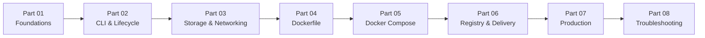

# Docker: Từ nền tảng đến vận hành

> Tài liệu Docker bằng tiếng Việt, tập trung vào mental model, syntax,
> cách kiểm chứng và những quan niệm dễ gây hiểu nhầm.

## Tài liệu này dành cho ai?

Bộ tài liệu dành cho người mới học Docker, developer muốn củng cố mental model và người cần tra cứu cách Docker xử lý Image, Container, build, delivery và vận hành. Sau khi đi hết lộ trình, người đọc có thể giải thích các thành phần chính, kiểm soát vòng đời Container, đóng gói ứng dụng và chẩn đoán vấn đề dựa trên trạng thái quan sát được.

Bạn có thể đọc tuần tự như một cuốn sách hoặc đi thẳng đến khu vực phù hợp với nhu cầu hiện tại:

| Nhu cầu | Khu vực |
|---|---|
| Học từ đầu | Learning Path |
| Thực hành có hướng dẫn | Tutorials |
| Hoàn thành một công việc cụ thể | How-to |
| Tra cứu syntax | Reference |
| Xem lỗi và cách sửa thực tế | Case Studies |

## Lộ trình tám phần

Lộ trình đi từ **hiểu** mental model, **điều khiển** vòng đời, **lưu trữ và kết nối** dữ liệu, **đóng gói** ứng dụng, **phối hợp** nhiều service, **phân phối** Image, **vận hành** hệ thống đến **chẩn đoán** sự cố. Mỗi phần dùng kiến thức của phần trước làm nền, nhưng các khu vực tra cứu và how-to vẫn có thể được dùng độc lập khi cần giải quyết một công việc cụ thể.

## Mục lục tổng

| Phần | Trọng tâm | Trạng thái |
|---|---|---|
| [Part 01. Docker Foundations](learning-path/01-foundations/README.md) | Mental model nền tảng về Docker, Image, Container và hệ sinh thái | Có thể đọc |
| [1. Docker là gì?](learning-path/01-foundations/01-docker-la-gi.md) | Vấn đề Docker giải quyết, use case và giới hạn | Có thể đọc |
| [2. Docker hoạt động như thế nào?](learning-path/01-foundations/02-docker-hoat-dong-nhu-the-nao.md) | Client, API, Engine, Daemon và các luồng build, pull, run | Có thể đọc |
| [3. Docker Image](learning-path/01-foundations/03-docker-image.md) | Cấu trúc Image, layer, metadata và quan hệ với Container | Có thể đọc |
| [4. Docker Container](learning-path/01-foundations/04-docker-container.md) | Runtime instance, lifecycle, isolation và writable state | Có thể đọc |
| [5. Image và Container](learning-path/01-foundations/05-image-va-container.md) | Mental model kết hợp và các quan hệ vòng đời | Có thể đọc |
| [6. Bức tranh tổng thể](learning-path/01-foundations/06-buc-tranh-tong-the.md) | Luồng từ Dockerfile đến Image, Registry, Container, dữ liệu và kết nối | Có thể đọc |
| [Part 02. CLI & Lifecycle](learning-path/02-cli-and-lifecycle/README.md) | Cú pháp CLI, vòng đời và quan sát Docker object | Có thể đọc |
| [Part 03. Storage & Networking](learning-path/03-storage-and-networking/README.md) | Volume, bind mount, tmpfs, network và kết nối service | Có thể đọc |
| [Part 04. Dockerfile](learning-path/04-dockerfile/README.md) | Build context, instruction, cache, multi-stage và Java Image | Có thể đọc |
| [Part 05. Docker Compose](learning-path/05-docker-compose/README.md) | Mô tả, phối hợp và vận hành ứng dụng nhiều service | Có thể đọc |
| [Part 06. Registry & Delivery](learning-path/06-registry-and-delivery/README.md) | Image reference, Tag, Digest, Registry và delivery flow | Có thể đọc |
| [Part 07. Production](learning-path/07-production/README.md) | Bảo mật, tài nguyên, health, observability và readiness | Có thể đọc |
| [Part 08. Troubleshooting](learning-path/08-troubleshooting/README.md) | Điều tra build, process, network, storage, Compose và disk | Có thể đọc |

Tài liệu dùng chung hiện có:

- [Docker Glossary](reference/glossary.md) — định nghĩa thống nhất cho các thuật ngữ cốt lõi.
- [Docker CLI Reference](reference/commands/README.md) — bảng tra lệnh và syntax thường dùng.
- [Dockerfile Reference](reference/dockerfile/README.md) — instruction và build options.
- [Docker Compose Reference](reference/compose/README.md) — Compose keys và CLI commands.
- [Tutorial: Dockerize Spring Boot với Gradle](tutorials/dockerize-spring-boot-gradle.md) — bài thực hành build và chạy ứng dụng Gradle.
- [Tutorial: Dockerize Spring Boot với Maven](tutorials/dockerize-spring-boot-maven.md) — bài thực hành tương ứng cho Maven.
- [How-to Guides](how-to/README.md) — quy trình ngắn để xử lý các công việc vận hành cụ thể.
- [Docker Documentation Style Guide](STYLE-GUIDE.md) — quy chuẩn biên tập, cấu trúc và kiểm chứng nội dung.

## Quy ước của repository

- Chapter trong Learning Path dùng số thứ tự để thể hiện vị trí học được khuyến nghị.
- Thuật ngữ kỹ thuật tiếng Anh được giữ nguyên và giải thích bằng tiếng Việt ở lần xuất hiện đầu tiên.
- Định nghĩa sâu liên kết tới Glossary; mỗi mục Glossary có backlink về đúng đoạn đang học.
- Syntax quan trọng được phân tích từ token, scope và giá trị đã resolve đến trạng thái trước và sau khi thực thi.
- Các quan niệm dễ gây hiểu nhầm được nêu rõ, sửa bằng mental model chính xác và đi kèm cách kiểm chứng.
- Diagram dùng Mermaid khi relationship, sequence hoặc state change khó diễn đạt gọn bằng văn xuôi; mỗi diagram đều được giải thích ở phần liền kề.
- Docker Official Documentation là nguồn chính; OCI Specification được dùng khi cần độ chính xác về định dạng Image hoặc runtime.

## Trạng thái xuất bản

| Phạm vi | Trạng thái |
|---|---|
| Kiến trúc tài liệu, quy chuẩn và Glossary | Hoàn thành |
| Learning Path Part 01-08 | Có thể đọc |
| CLI, Dockerfile và Compose Reference | Có thể tra cứu |
| Java Tutorials và task-oriented How-to | Có thể thực hành |

Bộ Learning Path hiện đã đi trọn luồng: hiểu Docker → điều khiển object → quản lý data/network → build Image → phối hợp service → phân phối artifact → vận hành → chẩn đoán.
