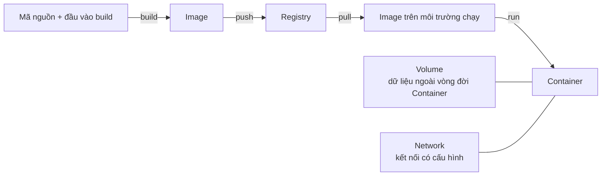

# 1. Docker là gì?

> **Tóm tắt một câu:** Docker là một platform (nền tảng) giúp build, phân phối và chạy ứng dụng dưới dạng Container, nhờ đó nhóm phát triển kiểm soát tốt hơn sự khác biệt môi trường nhưng không loại bỏ mọi phụ thuộc hạ tầng.

> **Loại:** Explanation · **Cấp độ:** Beginner · **Thời gian:** Khoảng 25 phút 
> **Nguồn chính:** [Docker overview](https://docs.docker.com/get-started/docker-overview/) · [What is a container?](https://docs.docker.com/get-started/docker-concepts/the-basics/what-is-a-container/) · [What is an image?](https://docs.docker.com/get-started/docker-concepts/the-basics/what-is-an-image/)

> **Sau chapter này, bạn có thể:**
> - Giải thích Docker giải quyết nhóm vấn đề môi trường và dependency nào.
> - Định nghĩa Docker qua ba hoạt động build, phân phối và chạy ứng dụng.
> - Phân biệt Container với virtual machine, đặc biệt về kernel.
> - Nhận diện Image, Container, Registry, Volume và Network.
> - Nêu được giới hạn của Docker trong bảo mật và vận hành production.

[Mục lục Foundation](README.md) · [Chương sau: Docker hoạt động như thế nào? →](02-docker-hoat-dong-nhu-the-nao.md)

---

## 1. Vấn đề bắt đầu từ sự không nhất quán của môi trường

Một ứng dụng hiếm khi chỉ cần mã nguồn. Ứng dụng Spring Boot còn cần đúng Java runtime, dependency (thư viện phụ thuộc), file cấu hình, biến môi trường, quyền truy cập và command khởi động. Vì vậy, “mã nguồn giống nhau” không đồng nghĩa “ứng dụng chạy giống nhau”.

Máy lập trình viên có thể dùng Java 21 trong khi server chỉ có Java 17; máy A có sẵn library mà máy B còn thiếu; CI (continuous integration, hệ thống tích hợp liên tục) có thể khởi động ứng dụng bằng command khác. Tài liệu cài đặt chỉ mô tả trạng thái mong muốn, không bảo đảm máy thực tế đã được thiết lập đúng. Khoảng cách đó tạo ra lỗi “works on my machine” — chạy trên máy tôi nhưng thất bại ở nơi khác.

Docker thu hẹp khoảng cách bằng cách chuẩn hóa một đơn vị có thể build, chuyển giao và chạy lại. Mỗi môi trường không còn phải tự lắp ghép toàn bộ runtime từ một danh sách thủ công; nó nhận một gói có cấu trúc chuẩn rồi cung cấp cấu hình và tài nguyên runtime cần thiết.

> [!IMPORTANT]
> Docker làm giảm một lớp khác biệt môi trường; Docker không làm mọi môi trường trở thành hoàn toàn giống nhau. Kernel, CPU architecture, dữ liệu, secret, tài nguyên máy, network và các service bên ngoài vẫn có thể khác.

## 2. Hiểu nhanh: kiện hàng chuẩn hóa

Có thể hình dung ứng dụng như hàng hóa đi qua máy lập trình viên, CI, môi trường kiểm thử và server. Nếu mỗi nơi nhận linh kiện cùng hướng dẫn lắp ráp, kết quả dễ lệch nhau. Docker gần với việc đóng hàng theo chuẩn chung: **build** tạo gói, **distribute** chuyển gói, còn **run** tạo môi trường chạy từ gói đó.

Giới hạn của phép so sánh: Container không phải hộp kín mang theo toàn bộ thế giới. Nó vẫn dùng kernel và tài nguyên của môi trường chạy; dữ liệu lâu dài, network, secret và cấu hình triển khai thường đến từ bên ngoài. Docker cũng không chứng minh mã nguồn đúng hay dependency an toàn.

## 3. Định nghĩa chính xác

Docker là một **platform for building, distributing, and running containerized applications** — nền tảng để build, phân phối và chạy các ứng dụng được đóng gói theo mô hình Container.

**Platform** cho biết Docker không chỉ là một command hay process. Nó gồm công cụ build, runtime, API, giao diện dòng lệnh và cơ chế phân phối Image. **Build** biến đầu vào ứng dụng thành Image; **distribute** đưa Image tới môi trường khác; **run** tạo Container, áp dụng cấu hình runtime rồi khởi động process. Kiến trúc client, API và daemon thuộc chapter sau; Dockerfile, Tag, Digest và quy trình phát hành thuộc các phần sau.

**Containerized application** là ứng dụng được chuẩn bị để chạy theo mô hình này, không phải ứng dụng đã độc lập với mọi hệ điều hành, phần cứng hay service bên ngoài. Docker thường được dùng qua Docker Engine trên Linux hoặc Docker Desktop trên Windows và macOS; “Docker” vẫn là tên của nền tảng rộng hơn, không phải tên khác của riêng Container.

## 4. Docker giải quyết điều gì?

| Giá trị | Cơ chế và giới hạn |
|---|---|
| Chuẩn hóa đầu vào | Image đóng gói binary, library, runtime và mặc định cần thiết. Hai Container từ cùng Image vẫn có thể khác vì biến môi trường, dữ liệu hoặc tài nguyên runtime. |
| Tách dependency | Ranh giới process và filesystem giúp các ứng dụng ít trộn dependency vào nhau. Đây không phải máy vật lý riêng; chúng vẫn dùng chung tài nguyên nền tảng. |
| Tạo đơn vị chuyển giao | Developer, CI và môi trường triển khai trao đổi Image reference thay vì danh sách cài đặt dài. Docker không tự thiết kế versioning hay release policy. |
| Tạo môi trường nhanh | Container thường khởi tạo nhanh và nhẹ hơn VM đầy đủ vì không boot guest OS cho từng instance. Tốc độ thực tế vẫn phụ thuộc tải Image, ứng dụng và dữ liệu. |

## 5. Docker không giải quyết điều gì?

Docker là công cụ đóng gói và chạy ứng dụng, không phải lời giải tự động cho mọi vấn đề kỹ thuật.

| Docker không tự giải quyết | Vì sao |
|---|---|
| Bug trong ứng dụng | Container chạy cùng logic mà ứng dụng cung cấp; đóng gói không sửa thuật toán sai. |
| Lỗ hổng bảo mật | Image có thể chứa dependency dễ bị tấn công hoặc quyền quá rộng; vẫn cần cập nhật, quét và hardening (gia cố bảo mật). |
| Dữ liệu bền vững | Dữ liệu trong lớp ghi của Container gắn với vòng đời Container; dữ liệu cần giữ phải có storage phù hợp. |
| Tính sẵn sàng và mở rộng | Container chạy được không đồng nghĩa đã có health check, failover, scaling hay cân bằng tải. |
| Secret và cấu hình | Password, token và giá trị theo môi trường thường phải được quản lý bên ngoài Image. |
| Kernel và CPU | Container phụ thuộc kernel của runtime; binary phải phù hợp operating system và CPU architecture mục tiêu. |

Docker cũng không luôn thay thế virtual machine. VM vẫn hữu ích khi cần kernel hoặc operating system riêng, ranh giới ảo hóa phần cứng, chạy workload không tương thích với kernel hiện có, hoặc đáp ứng một số yêu cầu quản trị và cô lập cụ thể.

## 6. Container và virtual machine

Container và virtual machine đều tạo ranh giới chạy workload, nhưng ở hai lớp khác nhau.

| Khía cạnh | Container | Virtual machine |
|---|---|---|
| Đơn vị chính | Một hoặc nhiều process được cô lập cùng filesystem và cấu hình runtime | Một máy tính ảo có guest operating system |
| Kernel | Dùng kernel do môi trường container runtime cung cấp | Có kernel của guest operating system riêng |
| Khởi động | Thường khởi động process ứng dụng trực tiếp nên nhanh và gọn hơn | Phải khởi động guest OS rồi mới chạy ứng dụng |
| Kích thước | Image thường chỉ chứa user-space file cần thiết, không chứa kernel đang chạy | Disk image thường chứa hệ điều hành khách và ứng dụng |
| Cô lập | Cơ chế của hệ điều hành; mức bảo vệ phụ thuộc cấu hình và runtime | Hypervisor và phần cứng ảo hóa; thường là ranh giới mạnh hơn nhưng vẫn cần cấu hình an toàn |
| Trường hợp phù hợp | Đóng gói service, job, công cụ phát triển và workload có thể dùng kernel tương thích | Chạy hệ điều hành hoặc kernel riêng, workload legacy, hay ranh giới quản trị cần VM |

Điểm dễ nhầm nhất là kernel. Trên Linux, Linux Container dùng Linux kernel của host qua các cơ chế cô lập tài nguyên và process. Image có thể chứa user-space file của Ubuntu hoặc Alpine, nhưng mỗi Container không khởi động một kernel Ubuntu hoặc Alpine riêng.

Trên Windows và macOS, Docker Desktop cung cấp môi trường Linux được quản lý. Linux Container dùng kernel của môi trường đó, không trực tiếp dùng kernel Windows hoặc macOS. Trên Windows, backend có thể dựa trên WSL 2 hoặc Hyper-V; Windows Container là trường hợp khác với yêu cầu tương thích riêng.

> [!NOTE]
> Câu “Container chia sẻ kernel của host” đúng khi “host” được hiểu là môi trường Linux đang thực sự chạy container runtime. Với Docker Desktop, môi trường đó có thể là Linux VM hoặc WSL 2 do Docker Desktop quản lý, không nhất thiết là hệ điều hành giao diện mà người dùng đang nhìn thấy.

## 7. Năm thành phần cần nhận diện

Chapter này chỉ giới thiệu vai trò để bạn đọc được bức tranh tổng thể. Cấu trúc Image, vòng đời Container, Registry delivery, Volume và Network sẽ được giải thích ở các phần tương ứng.

**[Image](../../reference/glossary.md#image)** — gói mẫu chỉ đọc chứa nội dung filesystem và cấu hình mặc định dùng để tạo Container. Image là đơn vị thường được build và phân phối; bản thân nó không phải process đang chạy.

**[Container](../../reference/glossary.md#container)** — môi trường chạy cụ thể được tạo từ Image, có cấu hình runtime, trạng thái vòng đời và vùng ghi riêng. Một Image có thể tạo nhiều Container độc lập.

**[Registry](../../reference/glossary.md#registry)** — dịch vụ lưu trữ và phân phối Image qua mạng. Docker Hub là một Registry phổ biến, nhưng tổ chức có thể dùng Registry khác hoặc vận hành Registry riêng.

**Volume** — cơ chế lưu dữ liệu tách khỏi vòng đời một Container cụ thể. Cách tạo, mount và chọn storage thuộc phần Storage.

**Network** — cơ chế kết nối Container với Container khác hoặc thế giới bên ngoài. Naming, port publishing, DNS và network isolation thuộc phần Networking.

Đọc từ trái sang phải: đầu vào build tạo Image; Image được push lên Registry, pull xuống môi trường khác rồi dùng để tạo Container. Volume và Network không trở thành một phần của Image; chúng được cấu hình khi chạy để cung cấp dữ liệu và kết nối.

Sơ đồ không hiển thị client, API, daemon hay cú pháp Dockerfile vì các chi tiết kiến trúc đó thuộc chapter sau.

## 8. Các trường hợp sử dụng phổ biến và ranh giới

| Trường hợp | Giá trị và ranh giới |
|---|---|
| Môi trường phát triển | Image cho công cụ hoặc service phụ thuộc giúp thành viên bắt đầu từ điểm gần nhau hơn. Nhóm vẫn phải mô tả biến môi trường, port, dữ liệu mẫu và quyền truy cập. |
| Build và test trong CI | Image giữ runtime và toolchain nhất quán hơn. Build chưa tất định nếu dependency từ xa, cache hoặc input thay đổi. |
| Phân phối service | API, worker, web server và công cụ dòng lệnh có thể dùng chung một đơn vị giao nhận. Nền tảng triển khai vẫn cung cấp config, secret, storage và network. |
| Dependency cục bộ | Developer có thể chạy database hoặc message broker mà không cài trực tiếp lên host. Dữ liệu và port vẫn cần quản lý có chủ ý. |

Docker có thể ít giá trị với binary đã dễ phân phối, workload cần phần cứng hoặc kernel đặc thù, ứng dụng desktop phụ thuộc sâu vào host, hoặc hệ thống yêu cầu mô hình cô lập khác. Quyết định nên dựa trên môi trường và rủi ro, không chỉ vì Docker phổ biến.

---

## 9. Quan niệm dễ gây hiểu nhầm

### 9.1 “Docker là một loại máy ảo nhẹ.”

- **Phân loại:** Phép so sánh hữu ích nhưng sai nếu coi là định nghĩa.
- **Vì sao nghe hợp lý:** Cả Container và VM đều cho ứng dụng một môi trường có filesystem, process và cấu hình riêng.
- **Lỗi kỹ thuật:** VM chạy guest OS với kernel riêng; Container dùng kernel của môi trường runtime. Docker Desktop có thể dùng VM chung để cung cấp Linux kernel, nhưng từng Container không trở thành VM riêng.
- **Cách nói tốt hơn:** “Container là môi trường process được cô lập ở mức hệ điều hành; Docker Desktop có thể dùng một Linux VM chung để chạy Linux Container trên Windows hoặc macOS.”
- **Cách kiểm chứng:** Nhiều Linux Container trên cùng Docker Engine báo kernel của cùng môi trường Linux thay vì mỗi Container boot kernel riêng.

### 9.2 “Đã chạy trong Docker thì chắc chắn chạy giống nhau ở mọi nơi.”

- **Phân loại:** Đúng một phần nhưng tuyệt đối hóa tính portability (khả năng di chuyển).
- **Vì sao nghe hợp lý:** Cùng Image cung cấp cùng nội dung file và cấu hình mặc định.
- **Lỗi kỹ thuật:** Kết quả còn phụ thuộc CPU, kernel feature, biến môi trường, secret, dữ liệu, network và service bên ngoài. Tag cũng có thể trỏ tới nội dung mới.
- **Cách nói tốt hơn:** “Cùng nội dung Image làm điểm xuất phát nhất quán hơn trên các runtime tương thích; đầu vào runtime vẫn phải được kiểm soát.”
- **Cách kiểm chứng:** Đối chiếu Image Digest và cấu hình Container, không chỉ tên Image hoặc Dockerfile.

### 9.3 “Image chứa cả hệ điều hành hoàn chỉnh của Container.”

- **Phân loại:** Không chính xác.
- **Vì sao nghe hợp lý:** Image thường có cây thư mục như `/etc`, `/usr` và package của một Linux distribution.
- **Lỗi kỹ thuật:** Các file đó thuộc user space; kernel được cung cấp từ bên ngoài Image. Image tối giản còn có thể không chứa shell.
- **Cách nói tốt hơn:** “Image chứa filesystem và cấu hình user-space cần để khởi tạo Container, không đóng gói kernel đang chạy.”
- **Cách kiểm chứng:** Đổi base Image có thể đổi file và library nhưng kernel report vẫn thuộc môi trường runtime.

### 9.4 “Docker giải quyết xong deployment và bảo mật.”

- **Phân loại:** Không chính xác.
- **Vì sao nghe hợp lý:** Docker tạo artifact triển khai rõ ràng và ranh giới cô lập tốt hơn việc chạy mọi process trực tiếp trên host.
- **Lỗi kỹ thuật:** Production còn cần secret, cập nhật Image, quyền tối thiểu, giám sát, backup, health check, rollback và kiểm soát network.
- **Cách nói tốt hơn:** “Docker cung cấp một nền tảng và đơn vị triển khai; bảo mật và vận hành là các trách nhiệm bổ sung.”
- **Cách kiểm chứng:** Kiểm tra Image source, user, quyền mount, port và chiến lược cập nhật; trạng thái `running` không chứng minh hệ thống an toàn hay sẵn sàng.

## 10. Tự kiểm tra mental model

1. Vì sao cùng mã nguồn chưa đủ để bảo đảm ứng dụng chạy giống nhau trên hai máy?
2. Trong định nghĩa Docker, build, distribute và run giải quyết ba phần khác nhau của vòng đời ứng dụng như thế nào?
3. Cùng một Image có bảo đảm hai Container cho kết quả giống hệt không? Hãy nêu ít nhất ba đầu vào runtime có thể làm kết quả khác nhau.
4. Vì sao Linux Container chạy trên Docker Desktop cho Windows không trực tiếp dùng kernel Windows?
5. Image, Container và Registry khác nhau ở điểm nào? Thành phần nào là gói mẫu, thành phần nào là instance chạy và thành phần nào là dịch vụ phân phối?
6. Khi nào dữ liệu nên được nghĩ tới như trách nhiệm của Volume thay vì là thay đổi tạm thời trong Container?
7. Hãy nêu một vấn đề Docker giúp giảm và một vấn đề Docker không tự giải quyết.

## 11. Tóm tắt

1. Docker là nền tảng để build, phân phối và chạy ứng dụng được containerize, không phải tên khác của Container hay một command duy nhất.
2. Docker giảm sự lệch môi trường bằng cách chuẩn hóa Image và cách tạo Container, nhưng kết quả vẫn phụ thuộc kernel, CPU, cấu hình, dữ liệu, network và service bên ngoài.
3. Container cô lập process ở mức hệ điều hành và dùng kernel do môi trường runtime cung cấp; VM có guest OS cùng kernel riêng.
4. Image là gói mẫu, Container là môi trường chạy cụ thể, Registry phân phối Image, Volume giữ dữ liệu tách khỏi vòng đời Container và Network cung cấp kết nối có cấu hình.
5. Docker không tự sửa bug, bảo mật ứng dụng, quản lý production hay thiết kế quy trình release; các trách nhiệm đó vẫn cần được giải quyết riêng.

## 12. Học tiếp

- Đọc [Chương 2: Docker hoạt động như thế nào?](02-docker-hoat-dong-nhu-the-nao.md) để hiểu ở mức nền tảng cách yêu cầu đi từ người dùng tới các thành phần Docker.
- Quay lại [Mục lục Foundation](README.md) để xem phạm vi và thứ tự của toàn bộ phần nền tảng.
- Dùng [Docker Glossary](../../reference/glossary.md) khi cần tra lại định nghĩa ổn định của Image, Container và Registry.

## Tài liệu tham khảo

- Docker Docs, [Docker overview](https://docs.docker.com/get-started/docker-overview/)
- Docker Docs, [What is a container?](https://docs.docker.com/get-started/docker-concepts/the-basics/what-is-a-container/)
- Docker Docs, [What is an image?](https://docs.docker.com/get-started/docker-concepts/the-basics/what-is-an-image/)
- Docker Docs, [Containers and virtual machines](https://docs.docker.com/get-started/docker-concepts/the-basics/what-is-a-container/#containers-versus-virtual-machines)
- Docker Docs, [Docker Desktop](https://docs.docker.com/desktop/)

[Mục lục Foundation](README.md) · [Chương sau: Docker hoạt động như thế nào? →](02-docker-hoat-dong-nhu-the-nao.md)
