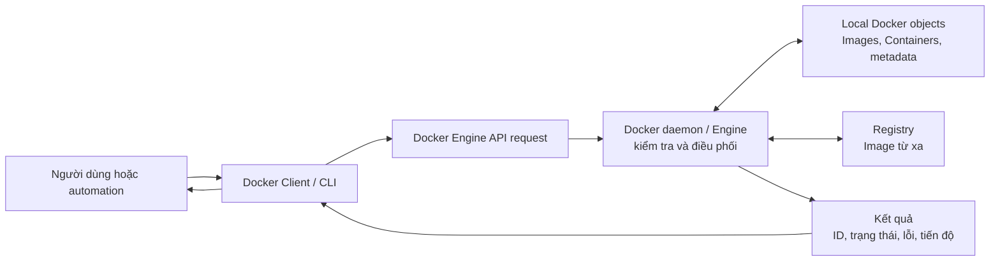
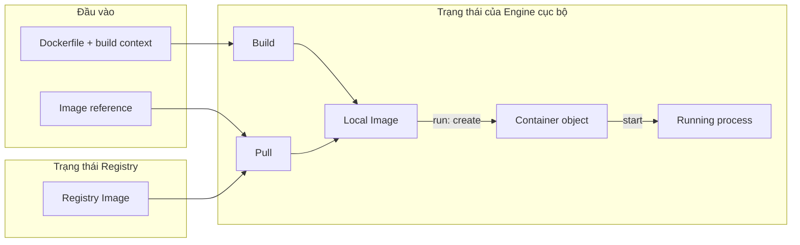

# 2. Docker hoạt động như thế nào?

> **Tóm tắt một câu:** Docker Client diễn đạt yêu cầu qua API; Docker Engine tiếp nhận, điều phối việc quản lý object cục bộ và trao đổi Image với Registry, rồi trả kết quả cho người dùng.

> **Loại:** Explanation · **Cấp độ:** Beginner · **Thời gian:** Khoảng 30 phút<br>
> **Điều kiện:** Đã hiểu Docker giải quyết vấn đề đóng gói và chạy ứng dụng ở mức nhập môn.<br>
> **Nguồn chính:** [Docker overview](https://docs.docker.com/get-started/docker-overview/) · [Docker CLI overview](https://docs.docker.com/reference/cli/docker/) · [Docker Engine](https://docs.docker.com/engine/)

> **Sau chapter này, bạn có thể:**
> - Phân biệt Docker Client, Docker Engine API, Docker daemon, Docker object và Registry.
> - Mô tả đường đi của một yêu cầu từ câu lệnh đến kết quả.
> - Giải thích ở mức khái niệm ba luồng `build`, `pull` và `run`.
> - Phân biệt trạng thái cục bộ với trạng thái trong Registry.
> - Đặt Docker Desktop đúng vị trí trong kiến trúc Windows và macOS.

[← 1. Docker là gì?](01-docker-la-gi.md) · [Mục lục Foundation](README.md) · [3. Docker Image →](03-docker-image.md)

---

## 1. Vấn đề cần giải quyết

Khi gõ `docker container run nginx`, người mới dễ nghĩ chương trình `docker` tự tải file, tạo môi trường cô lập và chạy tiến trình. Cách hiểu đó không giải thích được vì sao CLI có thể hoạt động nhưng không kết nối được daemon, Image có trên Registry nhưng chưa có cục bộ, hoặc cùng một lệnh cho kết quả khác khi Client trỏ tới Engine khác.

Muốn hiểu các tình huống này, cần nhìn Docker như một hệ thống thành phần cộng tác qua API, không phải một chương trình nguyên khối.

## 2. Hiểu nhanh: quầy điều phối, xưởng và kho phân phối

Có thể hình dung Docker có **quầy điều phối** là Client, **xưởng xử lý** là phía Engine, và **kho phân phối** là Registry. Client chuyển yêu cầu theo hợp đồng API; Engine kiểm tra Image cục bộ, chuẩn bị Container, khởi động tiến trình và trả kết quả. Khi thiếu Image và chính sách cho phép, Engine liên lạc Registry.

Giới hạn của phép so sánh: daemon có thể điều phối builder (bộ dựng) và container runtime thay vì tự làm mọi thao tác mức thấp; Registry không phải thư mục mạng dùng chung; Client cũng có thể gọi Engine ở một đích khác.

---

## 3. Mô hình chính xác của các thành phần

### 3.1 Docker Client và Docker Engine API

**Docker Client** tạo yêu cầu theo ý người dùng hoặc chương trình gọi nó. Docker CLI `docker` là client phổ biến nhất; ứng dụng khác có thể gọi API trực tiếp.

**Docker Engine API** quy định request và response giữa Client với Engine. Kết nối có thể dùng Unix socket, Windows named pipe, SSH hoặc TCP tùy cấu hình. Client gửi yêu cầu tới một endpoint (điểm nhận kết nối), không trực tiếp sửa kho object. Client và Engine có thể cùng hệ thống hoặc ở hai nơi khác nhau.

### 3.2 Docker Engine và Docker daemon

**Docker Engine** là nền tảng cốt lõi cung cấp API và khả năng build, quản lý Image, tạo Container và điều phối runtime. Trong kiến trúc Docker Engine quen thuộc, <a id="back-02-docker-hoat-dong-nhu-the-nao-daemon"></a> **[Daemon](../../reference/glossary.md#daemon)** — tiến trình nền dài hạn, thường là `dockerd` — lắng nghe yêu cầu API và chịu trách nhiệm điều phối việc quản lý Docker object.

Daemon kiểm tra yêu cầu, quản lý metadata và vòng đời object, điều phối builder/runtime, trao đổi Image với Registry khi cần, rồi trả ID, trạng thái, tiến độ hoặc lỗi cho Client.

> [!IMPORTANT]
> “Daemon chịu trách nhiệm” không có nghĩa mọi cài đặt luôn dùng daemon từ xa với đặc quyền cao nhất. Engine có thể ở cùng máy, trong Docker Desktop hoặc tại đích khác; rootless mode (chế độ không dùng đầy đủ quyền root) cũng tồn tại. Hãy giữ mental model về vai trò server-side, không tuyệt đối hóa vị trí hay đặc quyền.

### 3.3 Docker object và trạng thái cục bộ

Docker quản lý các **object** — đối tượng có danh tính, metadata và vòng đời riêng. Trong Foundation, hai object quan trọng nhất là:

- <a id="back-02-docker-hoat-dong-nhu-the-nao-image"></a> **[Image](../../reference/glossary.md#image)** — đầu vào chỉ đọc gồm nội dung filesystem và cấu hình mặc định để tạo Container.
- <a id="back-02-docker-hoat-dong-nhu-the-nao-container"></a> **[Container](../../reference/glossary.md#container)** — môi trường chạy cụ thể được tạo từ Image, có cấu hình và trạng thái vòng đời riêng.

Engine còn quản lý Network, Volume và object khác, nhưng cơ chế của chúng thuộc phần sau. **Trạng thái cục bộ** là những gì Engine đích hiện biết: Image đã tải/build, Container đã tạo và trạng thái liên quan. “Cục bộ” gắn với Engine đang được chọn, không nhất thiết với filesystem của terminal.

### 3.4 Registry và trạng thái từ xa

<a id="back-02-docker-hoat-dong-nhu-the-nao-registry"></a> **[Registry](../../reference/glossary.md#registry)** — dịch vụ lưu trữ và phân phối Image — giữ nội dung Image cùng các tên tham chiếu liên quan. Docker Hub là một Registry phổ biến, nhưng không phải Registry duy nhất.

Registry cung cấp dữ liệu cho `pull` và nhận dữ liệu từ `push`; nó không quản lý Container đang chạy. Image tồn tại từ xa chưa có nghĩa Engine cục bộ đã có layer và metadata cần thiết.

| Câu hỏi | Trạng thái cục bộ của Engine | Trạng thái trong Registry |
|---|---|---|
| Image dùng được ngay? | Có nếu nội dung cần thiết đã hiện diện. | Có thể phải pull trước. |
| Container nào đang chạy? | Engine quản lý và trả lời. | Registry không quản lý runtime. |
| Tên Image trỏ tới đâu? | Ánh xạ Engine đang biết. | Ánh xạ Registry hiện công bố; hai phía có thể khác. |

### 3.5 Docker Desktop trên Windows và macOS

**Docker Desktop** đóng gói ứng dụng quản lý, Docker CLI, Docker Engine và các thành phần hỗ trợ; nó không phải tên thay thế cho Docker hay chỉ là GUI.

Khi chạy Linux Container trên Windows/macOS, Docker Desktop cung cấp môi trường Linux được quản lý, như backend WSL 2 hoặc máy ảo tùy nền tảng/cấu hình. Client trên host gọi Engine trong môi trường đó. Windows Container là chế độ khác với nền tảng kernel khác, nên cũng không nên nói tuyệt đối “Docker Desktop luôn là một Linux VM”.

---

## 4. Luồng yêu cầu trong kiến trúc Docker



Đọc từ trái sang phải: Client biến ý định thành API request; Engine đọc hoặc đổi object cục bộ, chỉ gọi Registry khi cần tải/gửi Image, rồi trả kết quả. Mũi tên hai chiều với Registry biểu diễn pull và push, không có nghĩa mọi lệnh đều truy cập mạng. Daemon có thể ủy quyền chi tiết cho builder hoặc runtime.

Một yêu cầu có thể thất bại ở các ranh giới khác nhau:

- Client có thể sai cú pháp hoặc không kết nối được endpoint.
- Engine có thể từ chối vì object, quyền, nền tảng hoặc tài nguyên.
- Registry có thể không trả dữ liệu do reference, xác thực hoặc kết nối.
- Container có thể được tạo thành công nhưng process bên trong thoát sau đó.

Xác định ranh giới lỗi chính xác hơn kết luận chung rằng “Docker hỏng”.

## 5. Ba luồng chính: build, pull và run



Build tạo Local Image; pull đưa nội dung cần thiết từ Registry về Engine; run dùng Local Image để tạo Container rồi khởi động process. Registry Image và Local Image có thể liên quan về nội dung nhưng nằm ở hai trạng thái khác nhau; Container chỉ thuộc Engine chạy workload.

### 5.1 Luồng build

Build dùng <a id="back-02-docker-hoat-dong-nhu-the-nao-dockerfile"></a> **[Dockerfile](../../reference/glossary.md#dockerfile)** — file khai báo cách tạo Image — và <a id="back-02-docker-hoat-dong-nhu-the-nao-build-context"></a> **[Build context](../../reference/glossary.md#build-context)** — tập file builder được phép dùng. Builder xử lý đầu vào, lấy Image nền nếu cần và xuất Local Image. Build không tự đưa Image lên Registry; việc phân phối cần push riêng. Cú pháp, cache và multi-stage build thuộc Part 04.

### 5.2 Luồng pull

Pull nhận Image reference, liên lạc Registry, kiểm tra nội dung cục bộ và tải phần còn thiếu; layer sẵn có có thể được tái sử dụng. Registry vẫn giữ bản phân phối, còn Engine nhận bản cục bộ. Pull không tạo Container hay process. Tag, Digest và đăng nhập thuộc phần sau.

### 5.3 Luồng run

Run yêu cầu tạo Container mới từ Image rồi khởi động nó:

1. Resolve Image reference và xác định Image phù hợp trong trạng thái cục bộ.
2. Nếu Image cần thiết chưa có, có thể pull theo pull policy (chính sách tải) đang áp dụng.
3. Tạo Container object với cấu hình runtime cụ thể.
4. Yêu cầu runtime chuẩn bị môi trường cô lập và khởi động process.
5. Trả ID, output hoặc lỗi.

`run` không sửa Image thành Container: Image vẫn là đầu vào, Container là object mới. Nó cũng không bảo đảm luôn tải bản mới nhất; việc tải phụ thuộc trạng thái cục bộ, reference và pull policy.

---

## 6. Quan sát kiến trúc bằng Docker CLI

Các lệnh sau chỉ dùng để kiểm chứng mental model, không phải một tutorial cài đặt hoặc vận hành.

### 6.1 Phân biệt Client và Server

```bash
docker version
```

Output thường có hai phần `Client` và `Server`. Nếu Client xuất hiện nhưng Server báo lỗi kết nối, CLI đang chạy còn Engine endpoint chưa sẵn sàng. Lệnh chỉ đọc thông tin, không tạo object.

### 6.2 Xác định Engine đích mà Client đang dùng

```bash
docker context show
```

Output là context (ngữ cảnh kết nối) đang hoạt động, qua đó xác định endpoint Client sẽ gọi. “Local terminal” chưa đủ để kết luận object nằm ở đâu.

### 6.3 Quan sát hai loại object cục bộ

```bash
docker image ls
docker container ls
```

Lệnh đầu liệt kê Image cục bộ; lệnh sau liệt kê Container đang chạy theo phạm vi mặc định. Chúng không liệt kê toàn bộ Image trong Registry, nên tên có trên Registry chưa chắc xuất hiện cục bộ.

## 7. Quan niệm dễ gây hiểu nhầm

### 7.1 “Docker CLI tự tạo và chạy Container.”

- **Phân loại:** Sai vì gộp Client với phía thực thi.
- **Vì sao nghe hợp lý:** Người dùng chỉ trực tiếp mở terminal và chạy chương trình `docker`.
- **Lỗi kỹ thuật:** CLI tạo API request; Engine, daemon và runtime phía server mới quản lý object và process.
- **Cách nói tốt hơn:** “Docker CLI gửi yêu cầu; Engine đích thực hiện và trả kết quả.”
- **Cách kiểm chứng:** `docker version` có thể hiển thị Client nhưng báo không lấy được thông tin Server khi endpoint không sẵn sàng.

### 7.2 “Registry là nơi Container của tôi đang chạy.”

- **Phân loại:** Sai do nhầm phân phối Image với runtime.
- **Vì sao nghe hợp lý:** Registry là dịch vụ từ xa liên quan trực tiếp tới ứng dụng được đóng gói.
- **Lỗi kỹ thuật:** Registry lưu và phân phối Image; Container object và process thuộc Engine chạy workload.
- **Cách nói tốt hơn:** “Registry cung cấp đầu vào Image; Engine dùng đầu vào đó để tạo Container cục bộ.”
- **Cách kiểm chứng:** Pull làm Image xuất hiện trong `docker image ls` nhưng không tự tạo dòng mới trong `docker container ls`.

### 7.3 “Mỗi lần `docker run` đều tải Image mới nhất từ Registry.”

- **Phân loại:** Sai; hành vi phụ thuộc trạng thái cục bộ, reference và pull policy.
- **Vì sao nghe hợp lý:** Run có thể tự tải Image khi máy chưa có Image đó.
- **Lỗi kỹ thuật:** Engine có thể dùng Image cục bộ phù hợp; một Tag từ xa có thể đã đổi mà ánh xạ cục bộ chưa được cập nhật.
- **Cách nói tốt hơn:** “Run resolve Image cho lần tạo Container; việc liên lạc Registry phụ thuộc Image cục bộ và chính sách tải.”
- **Cách kiểm chứng:** So sánh thời điểm pull với danh sách Image cục bộ; không suy ra nội dung từ xa chỉ từ việc run thành công.

### 7.4 “Docker daemon luôn là một server từ xa chạy với quyền root.”

- **Phân loại:** Sai vì biến một cấu hình phổ biến thành quy luật tuyệt đối.
- **Vì sao nghe hợp lý:** Docker dùng kiến trúc client-server và daemon truyền thống thường có quyền mạnh để quản lý tài nguyên hệ thống.
- **Lỗi kỹ thuật:** Client có thể kết nối Engine cùng máy, Engine trong Docker Desktop hoặc Engine từ xa; rootless mode thay đổi mô hình đặc quyền.
- **Cách nói tốt hơn:** “Daemon là vai trò server-side nhận và điều phối request; vị trí cùng mức đặc quyền phụ thuộc môi trường.”
- **Cách kiểm chứng:** `docker context show` xác định context Client đang chọn; cấu hình Engine quyết định endpoint và chế độ chạy thực tế.

## 8. Tự kiểm tra mental model

1. Vì sao cài được Docker CLI chưa đủ để kết luận bạn có thể tạo Container?
2. Khi `docker image ls` không thấy một Image đang có trên Registry, trạng thái nào đang khác nhau?
3. Trong luồng `run`, bước nào tạo Container object và bước nào làm process bắt đầu chạy?
4. Vì sao đổi Docker context có thể làm danh sách Image và Container thay đổi dù bạn vẫn dùng cùng terminal?
5. Hãy giải thích vị trí của Docker Desktop khi chạy Linux Container trên Windows hoặc macOS mà không gọi Docker Desktop là “Docker” hoặc “một Linux VM” một cách tuyệt đối.
6. Build thành công tạo ra kết quả ở đâu, và cần thêm luồng nào nếu muốn một Engine khác tải được Image đó từ Registry?

## 9. Tóm tắt

1. Docker Client diễn đạt ý định thành API request; nó không trực tiếp quản lý filesystem và process của Container.
2. Docker Engine, thường thông qua daemon và các thành phần được điều phối, quản lý object cục bộ và thực hiện yêu cầu.
3. Registry lưu và phân phối Image từ xa; nó không quản lý Container runtime của Engine cục bộ.
4. Build tạo Image cục bộ, pull đưa Image từ Registry về trạng thái cục bộ, còn run tạo Container rồi khởi động process từ Image.
5. Trạng thái “cục bộ” thuộc Engine đang được Client chọn; nó có thể ở cùng máy, trong Docker Desktop hoặc tại một endpoint khác.
6. Docker Desktop đóng gói trải nghiệm desktop và cung cấp môi trường Linux cần thiết cho Linux Container trên Windows/macOS, nhưng không đồng nghĩa với toàn bộ Docker hay riêng Docker Engine.

## 10. Học tiếp

- Đọc [3. Docker Image](03-docker-image.md) để hiểu chính xác object mà build tạo ra, pull tải về và run dùng làm đầu vào.
- Quay lại [Mục lục Foundation](README.md) để xem phạm vi và thứ tự của toàn bộ phần nền tảng.
- Dùng [Docker Glossary](../../reference/glossary.md) khi cần tra lại định nghĩa ổn định của Daemon, Image, Container, Registry, Dockerfile và Build context.

## Tài liệu tham khảo

- Docker Docs, [Docker overview](https://docs.docker.com/get-started/docker-overview/)
- Docker Docs, [Docker Engine](https://docs.docker.com/engine/)
- Docker CLI Reference, [Use the Docker command line](https://docs.docker.com/reference/cli/docker/)
- Docker Docs, [Docker contexts](https://docs.docker.com/engine/manage-resources/contexts/)
- Docker Docs, [Docker Desktop](https://docs.docker.com/desktop/)
- Docker Docs, [Docker Desktop WSL 2 backend on Windows](https://docs.docker.com/desktop/features/wsl/)

[← 1. Docker là gì?](01-docker-la-gi.md) · [Mục lục Foundation](README.md) · [3. Docker Image →](03-docker-image.md)
