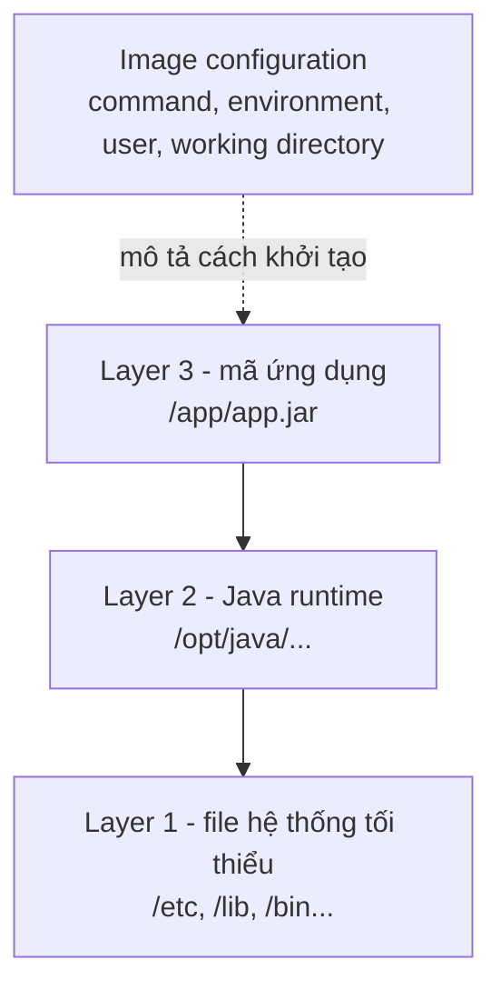
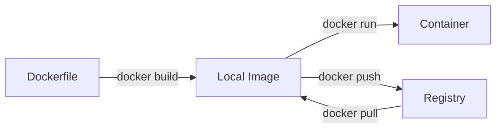
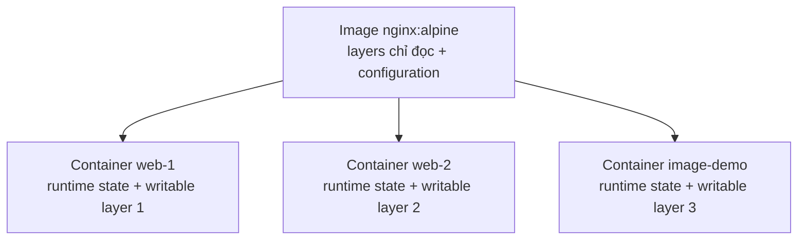

# 3. Docker Image

> **Tóm tắt một câu:** Docker Image là đầu vào chỉ đọc gồm filesystem (cây thư mục và file) cùng cấu hình mặc định; Docker dùng nó để tạo một hoặc nhiều Container (môi trường chạy cụ thể) có trạng thái riêng.

> **Loại:** Explanation · **Cấp độ:** Beginner · **Thời gian:** Khoảng 35 phút<br>
> **Nguồn chính:** [What is an image?](https://docs.docker.com/get-started/docker-concepts/the-basics/what-is-an-image/) · [Understanding the image layers](https://docs.docker.com/get-started/docker-concepts/building-images/understanding-image-layers/) · [docker image](https://docs.docker.com/reference/cli/docker/image/) · [OCI Image Format Specification](https://github.com/opencontainers/image-spec/blob/main/spec.md)

> **Sau chapter này, bạn có thể:**
> - Phân biệt nội dung filesystem, Image configuration và runtime state.
> - Giải thích layer, tính bất biến, Tag và Digest bằng mental model chính xác.
> - Mô tả luồng build, pull, push và tạo Container từ Image.
> - Dùng output inspect và history để kiểm chứng quan hệ Image–Container.

[Mục lục Foundation](README.md)

---

## 1. Vấn đề cần giải quyết

Giả sử một nhóm có mã nguồn Spring Boot và `pom.xml`. Một máy chạy thành công, máy khác lại dùng Java khác phiên bản, thiếu thư viện hoặc khởi động bằng tham số khác. Mã nguồn giống nhau chưa bảo đảm môi trường chạy giống nhau.

Để tái tạo một ứng dụng đang chạy, hệ thống còn cần nhiều đầu vào ngoài mã nguồn:

- Java runtime, tức môi trường thực thi bytecode Java, phải có phiên bản và biến thể phù hợp.
- Các dependency, tức thư viện phụ thuộc mà ứng dụng cần lúc build hoặc lúc chạy, phải hiện diện đúng phiên bản.
- Resource, tức tài nguyên đi kèm như file cấu hình, mẫu hiển thị, chứng thư hoặc file tĩnh, phải nằm đúng đường dẫn.
- Nội dung **[Filesystem](../../reference/glossary.md#filesystem)** — cây thư mục và file mà môi trường nhìn thấy — phải có quyền truy cập và cấu trúc dự kiến.
- Cấu hình khởi động như command (lệnh), environment variable (biến môi trường), working directory (thư mục làm việc) và user (tài khoản) phải nhất quán.

Cách truyền thống là viết tài liệu cài đặt rồi hy vọng máy thực tế không lệch khỏi mô tả. Docker thu hẹp khoảng cách này bằng **[Image](../../reference/glossary.md#image)** — gói mẫu chỉ đọc dùng làm đầu vào để tạo Container.

Image không giải quyết mọi khác biệt hạ tầng. Kernel (nhân hệ điều hành), CPU architecture (kiến trúc bộ xử lý), secret (dữ liệu bí mật), network (mạng), volume (vùng dữ liệu độc lập) và tài nguyên runtime vẫn đến từ bên ngoài. Nhiều Image chỉ chứa file tối thiểu, không phải hệ điều hành hoàn chỉnh. Container dùng kernel do môi trường runtime cung cấp; Linux Container trên Docker Desktop dùng môi trường Linux được quản lý như Linux VM hoặc WSL 2, không trực tiếp dùng kernel Windows/macOS. Mental model đúng là “đóng gói nội dung và giá trị mặc định”, không phải “đóng gói cả một máy”.

## 2. Hiểu nhanh và định nghĩa chính xác

### 2.1 Phép so sánh: khuôn đúc và sản phẩm được đúc

Có thể hình dung Image như một khuôn đúc đã được chuẩn hóa. Một khuôn có thể tạo nhiều sản phẩm; sửa một sản phẩm đã đúc không làm khuôn tự đổi; muốn thay thiết kế, ta tạo khuôn mới. Tương tự, một Image có thể tạo nhiều **[Container](../../reference/glossary.md#container)** — môi trường chạy cụ thể có cấu hình runtime, trạng thái vòng đời và filesystem riêng.

Giới hạn của phép so sánh: Image còn chứa dữ liệu file và cấu hình mặc định. Container cũng không sao chép vật lý toàn bộ Image; nhiều Container dùng chung dữ liệu chỉ đọc rồi thêm phần ghi riêng.

### 2.2 Định nghĩa chính xác

Docker mô tả container image là gói chuẩn hóa gồm file, binary (file thực thi), library (thư viện) và configuration (cấu hình) cần để chạy Container. Theo OCI, **manifest** là tài liệu liệt kê configuration và layer; **image index** là danh sách manifest, thường để cung cấp nhiều nền tảng. Có thể rút gọn Image thành hai nhóm cần giữ tách biệt:

1. **Nội dung chỉ đọc** tạo nên góc nhìn filesystem ban đầu.
2. **Cấu hình mặc định** giúp runtime biết nên khởi tạo Container như thế nào.

**[Filesystem layer](../../reference/glossary.md#filesystem-layer)** — lớp thay đổi filesystem — ghi một tập thay đổi như thêm, sửa hoặc đánh dấu xóa đường dẫn so với lớp bên dưới. Nhiều layer được ghép theo thứ tự để người dùng nhìn thấy một cây thư mục thống nhất.

**[Metadata](../../reference/glossary.md#metadata)** — dữ liệu mô tả hoặc điều khiển cách một object (đối tượng Docker) được xử lý — gồm kiến trúc, hệ điều hành, label (nhãn), lịch sử và cấu hình. Nó không phải một file duy nhất; cũng không phải mọi metadata đều tác động trực tiếp lúc chạy.

**[Image configuration](../../reference/glossary.md#image-configuration)** — object JSON (định dạng dữ liệu có cấu trúc) mô tả Image và mặc định runtime — có thể chứa environment, entrypoint (chương trình khởi đầu), command, working directory, user và thứ tự thay đổi filesystem. Byte file ứng dụng nằm trong layer, không nằm ở configuration.

Khi Docker tạo một Container từ Image, Container là một **[Instance](../../reference/glossary.md#instance)** — bản thể cụ thể được hiện thực hóa từ một khuôn dùng lại được. `Instance` chỉ là thuật ngữ giải thích quan hệ; Docker CLI không có object riêng tên `instance`.

## 3. Image dùng để làm gì?

### 3.1 Tái tạo đầu vào triển khai

Image gom ứng dụng và giá trị mặc định vào một object có thể nhận diện, thay cho việc máy đích tự cài Java và chép file. Cùng nội dung Image và cấu hình runtime tương đương tạo điểm xuất phát nhất quán hơn; thời gian, dữ liệu ngoài, network, secret và service phụ thuộc vẫn có thể khác.

### 3.2 Phân phối một đơn vị chuẩn hóa

Image có thể đi giữa máy phát triển, hệ thống CI và môi trường triển khai qua **[Registry](../../reference/glossary.md#registry)** — dịch vụ lưu trữ, phân phối Image. **CI (continuous integration)** tự động tích hợp và kiểm tra thay đổi; đăng nhập, policy và pipeline thuộc phần sau.

### 3.3 Đầu vào có phiên bản cho deployment

Mỗi deployment có thể chọn một Image reference thay vì lắp ghép môi trường thủ công, miễn là phân biệt tên tham chiếu với định danh nội dung.

### 3.4 Giữ điểm xuất phát giữa máy cục bộ và CI gần nhau

Lập trình viên và CI có thể dùng cùng Image. Environment, mount hoặc command vẫn có thể khác, nhưng filesystem và mặc định bắt đầu từ cùng gói.

### 3.5 Một Image tạo nhiều Container

Image không bị “tiêu thụ” sau một lần chạy. Nhiều Container chia sẻ layer chỉ đọc nhưng có runtime state và vùng ghi riêng.

---

## 4. Cấu tạo của Image

### 4.1 Filesystem layer

Mỗi filesystem layer biểu diễn thay đổi so với trạng thái trước: thêm, sửa hoặc đánh dấu xóa file. Runtime ghép các layer theo thứ tự thành một filesystem thống nhất. Trong Container, `/etc`, `/usr`, `/app` hiện như một cây thư mục thay vì nhiều kho layer rời.



Đọc từ dưới lên: `Layer 1` cung cấp file hệ thống tối thiểu, không phải hệ điều hành hoàn chỉnh đang chạy; `Layer 2` thêm Java runtime; `Layer 3` thêm artifact (sản phẩm build) `/app/app.jar`. Ba layer tạo một filesystem hợp nhất. `Image configuration` đứng riêng vì command, environment, user và working directory là cấu hình toàn Image, không phải byte file của một layer.

Layer được nhận diện theo nội dung và có thể tái sử dụng. Hai Image tham chiếu cùng layer không cần lưu hai bản byte. Điều này giảm dữ liệu tải/lưu, nhưng không tạo quy tắc “một Dockerfile instruction bằng một layer”.

### 4.2 Image configuration

Image configuration trả lời các câu hỏi khác với filesystem:

| Câu hỏi | Ví dụ giá trị cấu hình |
|---|---|
| Tiến trình mặc định chạy gì? | `ENTRYPOINT` và `CMD` thành chương trình vào/đối số mặc định |
| Tiến trình nhìn thấy environment nào? | Danh sách như `PATH=...` hoặc biến ứng dụng |
| Thư mục làm việc ban đầu là đâu? | `/app` |
| User mặc định là ai? | UID (mã người dùng), username (tên người dùng) hoặc giá trị rỗng |
| Image dành cho nền tảng nào? | Operating system và CPU architecture |

Runtime kết hợp các giá trị này với option lúc tạo Container. Giá trị mặc định có thể bị ghi đè mà không sửa Image nguồn.

### 4.3 Không phải mọi Dockerfile instruction tạo filesystem layer

**[Dockerfile](../../reference/glossary.md#dockerfile)** — file khai báo instruction để builder (bộ dựng) tạo Image — có instruction đổi file và instruction chủ yếu đổi cấu hình. `COPY` thường đổi filesystem, còn `CMD` đặt command mặc định và có thể xuất hiện trong history với `0B`. Vì vậy số dòng history có thể lớn hơn số filesystem layer.

Cache (kết quả build tái sử dụng), quan hệ instruction với build step (bước dựng), và multi-stage build (dựng nhiều giai đoạn) thuộc Part 04. Ở đây chỉ cần nhớ layer khác configuration; không đếm dòng Dockerfile để suy ra cấu trúc Image.

## 5. Tính bất biến, Tag và Digest

### 5.1 “Không sửa tại chỗ” nghĩa là gì?

Docker Docs gọi Image là **immutable** (bất biến): nội dung đã tạo không được mở rồi lưu đè tại chỗ. Khi ứng dụng hoặc runtime đổi, build tạo nội dung mới; layer không đổi có thể được tái sử dụng.

> [!IMPORTANT]
> Không nên viết trần trụi “Docker Image hoàn toàn không bao giờ thay đổi”. Cách nói chính xác hơn là: nội dung đã định danh không bị sửa tại chỗ; build lại tạo nội dung mới, còn tên tham chiếu có thể được cập nhật để trỏ sang nội dung mới.

### 5.2 Tag là tên có thể di chuyển

**[Repository](../../reference/glossary.md#repository)** — không gian tên nhóm các phiên bản liên quan trong Registry — có thể chứa nhiều tham chiếu. **[Tag](../../reference/glossary.md#tag)** — nhãn dễ đọc như `alpine`, `1.0` hoặc `latest` — ánh xạ tên đó tới một manifest hoặc image index tại một thời điểm.

Trong `nginx:alpine`, `nginx` là repository và `alpine` là Tag. Publisher (bên phát hành) có thể chuyển Tag sang bản mới, nên hai lần pull ở hai thời điểm không bảo đảm cùng nội dung.

### 5.3 Digest nhận diện nội dung cụ thể

**[Digest](../../reference/glossary.md#digest)** — định danh content-addressable, tức được tính từ byte nội dung — thường có dạng `sha256:<chuỗi-hex>`. Object đổi thì Digest đổi; `name@sha256:...` vì thế cố định hơn Tag.

Cần hỏi “Digest của object nào?”. **Descriptor** là bản ghi OCI chứa loại, kích thước và Digest của nội dung đích; nó có thể trỏ đến index, manifest, configuration hoặc layer. Image ID cục bộ và các Digest đó không phải một khái niệm chỉ vì đều bắt đầu bằng `sha256:`.

## 6. Vòng đời và luồng di chuyển của Image



Sơ đồ có hai đường vào kho Image cục bộ. `Dockerfile -> docker build -> Local Image` nghĩa là builder đọc khai báo và tạo Image; `Registry -> docker pull -> Local Image` nghĩa là Docker tải manifest, configuration và layer.

Từ `Local Image`, `docker run` tạo và khởi động Container mới mà không biến hoặc xóa Image. `docker push` gửi nội dung lên Registry; Registry lưu và phân phối, không chạy process (tiến trình).

Các mũi tên chỉ mô tả hướng dữ liệu, không phải tutorial phát hành. Authentication (xác thực), naming (đặt tên), quyền Registry và **[Build context](../../reference/glossary.md#build-context)** — tập dữ liệu builder được phép dùng — thuộc phần sau.

---

## 7. Quan sát Image bằng Docker CLI

**Docker CLI (command-line interface)** là giao diện dòng lệnh gửi yêu cầu tới **[Daemon](../../reference/glossary.md#daemon)** — tiến trình nền quản lý Docker object. Cú pháp nền tảng:

```text
docker [GLOBAL OPTIONS] COMMAND [COMMAND OPTIONS] [ARGUMENTS]
```

`docker` chọn CLI; `image` hoặc `container` chọn nhóm object; động từ chọn action (hành động). Option là tùy chọn, argument là đối số mục tiêu. Output là kết quả in ra. Các lệnh chỉ quan sát mental model, không dạy vận hành Nginx.

### 7.1 Tải Image: `docker image pull`

```bash
docker image pull nginx:alpine
```

| Thành phần | Vai trò |
|---|---|
| `docker` | Docker CLI gửi yêu cầu tới daemon. |
| `image` | Nhóm object đang được quản lý. |
| `pull` | Action tải Image từ Registry. |
| `nginx:alpine` | Argument Image reference: repository `nginx`, Tag `alpine`; Registry và không gian tên mặc định được xác định thành `docker.io/library`. |

Ví dụ output ghi `sha256:4a73073b...c1752`, `Downloaded newer image` và `docker.io/library/nginx:alpine`. Digest có thể khác về sau vì Tag có thể di chuyển.

Trước lệnh, kho cục bộ có thể thiếu reference hoặc content blob. Sau lệnh, nó có metadata và layer cần thiết; layer sẵn có được tái sử dụng. Lệnh không tạo Container, nên không cần cleanup.

### 7.2 Liệt kê Image cục bộ: `docker image ls`

```bash
docker image ls
```

| Thành phần | Vai trò |
|---|---|
| `docker image` | Chọn nhóm object Image. |
| `ls` | Action list, tức liệt kê Image mà daemon hiện biết. |
| Option | Không có trong ví dụ. |
| Argument | Không có; lệnh liệt kê toàn bộ tập mặc định thay vì lọc theo repository. |

Quan sát `REPOSITORY`, `TAG`, `IMAGE ID`, `CREATED`, `SIZE` và dòng `nginx:alpine`. `SIZE` là cách Docker Engine (bộ máy thực thi Docker) biểu diễn kích thước Image, không phải số byte vừa tải.

Đây là phép đọc, nên trạng thái không đổi. Tag hiện cạnh Image ID, cho thấy tên tham chiếu không phải toàn bộ nội dung.

### 7.3 Xem cấu trúc chi tiết: `docker image inspect`

```bash
docker image inspect nginx:alpine
```

| Thành phần | Vai trò |
|---|---|
| `docker image` | Chọn object Image. |
| `inspect` | Action hiển thị thông tin chi tiết dạng JSON. |
| Option | Không có; vì vậy output không bị thu gọn bằng template (mẫu định dạng). |
| `nginx:alpine` | Argument chọn Image reference cần inspect. |

Quan sát `Id`, `RepoTags`, `RepoDigests`, `Os`, `Architecture`, `Config`, `RootFS.Layers`. Ví dụ output cho thấy `linux/amd64`, 8 layer, entrypoint (chương trình vào) `/docker-entrypoint.sh` và command mặc định `nginx -g daemon off;`. Đây không phải hợp đồng vĩnh viễn của Tag.

Hai nhánh `Config` và `RootFS.Layers` chứng minh configuration khác nội dung filesystem; `RepoTags` và `RepoDigests` tách tên dễ đọc khỏi tham chiếu nội dung.

### 7.4 Xem lịch sử tạo Image: `docker image history`

```bash
docker image history nginx:alpine
```

| Thành phần | Vai trò |
|---|---|
| `docker image` | Chọn nhóm Image. |
| `history` | Action hiển thị lịch sử các bước góp phần tạo Image. |
| Option | Không có; command dài có thể bị rút gọn trong cột `CREATED BY`. |
| `nginx:alpine` | Argument Image cần xem lịch sử. |

Quan sát `IMAGE`, `CREATED`, `CREATED BY`, `SIZE`, `COMMENT` và so sánh kích thước dương với `0B`. Ví dụ output có 20 dòng history nhưng 8 filesystem layer: history không ánh xạ một-một với layer; instruction đổi configuration có thể cho dòng `0B`.

History chỉ đọc và không phải bản sao nguyên vẹn của Dockerfile: output có thể bị rút gọn, Image nền có thể hiện `<missing>`.

### 7.5 Tạo một runtime instance: `docker container run`

Điều kiện trước: không có Container tên `image-demo`; nếu tên đã tồn tại, `--name` báo xung đột và lệnh không tạo Container mới.

```bash
docker container run --name image-demo --detach nginx:alpine
```

| Token | Loại và ý nghĩa |
|---|---|
| `docker container` | Chọn nhóm object Container. |
| `run` | Action kết hợp tạo Container mới rồi khởi động nó. |
| `--name image-demo` | Command option `--name` nhận giá trị `image-demo`, đặt tên dễ tham chiếu cho Container. |
| `--detach` | Command option chạy Container ở nền và in Container ID thay vì giữ terminal gắn với process. |
| `nginx:alpine` | Argument Image reference dùng làm đầu vào tạo Container. |

Về lifecycle, `run` bao gồm tạo như `docker container create` rồi khởi động như `docker container start`: nó luôn tạo Container mới, không khởi động lại một Container đã tồn tại.

Trước `run`, Image không có process hay lifecycle state. Sau `run`, `image-demo` có process, trạng thái `running` và một **[Writable layer](../../reference/glossary.md#writable-layer)** — lớp ghi riêng của Container; Image nguồn không đổi.

```bash
docker container inspect --format 'Image={{.Image}}; Status={{.State.Status}}' image-demo
```

Output có dạng `Image=sha256:...; Status=running`. Trường `Image` nối Container với Image ID đã dùng; `Status` chứng minh runtime instance đang chạy mà không cần truy cập Nginx.

Cleanup bắt buộc là xóa `image-demo`. Không dùng `--rm` vì object cần tồn tại đủ lâu để kiểm tra; lệnh kế tiếp cleanup rõ ràng.

### 7.6 Xóa Container demo: `docker container rm`

> [!WARNING]
> `--force` dừng cưỡng bức Container đang chạy bằng tín hiệu kết thúc mạnh rồi xóa object. Dữ liệu chỉ nằm trong writable layer sẽ mất theo Container và không thể hoàn tác; không dùng với Container chứa dữ liệu cần giữ.

```bash
docker container rm --force image-demo
```

| Token | Loại và ý nghĩa |
|---|---|
| `docker container` | Chọn nhóm object Container. |
| `rm` | Action remove, tức xóa Container object. |
| `--force` | Command option cho phép xóa Container đang chạy bằng `SIGKILL`, tín hiệu kết thúc cưỡng bức. |
| `image-demo` | Argument tên Container mục tiêu, không phải tên Image. |

Output thành công in `image-demo`. Trước lệnh, Container `running`; sau lệnh, Container và writable layer không còn. Inspect tiếp nhận `No such container: image-demo`, còn Image vẫn có cục bộ.

```bash
docker container inspect image-demo
docker image inspect nginx:alpine --format 'Image={{.Id}}'
```

Lệnh đầu thất bại với `No such container: image-demo`; lệnh sau vẫn in Image ID và thành công. Hai kết quả xác nhận Container đã bị xóa nhưng Image nguồn còn nguyên.

Ở đây `--force` gộp dừng cưỡng bức và xóa cho demo dùng một lần. Luồng trật tự là `docker container stop image-demo` rồi `docker container rm image-demo`, cho process cơ hội kết thúc trước khi xóa. Dù theo cách nào, writable layer mất theo Container nếu chưa lưu ra ngoài.

## 8. Quan hệ giữa Image và Container



Sơ đồ đọc từ trên xuống. Một Image duy nhất là đầu vào chung cho ba Container. Mỗi mũi tên là một lần tạo instance, không phải thao tác sao chép rồi sửa Image. `web-1`, `web-2` và `image-demo` có lifecycle state, process, tên/ID và writable layer riêng; thay đổi file trong writable layer 1 không tự xuất hiện trong writable layer 2 hoặc quay ngược vào Image.

Image không có trạng thái `running`, `stopped` hay exit code (mã thoát) vì nó không chạy process. Container mới có runtime state như `created`, `running`, `exited`. Image có thể còn khi mọi Container đã bị xóa; Container cũng có thể dừng mà chưa bị xóa.

Writable layer nhận thay đổi file không đi qua mount. Vì vậy Container có thể đổi trong lúc chạy mà layer Image vẫn chỉ đọc. Dữ liệu cần sống lâu hơn Container phải đưa ra lưu trữ phù hợp; chi tiết thuộc phần Storage (lưu trữ).

---

## 9. Quan niệm dễ gây hiểu nhầm

### 9.1 “Image là Container chưa chạy.”

- **Phân loại:** Sai do đồng nhất hai Docker object khác nhau.
- **Vì sao nghe hợp lý:** Container thường được tạo từ Image, và một Container đang dừng không có process chạy.
- **Lỗi kỹ thuật:** Image không có Container ID, writable layer, cấu hình runtime đã xác định hay lifecycle state. Container đã dừng vẫn là object cụ thể và có thể giữ writable layer; Image là đầu vào dùng lại được.
- **Cách nói tốt hơn:** “Image là nội dung và cấu hình mặc định dùng để tạo Container; Container là instance có trạng thái riêng, dù đang chạy hay đã dừng.”
- **Cách kiểm chứng:** `docker image inspect nginx:alpine` hiển thị cấu trúc Image; `docker container run ...` tạo ID mới và trạng thái `running`; xóa Container không làm inspect Image thất bại.

### 9.2 “Image chỉ là một file ZIP chứa ứng dụng.”

- **Phân loại:** Sai vì phép so sánh file nén đã bỏ mất cấu trúc và ngữ nghĩa.
- **Vì sao nghe hợp lý:** Image chứa file và nội dung có thể được tải qua mạng dưới dạng blob nén.
- **Lỗi kỹ thuật:** OCI Image có manifest hoặc index, configuration và danh sách layer được tham chiếu bằng descriptor/Digest. Layer biểu diễn tập thay đổi có thứ tự; configuration chứa mặc định runtime. File ZIP thông thường không diễn tả đủ các quan hệ này.
- **Cách nói tốt hơn:** “Image là tập object được định danh theo nội dung, gồm metadata cấu trúc, configuration và filesystem layer; runtime ghép chúng để chuẩn bị Container.”
- **Cách kiểm chứng:** So sánh hai nhánh `Config` và `RootFS.Layers` trong output inspect; history cũng cho thấy các entry `0B` không tương đương file ứng dụng.

### 9.3 “Hai Image có cùng Tag chắc chắn là cùng một Image.”

- **Phân loại:** Sai vì nhầm tên tham chiếu có thể thay đổi với định danh nội dung.
- **Vì sao nghe hợp lý:** `nginx:alpine` trông giống một phiên bản cố định và CLI luôn chấp nhận cùng chuỗi đó.
- **Lỗi kỹ thuật:** Publisher có thể cập nhật Tag `alpine` để trỏ sang manifest hoặc image index mới. Hai máy pull ở hai thời điểm có thể xác định cùng Tag thành Digest khác nhau.
- **Cách nói tốt hơn:** “Cùng Tag chỉ cho biết dùng cùng tên tham chiếu; muốn khẳng định cùng nội dung phải so sánh Digest phù hợp.”
- **Cách kiểm chứng:** Ghi lại dòng `Digest` khi pull hoặc `RepoDigests` khi inspect, rồi so sánh Digest thay vì chỉ so sánh cột `TAG`.

### 9.4 “Mỗi Container cần một Image riêng.”

- **Phân loại:** Sai vì bỏ qua khả năng chia sẻ layer chỉ đọc.
- **Vì sao nghe hợp lý:** Mỗi Container có filesystem nhìn như hoàn chỉnh và có thể thay đổi file độc lập.
- **Lỗi kỹ thuật:** Góc nhìn hoàn chỉnh được tạo từ các layer Image dùng chung cộng writable layer riêng. Docker không cần tạo một Image mới cho mỗi Container.
- **Cách nói tốt hơn:** “Nhiều Container có thể dùng cùng một Image; mỗi Container bổ sung runtime state và writable layer của chính nó.”
- **Cách kiểm chứng:** Tạo các Container với tên khác nhau từ cùng Image reference, rồi so sánh trường Image của từng Container với ID Image nguồn.

### 9.5 “Xóa Container cũng xóa Image.”

- **Phân loại:** Sai vì nhầm vòng đời hai object.
- **Vì sao nghe hợp lý:** Container phụ thuộc vào Image để được tạo, nên người mới có thể nghĩ chúng là một gói duy nhất.
- **Lỗi kỹ thuật:** `docker container rm` nhắm vào Container name/ID và xóa writable layer của instance đó. Image trong kho cục bộ là object riêng và vẫn có thể được inspect hoặc dùng tạo Container mới.
- **Cách nói tốt hơn:** “Xóa Container loại bỏ instance; Image chỉ bị xóa bởi thao tác quản lý Image riêng khi không còn ràng buộc cản trở.”
- **Cách kiểm chứng:** Sau `docker container rm --force image-demo`, inspect Container báo không tồn tại nhưng `docker image inspect nginx:alpine` vẫn thành công.

## 10. Tự kiểm tra mental model

1. Nếu hai lập trình viên đều chạy `nginx:alpine`, cần so sánh thêm thông tin nào trước khi kết luận họ dùng cùng nội dung Image? Vì sao Tag chưa đủ?
2. Vì sao `docker image history` có thể có nhiều dòng hơn số phần tử `RootFS.Layers` trong `docker image inspect`?
3. Một process trong Container sửa `/app/config.yml`. Hãy giải thích vì sao Image nguồn không đổi và một Container khác từ cùng Image không nhất thiết thấy thay đổi đó.
4. Với ứng dụng Spring Boot, phần nào hợp lý nằm trong filesystem layer, phần nào hợp lý nằm trong Image configuration, và phần nào vẫn nên được cung cấp lúc runtime?
5. Sau khi xóa toàn bộ Container từ một Image, thành phần nào có thể còn trong kho Image cục bộ và điều gì cần xảy ra để một process chạy lại?

## 11. Tóm tắt

1. Image là đầu vào chỉ đọc gồm filesystem content và configuration, không phải một process hay máy ảo hoàn chỉnh.
2. Filesystem layer biểu diễn thay đổi file theo thứ tự; Image configuration giữ các giá trị runtime mặc định của toàn Image.
3. Nội dung đã định danh không được sửa tại chỗ; build lại tạo nội dung mới, Tag có thể di chuyển còn Digest nhận diện object cụ thể.
4. Pull và build đưa Image vào kho cục bộ; run tạo Container; push phân phối nội dung lên Registry.
5. Một Image có thể tạo nhiều Container, mỗi Container có runtime state và writable layer riêng; xóa Container không tự xóa Image.

## 12. Học tiếp

- Quay lại [Mục lục Foundation](README.md) để theo dõi các chapter nền tảng khi chúng được xuất bản.
- Dùng [Docker Glossary](../../reference/glossary.md) khi cần phân biệt Image, Container, Tag, Digest, Registry và Writable layer bằng định nghĩa ổn định.

## Tài liệu tham khảo

- Docker Docs, [What is an image?](https://docs.docker.com/get-started/docker-concepts/the-basics/what-is-an-image/)
- Docker Docs, [Understanding the image layers](https://docs.docker.com/get-started/docker-concepts/building-images/understanding-image-layers/)
- Docker CLI Reference, [docker image](https://docs.docker.com/reference/cli/docker/image/)
- Docker CLI Reference, [docker container run](https://docs.docker.com/reference/cli/docker/container/run/)
- Docker CLI Reference, [docker container rm](https://docs.docker.com/reference/cli/docker/container/rm/)
- Open Container Initiative, [OCI Image Format Specification](https://github.com/opencontainers/image-spec/blob/main/spec.md)

[Mục lục Foundation](README.md)
