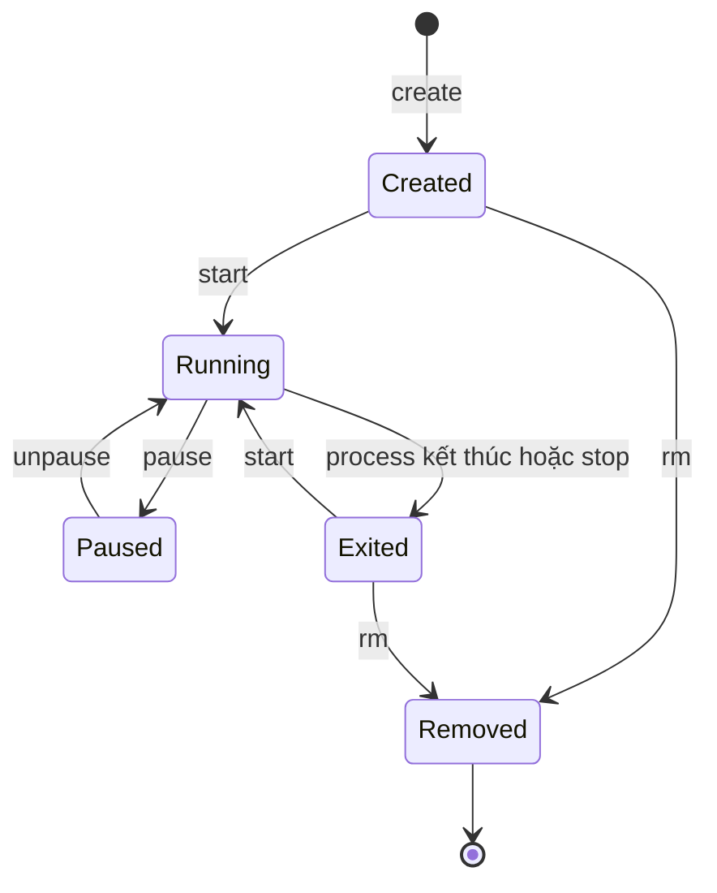

# 4. Docker Container

<a id="back-04-docker-container-container"></a>
<a id="back-04-docker-container-image"></a>
> **Tóm tắt một câu:** **[Container](../../reference/glossary.md#container)** là một runtime instance (bản thể lúc chạy) được tạo từ nội dung và cấu hình của **[Image](../../reference/glossary.md#image)**, cộng với thiết lập runtime và trạng thái ghi riêng; khi chạy, nó bao quanh các process được cô lập chứ không phải một máy ảo thu nhỏ.

> **Loại:** Explanation · **Cấp độ:** Beginner · **Thời gian:** Khoảng 30 phút<br>
> **Điều kiện:** Đã hiểu Image ở mức cơ bản<br>
> **Nguồn chính:** [What is a container?](https://docs.docker.com/get-started/docker-concepts/the-basics/what-is-a-container/) · [docker container](https://docs.docker.com/reference/cli/docker/container/)

> **Sau chapter này, bạn có thể:**
> - Định nghĩa Container qua Image, runtime settings, process và trạng thái ghi.
> - Giải thích isolation, resource controls và giới hạn của phép so sánh mini-VM.
> - Phân biệt `created`, `running`, `paused`, `exited`, `removed`, stop và remove.
> - Giải thích quan hệ một Image tạo nhiều Container và phạm vi của dữ liệu tạm thời.

[← 3. Docker Image](03-docker-image.md) · [Mục lục Foundation](README.md) · [5. Image và Container →](05-image-va-container.md)

---

## 1. Vấn đề cần giải quyết

Image cung cấp một điểm xuất phát có thể dùng lại: file ứng dụng, thư viện và các giá trị mặc định như command, environment hoặc working directory. Nhưng Image tự nó không có process đang chạy, không có trạng thái `running`, không nhận request và cũng không tạo ra một môi trường thực thi cụ thể.

Mỗi lần chạy, Docker còn phải xác định:

- Process nào được khởi động và còn sống hay không?
- Instance có tên, ID, environment và giới hạn tài nguyên nào?
- File được sửa nằm ở đâu và process nhìn thấy phạm vi hệ thống nào?
- Khi dừng hoặc xóa, trạng thái nào còn và trạng thái nào mất?

Container là object giúp Docker giữ các câu trả lời đó tách biệt cho từng lần chạy. Nếu chỉ hiểu Container là “Image đang chạy”, người học dễ bỏ qua cấu hình runtime, writable layer, vòng đời object và ranh giới cô lập.

## 2. Hiểu nhanh: một không gian làm việc được cấp từ mẫu

Hãy hình dung Image như mẫu phòng làm việc đã có dụng cụ và chỉ dẫn mặc định. Mỗi phòng được cấp từ mẫu có mã nhận diện, người đang làm việc, trạng thái mở/đóng và bảng nháp riêng. Nhiều phòng dùng cùng mẫu, nhưng chữ trên bảng của phòng này không tự xuất hiện ở phòng khác.

Giới hạn của phép so sánh: Container không sao chép vật lý toàn bộ Image. Docker thường dùng chung layer chỉ đọc và thêm trạng thái riêng. “Căn phòng” cũng không có kernel riêng; process vẫn dựa vào kernel của nền tảng runtime.

## 3. Định nghĩa chính xác

<a id="back-04-docker-container-instance"></a>
**[Instance](../../reference/glossary.md#instance)** là bản thể cụ thể từ một định nghĩa dùng lại được. Container là runtime instance được Docker tạo bằng ba nhóm đầu vào:

1. **Image content và configuration:** filesystem chỉ đọc cùng command, environment, working directory, user mặc định.
2. **Runtime settings:** tên, command ghi đè, environment, mount, cấu hình kết nối và giới hạn tài nguyên được chọn lúc tạo. Volume và Network được học sâu ở phần sau.
3. **Container state:** metadata vòng đời, process state và vùng ghi riêng.

Khi chạy, runtime khởi động process ban đầu theo cấu hình đã resolve. Process này có thể sinh process con hoặc có thêm process được chạy vào sau, nên “một Container bằng đúng một process” là cách rút gọn quá mức. Vòng đời chạy được tổ chức quanh process ban đầu: khi nó kết thúc và không có cơ chế khởi động lại can thiệp, Container chuyển sang `exited`.

Container vẫn là Docker object khi không có process đang chạy. Một Container ở `created` hoặc `exited` còn giữ ID, cấu hình đã resolve và writable layer cho đến khi bị remove.

## 4. Cơ chế tạo nên một Container

### 4.1 Process và cấu hình runtime

Docker kết hợp mặc định của Image với option runtime; giá trị lúc tạo có thể ghi đè một số mặc định mà không sửa Image. Mỗi Container có tên/ID và bản cấu hình riêng, nên hai Container từ cùng Image vẫn có thể chạy command, environment hoặc giới hạn tài nguyên khác nhau.

### 4.2 Filesystem chỉ đọc và writable layer

<a id="back-04-docker-container-filesystem"></a>
**[Filesystem](../../reference/glossary.md#filesystem)** của Container là cây thư mục được ghép từ layer chỉ đọc của Image, lớp ghi riêng và các mount nếu có.

<a id="back-04-docker-container-writable-layer"></a>
**[Writable layer](../../reference/glossary.md#writable-layer)** ghi nhận việc tạo, sửa hoặc xóa file không đi qua mount. Cơ chế copy-on-write cho process thấy một filesystem thống nhất trong khi Image vẫn không đổi.

Nếu `web-1` sửa `/tmp/result.txt`, thay đổi đó thuộc writable layer của `web-1`. `web-2` được tạo từ cùng Image có writable layer khác nên không tự thấy file này. Dừng `web-1` không xóa lớp ghi: khi start lại chính Container đó, file thường vẫn còn. Chỉ khi Container bị remove, writable layer gắn với object đó mới bị xóa.

> [!IMPORTANT]
> **Ephemeral Container state** là trạng thái tạm thời vì tuổi thọ của nó gắn với Container object, không phải vì mọi dữ liệu biến mất ngay khi process dừng. Stop giữ lại Container và writable layer; remove mới loại bỏ chúng.

Dữ liệu nghiệp vụ cần sống lâu hơn một Container không nên chỉ nằm trong writable layer. Docker cung cấp các cơ chế lưu trữ độc lập như Volume, nhưng cách tạo, mount và quản lý Volume thuộc phần Storage; chapter này chỉ thiết lập lý do cần chúng.

### 4.3 Isolation bằng cơ chế của hệ điều hành

**Isolation** (cô lập) cho process một góc nhìn riêng. Với Linux containers, runtime thường dùng **namespaces** để tách process ID, mount, network, hostname và một số tài nguyên liên tiến trình. Process có thể thấy PID `1` bên trong dù trên host nó có PID khác.

Isolation không đồng nghĩa với một kernel riêng hay ranh giới phần cứng tuyệt đối. Các Container Linux trên cùng môi trường runtime chia sẻ kernel Linux. Quyền quá rộng, cấu hình sai hoặc lỗ hổng kernel vẫn có thể làm suy yếu ranh giới này.

Trên Docker Desktop cho Windows hoặc macOS, Linux containers chạy trong môi trường Linux được quản lý, thường dựa trên virtual machine hoặc WSL 2. Windows containers dùng cơ chế của Windows. Vì vậy, namespaces là mô hình cho Linux containers, không phải tuyên bố mọi nền tảng triển khai giống hệt nhau.

### 4.4 Resource controls không tự xuất hiện như một giới hạn nhỏ

Với Linux, **cgroups** (control groups) giúp theo dõi và giới hạn CPU, memory hoặc số process. Nếu không đặt giới hạn phù hợp, Container vẫn có thể cạnh tranh tài nguyên với workload khác trên host hoặc virtual machine runtime quản lý.

Resource controls quản lý mức sử dụng; namespaces tách góc nhìn. Cả hai không tạo ra một máy ảo có kernel và phần cứng ảo riêng.

---

## 5. Vòng đời Container



Sơ đồ bắt đầu khi Docker tạo object. `Created` nghĩa cấu hình và filesystem đã sẵn sàng nhưng process chưa chạy. `Running` nghĩa process ban đầu hoạt động. `Paused` nghĩa runtime tạm treo process mà không kết thúc; unpause đưa nó về `running` với cùng process state.

`Exited` nghĩa process ban đầu đã kết thúc do tự thoát, lỗi hoặc stop. Start từ `exited` dùng cùng object, cấu hình và writable layer nhưng tạo một lần chạy process mới.

Trong giao tiếp hằng ngày, người dùng thường gọi Container ở `exited` là **stopped Container**. Tuy nhiên, `stopped` nên được hiểu là tình trạng “không chạy” hoặc kết quả của hành động stop; trường `.State.Status` mà Docker trả về thường là `exited`, không phải một object state riêng tên `stopped`.

`Removed` không phải trạng thái còn inspect được: object, tên/ID và writable layer đã bị xóa. Muốn chạy lại, Docker phải tạo Container mới từ Image.

> [!NOTE]
> Docker còn có thể hiển thị các trạng thái như `restarting`, `removing` hoặc `dead` trong những tình huống cụ thể. Chúng thuộc phân tích lifecycle chi tiết ở Part 02; sơ đồ trên giữ luồng nền tảng cần thiết cho người mới.

## 6. Một Image tạo nhiều Container độc lập

`web-1` và `web-2` có thể dùng chung Image `nginx:alpine`, nhưng mỗi Container có:

| Thành phần | `web-1` | `web-2` |
|---|---|---|
| Container ID và tên | Riêng | Riêng |
| Process và trạng thái vòng đời | Có thể `running` | Có thể `exited` |
| Runtime settings | Environment/giới hạn A | Environment/giới hạn B |
| Writable layer | Lớp ghi 1 | Lớp ghi 2 |

Dừng, start hoặc remove `web-1` không làm `web-2` đổi trạng thái. Writable layer 1 không sửa Image hay tự đi vào writable layer 2. Đây là quan hệ one-to-many: mỗi lần tạo sinh một object có runtime state riêng.

## 7. Quan sát vòng đời bằng Docker CLI

Các lệnh sau chỉ dùng để kiểm chứng mental model, không phải một tutorial vận hành Nginx. Cú pháp chung là `docker [GLOBAL OPTIONS] COMMAND [COMMAND OPTIONS] [ARGUMENTS]`.

### 7.1 Tạo và chạy một Container mới

Điều kiện trước: chưa có Container tên `container-demo`.

```bash
docker container run --name container-demo --detach nginx:alpine
```

| Token | Vai trò |
|---|---|
| `docker container` | Chọn nhóm object Container. |
| `run` | Tạo Container mới rồi start nó; không tái sử dụng một Container cũ. |
| `--name container-demo` | Option của `run`, đặt tên cho Container mới. |
| `--detach` | Option của `run`, để process chạy nền và trả Container ID về terminal. |
| `nginx:alpine` | Image reference dùng làm nguồn nội dung và cấu hình mặc định. |

Trước lệnh, Container chưa tồn tại. Sau lệnh, Docker tạo object, resolve cấu hình, thêm writable layer và khởi động process ở `running`. Nếu thiếu Image cục bộ, Docker có thể lấy Image trước; luồng Registry thuộc phần sau.

### 7.2 Kiểm tra Image origin và runtime state

```bash
docker container inspect --format 'Image={{.Image}}; Status={{.State.Status}}; Running={{.State.Running}}; Paused={{.State.Paused}}' container-demo
```

`inspect` trả metadata; `--format` chọn bốn trường cần đọc. Output có dạng `Image=sha256:...; Status=running; Running=true; Paused=false`. `Image` giữ Image ID nguồn; các trường state xác nhận Container đang chạy và không pause. Lệnh chỉ đọc.

### 7.3 Stop không phải remove

```bash
docker container stop container-demo
```

`stop` là action; `container-demo` là argument mục tiêu. Với Linux containers, Docker gửi stop signal đã cấu hình, thường là `SIGTERM`, chờ timeout rồi có thể buộc kết thúc; chi tiết khác theo cấu hình và nền tảng.

Sau stop, mẫu inspect ở mục 7.2 cho `Status=exited` và `Running=false`. Object, cấu hình và writable layer vẫn còn, nên `docker container start container-demo` chạy lại chính Container đó.

### 7.4 Cleanup bằng remove

> [!WARNING]
> Remove xóa Container object và writable layer của nó. Dữ liệu chỉ nằm trong lớp ghi này không có cơ chế hoàn tác từ Docker; chỉ cleanup demo khi không có dữ liệu cần giữ.

```bash
docker container rm container-demo
```

`rm` nhận tên Container đã dừng. Trước lệnh, object ở `exited`; sau lệnh, nó đã “removed” và không thể start. Output in `container-demo`; inspect tiếp báo `No such container`. Image `nginx:alpine` vẫn có thể tạo Container khác.

---

## 8. Quan niệm dễ gây hiểu nhầm

### 8.1 “Container là một mini-VM.”

- **Phân loại:** Phép so sánh hữu ích nhưng có giới hạn lớn.
- **Vì sao nghe hợp lý:** Container có filesystem, process, hostname và network view riêng, tạo cảm giác như một máy độc lập.
- **Lỗi kỹ thuật:** Container không boot guest operating system hoàn chỉnh. Linux containers chia sẻ kernel của môi trường Linux chạy Docker; trên Docker Desktop, môi trường đó có thể nằm trong VM hoặc WSL 2.
- **Cách nói tốt hơn:** “Container là môi trường process được cô lập ở mức hệ điều hành; VM cô lập một hệ điều hành khách cùng kernel riêng.”
- **Cách kiểm chứng:** `docker container inspect` hiển thị cấu hình và process state, không mô tả virtual disk hay guest kernel như VM.

### 8.2 “Container lưu mọi dữ liệu bền vững một cách an toàn.”

- **Phân loại:** Sai vì nhầm filesystem nhìn thấy được với tuổi thọ dữ liệu.
- **Vì sao nghe hợp lý:** File có thể còn sau stop và start, nên có vẻ đã bền vững.
- **Lỗi kỹ thuật:** File không đi qua mount nằm trong writable layer, sống cùng Container và bị xóa khi remove.
- **Cách nói tốt hơn:** “Writable layer giữ thay đổi trong tuổi thọ Container; dữ liệu cần sống độc lập phải dùng cơ chế lưu trữ phù hợp được học ở phần Volume.”
- **Cách kiểm chứng:** Stop/start có thể vẫn thấy file; remove rồi tạo Container mới từ cùng Image không khôi phục nó.

### 8.3 “Stop Container nghĩa là xóa Container.”

- **Phân loại:** Sai do gộp hai action lifecycle.
- **Vì sao nghe hợp lý:** Sau stop, ứng dụng không phục vụ và danh sách mặc định ẩn Container đã thoát.
- **Lỗi kỹ thuật:** Stop chuyển Container sang `exited`; remove mới xóa object. Bị ẩn khỏi danh sách mặc định không có nghĩa đã bị xóa.
- **Cách nói tốt hơn:** “Stop giữ object để có thể start lại; remove loại bỏ object và writable layer.”
- **Cách kiểm chứng:** Sau stop, `docker container inspect container-demo` vẫn thành công; sau remove, cùng lệnh báo `No such container`.

### 8.4 “Container có thể tồn tại mà không có nguồn gốc Image.”

- **Phân loại:** Sai nếu nói về cách Docker tạo Container; có phần dễ nhầm khi Tag nguồn không còn.
- **Vì sao nghe hợp lý:** Container có filesystem riêng, còn Tag nguồn có thể bị đổi hoặc xóa.
- **Lỗi kỹ thuật:** Docker tạo Container từ Image và lưu Image ID trong metadata. Tag biến mất không xóa quan hệ nguồn gốc.
- **Cách nói tốt hơn:** “Mọi Docker Container có Image origin khi được tạo; reference dễ đọc có thể thay đổi, còn metadata vẫn ghi Image ID đã dùng.”
- **Cách kiểm chứng:** Trường `.Image` trong `docker container inspect` cho thấy Image ID nguồn ngay cả khi người dùng không nhớ Tag ban đầu.

## 9. Tự kiểm tra mental model

1. Vì sao câu “Container là Image đang chạy” chưa đủ để mô tả runtime settings và writable layer?
2. Một Container đã stop có còn file được ghi vào writable layer không? Sự kiện nào làm layer đó biến mất?
3. Vì sao process trong Linux Container có thể thấy PID `1` nhưng Container vẫn không có kernel riêng?
4. Nếu `web-1` và `web-2` cùng được tạo từ một Image, những phần nào có thể dùng chung và những phần nào bắt buộc độc lập?
5. Sau `docker container stop`, vì sao `docker container start` và `docker container run` không tương đương?

## 10. Tóm tắt

1. Container là runtime instance được tạo từ Image content/configuration, runtime settings và trạng thái riêng.
2. Khi chạy, Container tổ chức một hoặc nhiều process quanh process ban đầu; khi process ban đầu kết thúc, trạng thái thường chuyển thành `exited`.
3. Namespaces và resource controls tạo cô lập cùng kiểm soát tài nguyên ở mức hệ điều hành; Container không phải một VM có kernel riêng.
4. Writable layer là vùng ghi riêng của từng Container: stop giữ nó, remove xóa nó. Dữ liệu cần bền hơn Container thuộc phạm vi Volume ở phần sau.
5. Một Image có thể tạo nhiều Container với ID, lifecycle, cấu hình runtime và writable layer độc lập.

## 11. Học tiếp

- Đọc [5. Image và Container](05-image-va-container.md) để đặt hai object cạnh nhau, phân biệt create, run, start, stop, remove và recreate trong một mental model thống nhất.
- Quay lại [Mục lục Foundation](README.md) để xem vị trí của chapter trong lộ trình nền tảng.
- Dùng [Docker Glossary](../../reference/glossary.md) khi cần tra lại định nghĩa ổn định của Container, Image, Instance, Filesystem và Writable layer.

## Tài liệu tham khảo

- Docker Docs, [What is a container?](https://docs.docker.com/get-started/docker-concepts/the-basics/what-is-a-container/)
- Docker CLI Reference, [docker container](https://docs.docker.com/reference/cli/docker/container/)
- Docker CLI Reference, [docker container run](https://docs.docker.com/reference/cli/docker/container/run/)
- Docker CLI Reference, [docker container inspect](https://docs.docker.com/reference/cli/docker/container/inspect/)
- Docker CLI Reference, [docker container pause](https://docs.docker.com/reference/cli/docker/container/pause/)
- Docker CLI Reference, [docker container stop](https://docs.docker.com/reference/cli/docker/container/stop/)
- Docker CLI Reference, [docker container rm](https://docs.docker.com/reference/cli/docker/container/rm/)
- Docker Docs, [Resource constraints](https://docs.docker.com/engine/containers/resource_constraints/)

[← 3. Docker Image](03-docker-image.md) · [Mục lục Foundation](README.md) · [5. Image và Container →](05-image-va-container.md)
