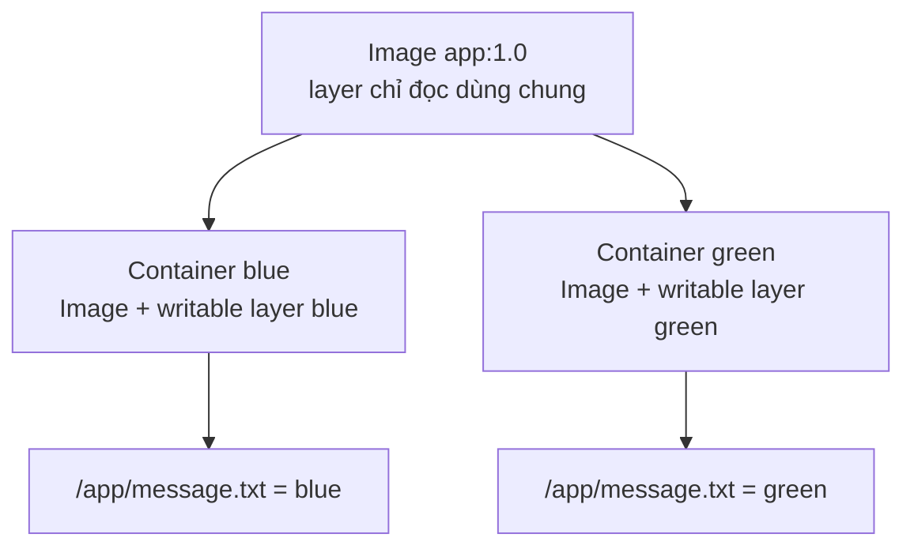
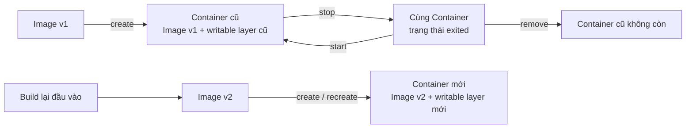

# 5. Image và Container

> **Tóm tắt một câu:** Image là đầu vào dùng lại được và giữ nội dung chung; mỗi Container là một lần hiện thực hóa đầu vào đó với danh tính, trạng thái vòng đời và phần ghi riêng.

> **Loại:** Explanation · **Cấp độ:** Beginner · **Thời gian:** Khoảng 25 phút · **Điều kiện:** Đã đọc chapter 3 và 4<br>
> **Nguồn chính:** [What is an image?](https://docs.docker.com/get-started/docker-concepts/the-basics/what-is-an-image/) · [What is a container?](https://docs.docker.com/get-started/docker-concepts/the-basics/what-is-a-container/) · [docker container](https://docs.docker.com/reference/cli/docker/container/) · [docker image rm](https://docs.docker.com/reference/cli/docker/image/rm/)

> **Sau chapter này, bạn có thể:**
> - So sánh Image và Container theo nội dung, danh tính, trạng thái và vòng đời thay vì chỉ học hai định nghĩa rời rạc.
> - Giải thích vì sao một Image tạo được nhiều Container có trạng thái ghi khác nhau.
> - Phân biệt dừng, khởi động lại, xóa và tạo lại Container.
> - Dự đoán điều gì còn, điều gì mất khi rebuild Image, recreate Container hoặc xóa một trong hai object.

[← 4. Docker Container](04-docker-container.md) · [Mục lục Foundation](README.md) · [6. Bức tranh tổng thể →](06-buc-tranh-tong-the.md)

---

## 1. Vấn đề cần giải quyết

Sau khi học riêng từng object, người mới thường vẫn gặp một nhóm câu hỏi có quan hệ với nhau:

- Nếu Container được tạo từ Image, nó là bản sao của Image hay vẫn dùng chung Image?
- Hai Container từ cùng một Image có nhìn thấy file mà bên kia vừa sửa không?
- Dừng rồi chạy lại có tạo Container mới không?
- Rebuild Image có cập nhật Container đang tồn tại không?
- Xóa Container có làm mất Image, và xóa Image có làm Container biến mất không?

Các câu hỏi này cần một mental model kết hợp, tách rõ nội dung dùng chung, trạng thái riêng và quan hệ vòng đời giữa hai Docker object.

<a id="back-05-image-va-container-image"></a>
**[Image](../../reference/glossary.md#image)** là đầu vào tái sử dụng được, cung cấp layer filesystem chỉ đọc và cấu hình mặc định. <a id="back-05-image-va-container-container"></a>
**[Container](../../reference/glossary.md#container)** là object được tạo từ một Image đã resolve thành Image ID, có ID hoặc tên, cấu hình runtime, trạng thái vòng đời và phần ghi riêng.

Điểm quan trọng là quan hệ này bất đối xứng. Container cần Image để được tạo, nhưng Image không “sở hữu” một Container duy nhất. Một Image có thể là đầu vào cho số lượng Container khác nhau; mỗi Container lại có vòng đời riêng.

## 2. Hiểu nhanh: đầu vào dùng lại và lần chạy cụ thể

### 2.1 Phép so sánh: mẫu in và các bản làm việc

Có thể hình dung Image như mẫu tài liệu được khóa nội dung. Nhiều bản làm việc bắt đầu từ mẫu đó nhưng có tên, trạng thái và ghi chú riêng. Ghi chú trên bản A không tự xuất hiện trên bản B hoặc sửa ngược mẫu.

Giới hạn của phép so sánh: Docker không nhất thiết sao chép toàn bộ byte Image cho từng Container. Các layer có thể được dùng chung ở dạng chỉ đọc; Container bổ sung phần ghi, metadata, process và trạng thái như `created`, `running` hoặc `exited`.

### 2.2 Ba trục cần giữ tách biệt

1. **Template/input so với runtime instance:** Image cung cấp điểm xuất phát; Container là lần hiện thực hóa cụ thể có thể chạy process.
2. **Nội dung chỉ đọc dùng chung so với trạng thái ghi riêng:** nhiều Container có thể dùng chung layer Image, nhưng mỗi Container nhận thay đổi filesystem riêng.
3. **Danh tính tái sử dụng so với trạng thái vòng đời:** Image được nhận diện như nội dung có thể dùng nhiều lần; Container có ID, tên, thời điểm tạo, trạng thái chạy và exit code riêng.

“Riêng” không có nghĩa là không liên quan. Container vẫn ghi lại Image ID nguồn; “vòng đời riêng” chỉ có nghĩa thao tác lên một object không mặc nhiên áp dụng cùng thao tác lên object kia.

## 3. Mô hình chính xác

### 3.1 Bảng so sánh trực tiếp

| Khía cạnh | Image | Container | Quan hệ cần nhớ |
|---|---|---|---|
| Vai trò | Đầu vào chuẩn hóa để tạo môi trường chạy | Runtime instance cụ thể được tạo từ Image | Một Image có thể tạo nhiều Container |
| Danh tính | Image ID; có thể được tham chiếu bằng Tag hoặc Digest | Container ID và tên riêng | Hai Container từ cùng Image vẫn là hai object khác nhau |
| Nội dung filesystem | Các layer chỉ đọc dùng chung | Góc nhìn từ layer Image cộng phần ghi riêng | Container không sửa layer Image tại chỗ |
| Cấu hình | Giá trị mặc định như command, environment, user, working directory | Giá trị runtime đã resolve, có thể ghi đè mặc định | Thay option lúc tạo Container không tạo Image mới |
| Process | Không có process đang chạy | Có process chính khi ở trạng thái chạy | Chỉ Container có trạng thái `running` và exit code |
| Trạng thái vòng đời | Không có `created`, `running`, `exited` | Có lifecycle state và thời điểm tạo riêng | Dừng Container không biến nó thành Image |
| Thay đổi khi ghi file | Không đổi | Ghi vào phần lưu trữ của Container, trừ đường dẫn được mount | Hai Container có thể phân kỳ dù cùng điểm xuất phát |
| Rebuild/recreate | Rebuild tạo nội dung Image mới | Recreate tạo Container object mới | Không thao tác nào tự cập nhật object cũ tại chỗ |
| Xóa | Xóa reference hoặc nội dung Image khi không bị ràng buộc cản trở | Xóa object và writable layer của Container | Xóa Container không tự xóa Image; xóa Image có thể bị chặn bởi Container phụ thuộc |

Bảng cho thấy đây không chỉ là so sánh file với process: Image có configuration và metadata; Container có filesystem view, cấu hình runtime, danh tính và lifecycle state.

### 3.2 Công thức mental model

Có thể mô tả góc nhìn filesystem của một Container bằng công thức khái niệm:

```text
Filesystem Container = layer Image chỉ đọc dùng chung + writable layer riêng
```

<a id="back-05-image-va-container-writable-layer"></a>
**[Writable layer](../../reference/glossary.md#writable-layer)** là lớp ghi gắn với một Container. Khi process tạo hoặc sửa file, thay đổi được thể hiện trong lớp ghi đó; layer Image bên dưới giữ nguyên. Storage driver có thể dùng copy-on-write, tức chỉ tạo phần thay đổi khi cần, nhưng chi tiết lưu byte nằm ngoài Foundation.

Nếu đường dẫn dùng mount, dữ liệu có thể đi vào vùng lưu trữ bên ngoài thay vì writable layer. Volume và Bind Mount được giải thích ở phần Storage sau.

## 4. Cơ chế một Image tạo nhiều Container



Sơ đồ đọc từ trên xuống. Hai mũi tên từ `Image app:1.0` biểu diễn hai lần tạo Container, không phải hai lần sửa Image. `blue` và `green` cùng đọc nội dung ban đầu từ các layer Image, nhưng mỗi bên có writable layer riêng. Hai node cuối cho thấy cùng một đường dẫn có thể resolve thành nội dung khác nhau trong hai Container vì lớp trên cùng của mỗi góc nhìn khác nhau.

### 4.1 Kịch bản phân kỳ trạng thái

Giả sử Image `app:1.0` chứa `/app/message.txt` với nội dung `base`.

1. Docker tạo Container `blue` và `green` từ cùng Image ID. Ban đầu, cả hai đọc `base`.
2. Process trong `blue` ghi `blue` vào `/app/message.txt`. Góc nhìn của `blue` giờ ưu tiên thay đổi trong writable layer của nó.
3. `green` chưa ghi đường dẫn đó nên vẫn đọc `base` từ Image. Image nguồn cũng vẫn chứa `base`.
4. Nếu `green` ghi `green`, hai Container cùng đường dẫn nhưng thấy hai giá trị khác nhau: `blue` và `green`.

Có thể kiểm chứng bằng `docker container inspect blue` và `docker container inspect green`: Container ID khác nhau nhưng trường Image có thể giống nhau. `docker container diff` trên từng Container cho thấy thay đổi độc lập. Docker vì thế vừa tái sử dụng nội dung Image chung, vừa giữ trạng thái ghi riêng.

## 5. Rebuild Image và recreate Container

**Rebuild** và **recreate** giải quyết hai loại thay đổi:

- Rebuild tạo Image mới từ đầu vào đóng gói đã thay đổi. Tag có thể chuyển sang Image mới, nhưng Image cũ không bị sửa tại chỗ.
- Recreate thay Container cũ bằng object mới từ Image được chọn lúc đó.



Nhánh trên giữ cùng Container: `stop` đổi trạng thái, `start` chạy lại, còn `remove` mới xóa object. Nhánh dưới tạo `Image v2` rồi tạo Container mới; rebuild không “nâng cấp” Container cũ.

Nếu Tag `app:latest` trước đây trỏ tới Image v1 và sau đó trỏ tới Image v2, Container cũ vẫn ghi nhận Image ID v1. Khởi động lại Container cũ không resolve Tag lần nữa. Muốn dùng v2, cần tạo Container mới từ reference hiện tại hoặc từ Digest/ID mong muốn.

## 6. Câu hỏi vòng đời và xóa object

### 6.1 Dừng Container: điều gì còn?

`docker container stop` kết thúc process chính nhưng giữ Container ID, tên, cấu hình runtime và writable layer. `docker container start` vì vậy chạy lại cùng object; dừng không reset Container về trạng thái ban đầu của Image.

### 6.2 Xóa rồi tạo lại: điều gì đổi?

`docker container rm` xóa object và writable layer của nó; Container đã remove không thể `start` lại. Tạo lại từ cùng Image cho ID, thời điểm tạo và writable layer mới, với điểm xuất phát lấy lại từ Image.

> [!WARNING]
> Dữ liệu chỉ tồn tại trong writable layer sẽ mất khi Container bị xóa. Dùng lại cùng tên Container không khôi phục object cũ hoặc dữ liệu cũ. Cơ chế giữ dữ liệu độc lập với vòng đời Container thuộc phần Storage sau.

### 6.3 Xóa Container có xóa Image không?

Không. `docker container rm` nhắm vào Container name hoặc ID; Image vẫn có thể được inspect và dùng để tạo Container khác. Bỏ một instance không xóa đầu vào dùng chung.

### 6.4 Xóa Image khi còn Container phụ thuộc thì sao?

Chiều ngược lại có ràng buộc. Khi `docker image rm` nhắm vào Image đang được Container tham chiếu, Docker có thể báo conflict; cả Container chạy và Container đã dừng đều có thể cản thao tác thông thường. Nếu nội dung có nhiều Tag hoặc reference, lệnh cũng có thể chỉ untag một reference.

Mental model an toàn là kiểm tra Container phụ thuộc, dừng và xóa object không còn cần, rồi mới xóa Image. `--force` thay đổi cách xử lý một số reference hoặc conflict nhưng không có nghĩa Docker tự quản lý toàn bộ Container liên quan.

Vì vậy hai object có vòng đời riêng nhưng không hoàn toàn không phụ thuộc: xóa Container không kéo theo Image; còn xóa Image phải tôn trọng các quan hệ sử dụng mà Docker đang theo dõi.

---

## 7. Quan niệm dễ gây hiểu nhầm

### 7.1 “Restart và recreate đều chỉ là chạy lại ứng dụng.”

- **Phân loại:** Đúng ở mục tiêu bề mặt, sai về danh tính và dữ liệu.
- **Vì sao nghe hợp lý:** Cả hai cuối cùng đều có thể tạo process đang chạy.
- **Lỗi kỹ thuật:** Restart giữ Container ID và writable layer; recreate tạo Container ID và writable layer mới, đồng thời có thể dùng Image hoặc cấu hình mới.
- **Cách nói tốt hơn:** “Restart tiếp tục vòng đời của object hiện tại; recreate thay object hiện tại bằng một object mới.”
- **Cách kiểm chứng:** Ghi lại `docker container inspect --format '{{.Id}}'` trước và sau. Restart giữ ID; recreate đổi ID.

### 7.2 “Sửa file trong một Container sẽ cập nhật Image và các Container cùng Image.”

- **Phân loại:** Sai do bỏ qua writable layer riêng.
- **Vì sao nghe hợp lý:** Container nhìn thấy một cây filesystem hợp nhất nên thay đổi trông như sửa trực tiếp file gốc.
- **Lỗi kỹ thuật:** Thay đổi không ghi ngược vào layer Image và không đi vào writable layer của Container khác.
- **Cách nói tốt hơn:** “Mỗi Container phủ thay đổi riêng lên nội dung Image chỉ đọc; các góc nhìn có thể phân kỳ.”
- **Cách kiểm chứng:** So sánh `docker container diff` của hai Container và đọc cùng đường dẫn trong từng Container.

### 7.3 “Rebuild Image hoặc cập nhật Tag sẽ tự nâng cấp Container đang chạy.”

- **Phân loại:** Sai do nhầm reference hiện tại với Image ID đã resolve lúc tạo Container.
- **Vì sao nghe hợp lý:** Container ban đầu được tạo bằng chuỗi như `app:latest`, và chuỗi đó nay trỏ tới bản mới.
- **Lỗi kỹ thuật:** Container cũ vẫn gắn với Image ID đã dùng khi create; restart không tạo lại quan hệ từ Tag.
- **Cách nói tốt hơn:** “Rebuild tạo Image mới; muốn Container dùng Image mới phải recreate từ reference hoặc ID mong muốn.”
- **Cách kiểm chứng:** So sánh trường `.Image` của Container cũ với ID mà `docker image inspect app:latest` hiện trả về.

### 7.4 “Image và Container độc lập, nên xóa bên nào trước cũng như nhau.”

- **Phân loại:** Đúng một phần về vòng đời, sai về ràng buộc phụ thuộc.
- **Vì sao nghe hợp lý:** Xóa Container không xóa Image, nên có vẻ hai object không liên quan sau khi create.
- **Lỗi kỹ thuật:** Docker vẫn theo dõi Image ID của Container và có thể từ chối xóa Image đang được Container dùng. Thứ tự xóa cũng quyết định dữ liệu writable layer còn hay mất.
- **Cách nói tốt hơn:** “Hai object có vòng đời riêng nhưng có quan hệ phụ thuộc: thường xóa Container không cần trước, rồi mới xóa Image.”
- **Cách kiểm chứng:** `docker image rm` báo conflict khi còn quan hệ sử dụng phù hợp; sau khi remove Container phụ thuộc, thao tác xóa Image có thể tiếp tục nếu không còn reference hoặc conflict khác.

## 8. Tự kiểm tra mental model

1. Hai Container có cùng trường Image ID nhưng đọc `/app/message.txt` ra hai giá trị khác nhau. Điều đó có mâu thuẫn không? Phần nào giải thích sự khác biệt?
2. Vì sao stop rồi start thường giữ file đã ghi trong Container, còn remove rồi create lại từ cùng Image thì không?
3. Tag `app:latest` chuyển từ Image v1 sang v2. Tại sao Container cũ vẫn có thể chạy v1 sau khi restart?
4. Xóa Container `blue` tác động thế nào đến Container `green` và Image chung?
5. Vì sao nói “Image và Container có vòng đời riêng” không đồng nghĩa với “xóa Image lúc nào cũng được”?

## 9. Tóm tắt

1. Image là đầu vào có nội dung chỉ đọc và danh tính dùng lại được; Container là runtime instance có ID, cấu hình, lifecycle state và phần ghi riêng.
2. Một Image có thể tạo nhiều Container. Chúng dùng chung điểm xuất phát nhưng writable layer riêng cho phép trạng thái filesystem phân kỳ.
3. Stop/start giữ cùng Container; remove/create tạo object mới. Dùng lại cùng tên không làm object mới trở thành object cũ.
4. Rebuild tạo Image mới và không tự cập nhật Container hiện có. Muốn dùng Image mới cần recreate Container.
5. Xóa Container không tự xóa Image; xóa Image có thể bị chặn bởi Container phụ thuộc hoặc chỉ gỡ một reference thay vì xóa nội dung.

## 10. Học tiếp

- Đọc [6. Bức tranh tổng thể](06-buc-tranh-tong-the.md) để đặt Dockerfile, Image, Container, Registry, Volume và Network vào một luồng chung ở mức nhận biết.
- Quay lại [Mục lục Foundation](README.md) để kiểm tra thứ tự và mục tiêu hoàn thành của phần nền tảng.
- Dùng [Docker Glossary](../../reference/glossary.md) khi cần tra lại định nghĩa ổn định của Image, Container và Writable layer.

## Tài liệu tham khảo

- Docker Docs, [What is an image?](https://docs.docker.com/get-started/docker-concepts/the-basics/what-is-an-image/)
- Docker Docs, [What is a container?](https://docs.docker.com/get-started/docker-concepts/the-basics/what-is-a-container/)
- Docker Docs, [Understanding the image layers](https://docs.docker.com/get-started/docker-concepts/building-images/understanding-image-layers/)
- Docker CLI Reference, [docker container](https://docs.docker.com/reference/cli/docker/container/)
- Docker CLI Reference, [docker container stop](https://docs.docker.com/reference/cli/docker/container/stop/)
- Docker CLI Reference, [docker container start](https://docs.docker.com/reference/cli/docker/container/start/)
- Docker CLI Reference, [docker container rm](https://docs.docker.com/reference/cli/docker/container/rm/)
- Docker CLI Reference, [docker image rm](https://docs.docker.com/reference/cli/docker/image/rm/)

[← 4. Docker Container](04-docker-container.md) · [Mục lục Foundation](README.md) · [6. Bức tranh tổng thể →](06-buc-tranh-tong-the.md)
