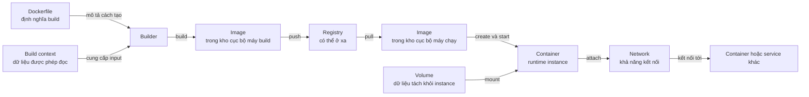

# 6. Bức tranh tổng thể

> **Tóm tắt một câu:** Docker nối mô tả build, dữ liệu đầu vào, nội dung Image, nơi phân phối, runtime instance, dữ liệu bền vững và kết nối thành một chuỗi có các object riêng biệt, mỗi object giải quyết một phần khác nhau của vòng đời ứng dụng.

> **Loại:** Explanation · **Cấp độ:** Beginner · **Thời gian:** Khoảng 30 phút<br>
> **Nguồn chính:** [Docker overview](https://docs.docker.com/get-started/docker-overview/) · [Building images](https://docs.docker.com/get-started/docker-concepts/building-images/) · [Running containers](https://docs.docker.com/get-started/docker-concepts/running-containers/) · [What is a registry?](https://docs.docker.com/get-started/docker-concepts/the-basics/what-is-a-registry/) · [Storage overview](https://docs.docker.com/engine/storage/) · [Networking overview](https://docs.docker.com/engine/network/)

> **Sau chapter này, bạn có thể:**
> - Kể lại luồng từ Dockerfile và build context đến Image, Registry và Container.
> - Giải thích vì sao Volume và Network được gắn ở runtime thay vì trở thành nội dung ứng dụng trong Image.
> - Phân loại object nào là định nghĩa, nội dung bất biến, runtime instance, dữ liệu bền vững hoặc khả năng kết nối.
> - Xác định object thường nằm ở máy cục bộ, object có thể ở xa và object thuộc về Docker host đang chạy Container.
> - Dùng một ví dụ Spring Boot để nối các khái niệm mà chưa cần học sâu cú pháp Dockerfile, Compose hay vận hành production.

[← 5. Image và Container](05-image-va-container.md) · [Mục lục Foundation](README.md)

---

## 1. Vấn đề cần giải quyết

Sau các chapter trước, từng khái niệm có thể đã rõ riêng lẻ. Khó khăn tiếp theo là ghép chúng thành một hệ thống thống nhất. Với một ứng dụng Spring Boot, mã nguồn phải trở thành artifact chạy được; artifact cần Java runtime; kết quả phải đến máy chạy; process cần dữ liệu và kết nối tới dịch vụ khác. Nếu gọi tất cả là “Docker container”, ta khó trả lời chính xác:

- Khi mã nguồn thay đổi, object nào phải được tạo lại?
- Khi đổi máy triển khai, nội dung nào cần được chuyển qua mạng?
- Khi Container bị xóa và tạo lại, dữ liệu nào còn tồn tại?
- Khi hai Container cần nói chuyện, quan hệ đó nằm trong Image hay được thiết lập lúc chạy?
- Khi không có Registry, Image cục bộ có chạy được không?

Docker chia vòng đời thành các trách nhiệm riêng: mô tả build, input của build, nội dung được tạo, nơi phân phối, instance đang chạy, dữ liệu độc lập và kết nối runtime.

## 2. Hiểu nhanh: từ bản thiết kế đến hệ thống đang chạy

Có thể hình dung luồng Docker như quá trình đóng gói và vận hành một sản phẩm:

1. Dockerfile giống bản mô tả cách đóng gói.
2. Build context là phạm vi nguyên liệu mà bộ phận đóng gói được phép lấy.
3. Image là gói thành phẩm đã niêm phong, có thể dùng lại.
4. Registry là kho phân phối các gói thành phẩm.
5. Container là một lần sản phẩm được đưa vào hoạt động trên một máy cụ thể.
6. Volume là vùng dữ liệu được giữ tách khỏi vòng đời của lần chạy đó.
7. Network là cơ chế tạo đường liên lạc giữa Container và các endpoint khác.

Giới hạn của phép so sánh: Image không chỉ là một hộp nén; build context không phải toàn bộ ổ đĩa; Registry có thể ở xa hoặc trong hạ tầng riêng; Volume không tự là backup; Network không đồng nghĩa với Internet.

> [!IMPORTANT]
> Hãy giữ hai luồng tách biệt trong đầu: **build và phân phối nội dung** tạo hoặc di chuyển Image; **runtime** tạo Container rồi gắn dữ liệu và kết nối. Đổi Volume hay Network không tự sửa Image, còn build Image mới không tự di chuyển dữ liệu đang nằm trong Volume.

## 3. Mô hình chính xác của từng thành phần

<a id="back-06-buc-tranh-tong-the-dockerfile"></a>
**[Dockerfile](../../reference/glossary.md#dockerfile)** — file văn bản chứa instruction để builder tạo Image filesystem và cấu hình mặc định. Nó là định nghĩa build, không phải Image hay chương trình đang chạy. Cú pháp chi tiết thuộc Part 04: Dockerfile.

<a id="back-06-buc-tranh-tong-the-build-context"></a>
**[Build context](../../reference/glossary.md#build-context)** — tập dữ liệu builder được phép dùng. Context thường là thư mục cục bộ, nhưng cũng có thể đến từ Git repository, URL hoặc nguồn khác. Dockerfile mô tả hành động; context cung cấp dữ liệu cho hành động đó.

<a id="back-06-buc-tranh-tong-the-image"></a>
**[Image](../../reference/glossary.md#image)** — nội dung chỉ đọc gồm filesystem layer và cấu hình runtime mặc định. Image có thể nằm trong kho cục bộ, Registry hoặc cả hai. Build tạo Image; runtime dùng Image để tạo object khác.

<a id="back-06-buc-tranh-tong-the-registry"></a>
**[Registry](../../reference/glossary.md#registry)** — dịch vụ lưu trữ và phân phối Image qua mạng. Docker Hub là một Registry phổ biến nhưng không phải Registry duy nhất. Registry lưu nội dung Image; nó không chạy process ứng dụng.

<a id="back-06-buc-tranh-tong-the-container"></a>
**[Container](../../reference/glossary.md#container)** — runtime instance được tạo từ Image, có ID hoặc tên, cấu hình, trạng thái và writable layer riêng. Container dừng vẫn có thể tồn tại; khi bị xóa, writable layer của nó cũng bị loại bỏ.

**Volume** — vùng lưu trữ tách khỏi writable layer. Volume có thể được mount vào Container và thường sống lâu hơn instance, nhưng vẫn có thể bị xóa riêng và không tự là backup.

**Network** — object và cơ chế runtime tạo kết nối giữa Container với endpoint khác. Metadata cổng trong Image không tự tạo đường truyền, mở firewall hay kết nối ứng dụng tới database.

## 4. Luồng build, distribute, run, data và connect



Sơ đồ đọc từ trái sang phải. Mỗi mũi tên là một quan hệ riêng:

1. `Dockerfile -> Builder`: Dockerfile mô tả instruction cần xử lý; builder không chạy ứng dụng như Container.
2. `Build context -> Builder`: context cung cấp file được phép đọc. Yêu cầu chép `app.jar` chỉ thành công khi file thuộc context phù hợp.
3. `Builder -> Image cục bộ`: build tạo nội dung Image và cấu hình mặc định, chưa tạo process.
4. `Image cục bộ -> Registry`: push phân phối nội dung. Xác thực, naming và delivery thuộc Part 06.
5. `Registry -> Image trên máy chạy`: pull đưa Image vào kho cục bộ của host đích. Image build ngay trên host không bắt buộc đi qua Registry.
6. `Image -> Container`: create/run tạo instance mới; Image vẫn độc lập và có thể tạo thêm instance.
7. `Volume -> Container`: mount làm dữ liệu xuất hiện tại một path trong Container nhưng không biến dữ liệu đó thành Image layer.
8. `Container -> Network`: runtime gắn Container vào Network và cấp endpoint; quan hệ này không phải nội dung bất biến của Image.
9. `Network -> service khác`: Network tạo đường liên lạc; ứng dụng vẫn cần đúng địa chỉ, cổng, protocol và thông tin xác thực.

Không phải ứng dụng nào cũng dùng toàn bộ sơ đồ. Máy có thể build rồi chạy Image cục bộ; Container stateless có thể không cần Volume; batch độc lập có thể không cần giao tiếp với Container khác.

---

## 5. Object nằm ở đâu và mang loại trạng thái nào?

| Thành phần | Thường tồn tại ở đâu? | Bản chất chính | Có sống độc lập với Container? |
|---|---|---|---|
| Dockerfile | Source repository hoặc filesystem của nhóm phát triển | Định nghĩa build dạng văn bản | Có; nó tồn tại trước và sau mọi lần chạy |
| Build context | Máy gọi build hoặc nguồn từ xa được chọn | Tập input cho một lần build | Có; nhưng context không phải Docker object runtime |
| Image cục bộ | Kho nội dung do Docker host quản lý | Nội dung chỉ đọc và cấu hình mặc định | Có; một Image tạo được nhiều Container |
| Image trong Registry | Dịch vụ Registry, thường truy cập qua mạng | Nội dung phân phối được tham chiếu bằng tên, Tag hoặc Digest | Có; Registry không phụ thuộc một Container tiêu thụ cụ thể |
| Container | Docker host nơi instance được tạo | Runtime instance và trạng thái vòng đời | Không theo nghĩa tồn tại trước khi được tạo; nó phụ thuộc Image nguồn lúc tạo |
| Volume | Docker host hoặc hệ thống lưu trữ do volume driver kết nối | Dữ liệu bền hơn writable layer của Container | Có; có thể tồn tại sau khi Container bị xóa |
| Network | Docker host hoặc phạm vi do network driver quản lý | Kết nối và endpoint runtime | Có thể tồn tại khi chưa có Container gắn vào |

“Cục bộ” được hiểu theo Docker daemon mà client điều khiển, không nhất thiết theo máy đặt cửa sổ terminal. Với Docker Desktop, daemon thường ở môi trường Linux được quản lý; với Docker context từ xa, object có thể nằm trên host khác.

Image có thể được sao chép giữa các kho. Container là instance tại host chạy, Volume giữ dữ liệu, còn Network giữ quan hệ kết nối. Chúng không trở thành thành phần bất biến của Image.

## 6. Ví dụ Spring Boot dùng lại được

Xét dịch vụ Spring Boot `order-api`. Sau Java build, nhóm có executable JAR `order-api.jar`. Luồng Docker ở mức khái niệm:

1. Source repository chứa Dockerfile và artifact hoặc input để tạo artifact. Phạm vi build context là quyết định build; Gradle, Maven, JDK và multi-stage build thuộc Part 04.
2. Dockerfile mô tả Java runtime, vị trí `/app/order-api.jar` và command mặc định khởi động ứng dụng.
3. Builder tạo Image như `example/order-api:1.0`. Tag giúp con người tham chiếu; Digest nhận diện nội dung cụ thể hơn.
4. Image có thể được push để CI, máy kiểm thử hoặc máy triển khai pull cùng nội dung. Registry không biên dịch Java hay chạy Spring Boot process.
5. Docker host tạo Container. Profile, địa chỉ database, giới hạn tài nguyên hoặc secret có thể đến từ cấu hình runtime thay vì bị đóng cứng trong Image.
6. File upload hoặc báo cáo cần sống qua lần thay Container phải dùng Volume hay storage ngoài phù hợp. JAR thuộc Image; dữ liệu nghiệp vụ không phải artifact triển khai.
7. Khi `order-api` gọi database hoặc service khác, Container dùng Network runtime. Image không mang sẵn một kết nối đang hoạt động tới database.

Từ cùng Image, Docker có thể tạo `order-api-1` và `order-api-2`. Chúng dùng chung nội dung Image nhưng có process, writable layer, cấu hình và endpoint riêng. Nếu cùng ghi dữ liệu chung, thiết kế ứng dụng và storage phải xử lý xung đột; mount chung một Volume không tự giải quyết vấn đề.

Ranh giới cần nhớ: đổi mã thường cần Image mới; đổi runtime configuration có thể chỉ cần Container mới; đổi dữ liệu Volume không sửa Image; đổi topology không biến Dockerfile thành Network definition.

## 7. Quan sát sự tách biệt bằng Docker CLI

Bốn lệnh chỉ đọc sau liệt kê bốn nhóm object khác nhau:

```bash
docker image ls
docker container ls --all
docker volume ls
docker network ls
```

`docker image ls` liệt kê Image cục bộ của daemon, không phải Image chỉ nằm ở Registry. `docker container ls --all` gồm cả Container đã dừng. Volume và Network có danh sách riêng vì chúng không bị hòa tan vào Image.

Các lệnh chỉ kiểm chứng kết luận nền tảng: Docker quản lý object có vòng đời riêng. Part 02 sẽ giải thích cách chọn object, đọc trạng thái và theo dõi lifecycle.

## 8. Quan niệm dễ gây hiểu nhầm

### 8.1 “Dockerfile, Image và Container chỉ là ba trạng thái của cùng một file.”

- **Phân loại:** Sai vì trộn định nghĩa, nội dung và runtime instance.
- **Vì sao nghe hợp lý:** Dockerfile dẫn đến Image, rồi Image dẫn đến Container.
- **Lỗi kỹ thuật:** Dockerfile là đầu vào của builder; Image là nội dung chỉ đọc; Container có lifecycle, process và writable layer.
- **Cách nói tốt hơn:** “Dockerfile mô tả cách build; build tạo Image; runtime dùng Image để tạo Container.”
- **Cách kiểm chứng:** Image và Container xuất hiện trong hai danh sách riêng; nhiều Container có thể dùng cùng Image.

### 8.2 “Dữ liệu ghi trong Container đã là dữ liệu bền vững vì Container có thể stop rồi start lại.”

- **Phân loại:** Đúng một phần nhưng nguy hiểm nếu dùng làm mô hình lưu trữ.
- **Vì sao nghe hợp lý:** Writable layer thường còn khi Container chỉ dừng.
- **Lỗi kỹ thuật:** Writable layer mất khi Container bị xóa; instance được tạo lại không có dữ liệu cũ.
- **Cách nói tốt hơn:** “Stop không đồng nghĩa delete, nhưng dữ liệu cần bền vững không nên phụ thuộc writable layer của Container.”
- **Cách kiểm chứng:** So sánh danh sách Container với danh sách Volume: chúng là object riêng, có thể tồn tại và bị xóa bằng các thao tác khác nhau.

### 8.3 “Khai báo cổng trong Image nghĩa là ứng dụng đã kết nối được ra ngoài.”

- **Phân loại:** Sai vì nhầm metadata với connectivity runtime.
- **Vì sao nghe hợp lý:** Dockerfile có thể mô tả cổng ứng dụng dự kiến lắng nghe.
- **Lỗi kỹ thuật:** Metadata không tự publish cổng, mở firewall hoặc gắn Container vào Network; process còn phải thực sự lắng nghe.
- **Cách nói tốt hơn:** “Image có thể mô tả ý định; kết nối thực tế được thiết lập và kiểm tra ở runtime.”
- **Cách kiểm chứng:** Network có danh sách object riêng; trạng thái Container và cấu hình runtime mới cho biết instance đang gắn vào Network nào.

### 8.4 “Volume là một phần của Image nên push Image cũng mang theo dữ liệu.”

- **Phân loại:** Sai vì trộn artifact triển khai với dữ liệu runtime.
- **Vì sao nghe hợp lý:** Dữ liệu Volume xuất hiện trong filesystem mà process nhìn thấy.
- **Lỗi kỹ thuật:** Cùng một path không có nghĩa cùng storage. Registry phân phối Image layer; Volume cần backup hoặc migration riêng khi có yêu cầu.
- **Cách nói tốt hơn:** “Mount ghép một nguồn dữ liệu runtime vào filesystem Container; nó không chép dữ liệu đó vào Image.”
- **Cách kiểm chứng:** `docker image ls` và `docker volume ls` quan sát hai kho object riêng; push Image không phải lệnh sao lưu Volume.

---

## 9. Tự kiểm tra hoàn thành Foundation

Bạn đã hoàn thành Foundation khi có thể trả lời bằng lời của mình, không cần đọc lại định nghĩa từng câu:

1. Vì sao Docker chia Dockerfile, Image và Container thành ba object hoặc lớp trách nhiệm khác nhau?
2. Dấu hiệu nào cho biết một thay đổi cần build Image mới, và dấu hiệu nào cho biết chỉ cần tạo Container mới với cấu hình runtime khác?
3. Nếu máy A build Image nhưng máy B cần chạy, Registry đóng vai trò gì? Trường hợp nào máy A không cần Registry?
4. Vì sao một Image có thể tạo nhiều Container mà dữ liệu ghi trong từng writable layer không sửa Image nguồn?
5. Container đã dừng khác Container đã bị xóa như thế nào đối với runtime state và dữ liệu trong writable layer?
6. Vì sao Volume có thể giữ dữ liệu qua việc thay Container nhưng vẫn không nên được đồng nhất với backup?
7. Vì sao Network thuộc runtime, và vì sao Image không thể chứa sẵn một kết nối đang hoạt động tới database?
8. Trong ví dụ Spring Boot, hãy phân loại `order-api.jar`, Image, Spring Boot process, file upload và kết nối database vào đúng vai trò.
Nếu bạn còn phải gọi mọi thứ là “container” để giải thích, hãy quay lại bảng ở mục 5. Nếu bạn phân biệt được object, vị trí, vòng đời và loại trạng thái nhưng chưa nhớ lệnh quản lý, đó là trạng thái phù hợp để chuyển sang Part 02.

## 10. Tóm tắt

1. Dockerfile là định nghĩa build; build context là phạm vi dữ liệu builder được phép dùng; builder kết hợp hai đầu vào này để tạo Image.
2. Image là nội dung chỉ đọc có thể tồn tại trong kho cục bộ hoặc Registry; Registry phân phối Image nhưng không chạy ứng dụng.
3. Container là runtime instance được tạo từ Image, có process, lifecycle, writable layer và cấu hình riêng.
4. Volume giữ dữ liệu tách khỏi writable layer để dữ liệu có thể sống lâu hơn một Container; Volume không tự là backup và không được push cùng Image.
5. Network tạo connectivity ở runtime; metadata trong Image không thay thế việc gắn Network, publish cổng hay cấu hình ứng dụng.
6. Build/distribute và run/data/connect là hai nhóm trách nhiệm liên quan nhưng có vòng đời độc lập. Mental model này là nền để học CLI, storage, networking, Dockerfile, Compose và delivery mà không trộn object.

## 11. Học tiếp

Phần tiếp theo là **Part 02: CLI & Lifecycle**. Ở đó, bạn sẽ học cách đọc cấu trúc lệnh Docker, chọn đúng nhóm object, phân biệt create, start, stop, restart, remove, inspect và quan sát state transition. Mục tiêu không phải thuộc lòng nhiều lệnh, mà là dùng CLI để kiểm chứng đúng mental model vừa hoàn thành.

Roadmap sau Foundation:

- Part 02: CLI & Lifecycle — điều khiển và quan sát vòng đời Docker object.
- Part 03: Storage & Networking — hiểu sâu Volume, mount, Network và luồng dữ liệu.
- Part 04: Dockerfile & Java Containerization — học build context, instruction, layer, cache và cách đóng gói Spring Boot.
- Part 05: Docker Compose — mô tả nhiều service, Volume và Network như một application model.
- Part 06: Registry & Delivery — đặt tên, Tag, Digest, push, pull, authentication và phân phối Image.
- Part 07: Production Operations — reliability, security, observability và vận hành production.

Các Part trên đang là roadmap văn bản; chapter này không tạo link tới file chưa được xuất bản.

## Tài liệu tham khảo

- Docker Docs, [Docker overview](https://docs.docker.com/get-started/docker-overview/)
- Docker Docs, [Building images](https://docs.docker.com/get-started/docker-concepts/building-images/)
- Docker Docs, [Running containers](https://docs.docker.com/get-started/docker-concepts/running-containers/)
- Docker Docs, [What is a registry?](https://docs.docker.com/get-started/docker-concepts/the-basics/what-is-a-registry/)
- Docker Docs, [Storage overview](https://docs.docker.com/engine/storage/)
- Docker Docs, [Volumes](https://docs.docker.com/engine/storage/volumes/)
- Docker Docs, [Networking overview](https://docs.docker.com/engine/network/)

[← 5. Image và Container](05-image-va-container.md) · [Mục lục Foundation](README.md)
