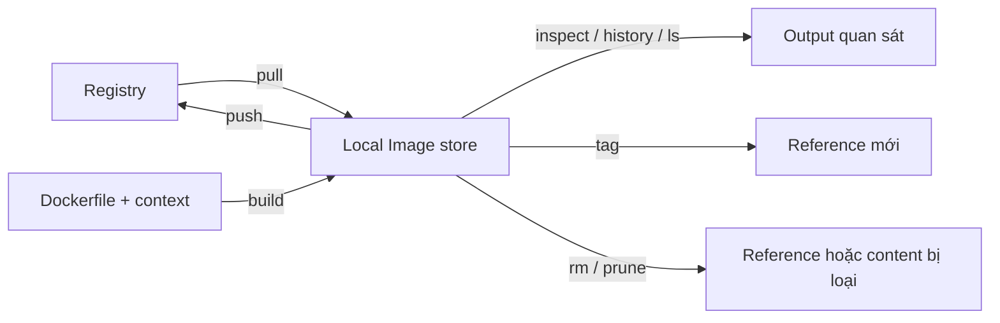

# 2. Lệnh quản lý Image

> **Tóm tắt một câu:** Các lệnh Image quản lý đầu vào chỉ đọc trong local Image store; chúng không trực tiếp tạo lifecycle state của Container.

> **Loại:** Explanation · **Cấp độ:** Beginner · **Thời gian:** Khoảng 30 phút<br>
> **Nguồn chính:** [`docker image`](https://docs.docker.com/reference/cli/docker/image/) · [`docker image pull`](https://docs.docker.com/reference/cli/docker/image/pull/)

> **Sau chapter này, bạn có thể:**
> - Phân biệt pull, list, inspect, history và remove.
> - Đọc Image reference và hiểu local Image store thay đổi ra sao.
> - Biết khi nào Image bị ràng buộc bởi Container.
> - Tránh nhầm `prune` với xóa toàn bộ Image.

[← 1. Cách đọc lệnh Docker](01-cach-doc-lenh-docker.md) · [Mục lục Part 02](README.md) · [3. Tạo và chạy Container →](03-tao-va-chay-container.md)

---

## 1. Một nhóm command, nhiều loại tác động

`docker image` chọn nhóm object Image. Một số action chỉ đọc metadata, một số tải content, một số tạo tên tham chiếu mới, và một số xóa reference/content khỏi kho cục bộ. Chúng không tương đương chỉ vì đều bắt đầu bằng `docker image`.



Sơ đồ đọc từ trái sang phải. `pull` và `build` đưa Image vào kho; `ls`, `inspect`, `history` chỉ quan sát; `tag` tạo reference khác tới nội dung; `push` phân phối; `rm` và `prune` thu hồi tài nguyên cục bộ theo phạm vi khác nhau.

## 2. Pull: đưa Image từ Registry về local store

```text
docker image pull [OPTIONS] NAME[:TAG|@DIGEST]
```

```bash
docker image pull nginx:alpine
```

| Token | Scope | Ý nghĩa |
|---|---|---|
| `docker image` | Docker CLI | Chọn object Image. |
| `pull` | Image command | Tải metadata và content còn thiếu từ Registry. |
| `nginx:alpine` | Image reference | Repository `nginx`, Tag `alpine`; mặc định thường resolve qua Docker Hub namespace chính thức. |

Trước pull, reference hoặc layer có thể chưa có cục bộ. Sau pull, daemon có metadata cần thiết và content blob còn thiếu; layer trùng có thể được tái sử dụng. Pull không tạo Container.

```bash
docker image inspect nginx:alpine --format '{{.Id}}'
```

Lệnh inspect thành công và in Image ID là bằng chứng local daemon resolve được reference. Xem cú pháp đầy đủ tại [`docker image pull`](../../reference/commands/docker-pull.md).

## 3. List: đọc inventory cục bộ

```bash
docker image ls
```

Các cột thường gặp:

| Cột | Ý nghĩa cần đọc đúng |
|---|---|
| `REPOSITORY` / `TAG` | Tên tham chiếu dễ đọc. |
| `IMAGE ID` | ID rút gọn của Image cục bộ. |
| `CREATED` | Thời điểm metadata Image được tạo, không phải thời điểm vừa pull. |
| `SIZE` | Kích thước logic Docker hiển thị; không phải lượng network vừa tải. |

`docker image ls --all` có thể hiện intermediate Image mà view mặc định ẩn. `--filter` thu hẹp output; nó không xóa object.

## 4. Inspect và history: hai góc nhìn khác nhau

```bash
docker image inspect nginx:alpine
docker image history nginx:alpine
```

`inspect` trả JSON mô tả trạng thái hiện tại của Image object: ID, Tag/Digest, architecture, configuration và root filesystem layer. `history` trình bày các history entry góp phần tạo Image; nó hữu ích để đọc kích thước và command tạo layer nhưng không phải bản Dockerfile nguyên vẹn.

> [!NOTE]
> Số dòng history không nhất thiết bằng số filesystem layer. Instruction chỉ đổi configuration có thể tạo history entry `0B` mà không thêm layer file.

## 5. Build, tag và push nằm ở đâu?

```bash
docker image build --tag my-app:1.0 .
docker image tag my-app:1.0 yourname/my-app:1.0
docker image push yourname/my-app:1.0
```

- `build` đọc Dockerfile và **build context** — tập file builder được phép truy cập — để tạo Image.
- `tag` tạo một Image reference mới; nó không sao chép toàn bộ layer.
- `push` gửi manifest và content chưa có lên Registry phù hợp với tên reference.

Chi tiết build thuộc Part 04, delivery thuộc Part 06. Ở đây điều quan trọng là ba action có state transition khác nhau: tạo nội dung, tạo tên, và phân phối nội dung.

## 6. Remove: xóa reference và content khi có thể

```text
docker image rm [OPTIONS] IMAGE [IMAGE...]
```

```bash
docker image rm nginx:alpine
```

Nếu reference là tên cuối cùng và không còn ràng buộc cản trở, content không dùng có thể được thu hồi. Nếu Container còn tham chiếu Image, Docker có thể từ chối xóa hoặc yêu cầu hành vi cưỡng bức tùy tình huống.

> [!WARNING]
> `--force` có thể loại reference dù còn quan hệ cần xem xét. Đừng dùng nó như phản xạ; trước tiên chạy `docker container ls --all --filter ancestor=nginx:alpine` để tìm Container phụ thuộc.

## 7. `image rm` và `image prune`

| Lệnh | Phạm vi mặc định |
|---|---|
| `docker image rm IMAGE` | Image/reference được chỉ định rõ. |
| `docker image prune` | Dangling Image, tức Image không có Tag/reference phù hợp và không được Container dùng. |
| `docker image prune --all` | Mọi Image không được Container hiện có dùng, phạm vi rộng hơn nhiều. |

**Dangling Image** là content/record còn lại không có tên tham chiếu thông thường, thường xuất hiện sau build lại. Dangling không đồng nghĩa “mọi Image đang không chạy”, vì Image không chạy và Container mới có trạng thái chạy.

## 8. Quan niệm dễ gây hiểu nhầm

### 8.1 “Pull Image là chạy ứng dụng”

- **Phân loại:** Sai do trộn distribution với runtime.
- **Lỗi kỹ thuật:** Pull chỉ đưa metadata/content vào local store; không tạo process, writable layer hay Container ID.
- **Kiểm chứng:** `docker container ls --all` không xuất hiện Container mới chỉ vì pull.

### 8.2 “Xóa Tag chắc chắn giải phóng toàn bộ dung lượng”

- **Phân loại:** Phụ thuộc ngữ cảnh.
- **Lỗi kỹ thuật:** Layer có thể còn được reference khác hoặc Container sử dụng; Docker chỉ thu hồi content không còn cần thiết.
- **Cách nói tốt hơn:** Xóa reference không bảo đảm mọi content liên quan trở thành không dùng.

### 8.3 “`image prune -a` chỉ xóa Image lỗi”

- **Phân loại:** Sai và nguy hiểm.
- **Lỗi kỹ thuật:** `--all` mở rộng tới Image không được Container nào tham chiếu, kể cả Image hợp lệ bạn định dùng lại.
- **Kiểm chứng trước:** `docker system df` và `docker image ls`; đọc prompt xác nhận phạm vi.

## 9. Tự kiểm tra mental model

1. Vì sao pull cùng Image có thể tải rất ít dữ liệu ở lần sau?
2. `tag` thay đổi content hay chỉ thay đổi cách tham chiếu?
3. Vì sao một Image không có Container đang chạy vẫn có thể không bị `image prune` mặc định xóa?
4. Khi remove thất bại vì conflict, nên tìm object phụ thuộc bằng cách nào trước khi dùng `--force`?

## 10. Tóm tắt

1. `pull` đưa Image về local store; `ls`, `inspect`, `history` quan sát các góc khác nhau.
2. `build` tạo content, `tag` tạo reference, `push` phân phối.
3. Xóa reference không luôn đồng nghĩa giải phóng mọi layer.
4. `image prune` mặc định nhắm dangling Image; `--all` mở rộng mạnh phạm vi.

## 11. Học tiếp

Đọc [3. Tạo và chạy Container](03-tao-va-chay-container.md) để hiểu Image trở thành đầu vào runtime như thế nào. Tra nhanh lệnh Image tại [Docker CLI quick reference](../../reference/commands/README.md).

## Tài liệu tham khảo

- Docker CLI, [`docker image`](https://docs.docker.com/reference/cli/docker/image/)
- Docker CLI, [`docker image pull`](https://docs.docker.com/reference/cli/docker/image/pull/)
- Docker CLI, [`docker image rm`](https://docs.docker.com/reference/cli/docker/image/rm/)
- Docker CLI, [`docker image prune`](https://docs.docker.com/reference/cli/docker/image/prune/)

[← 1. Cách đọc lệnh Docker](01-cach-doc-lenh-docker.md) · [Mục lục Part 02](README.md) · [3. Tạo và chạy Container →](03-tao-va-chay-container.md)
