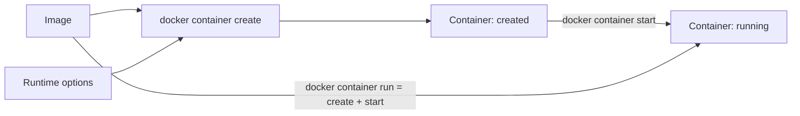

# 3. Tạo và chạy Container

> **Tóm tắt một câu:** `docker container run` là thao tác ghép `create` và `start`; option trước Image định hình Container mới, còn token sau Image có thể thay command của process bên trong.

> **Loại:** Explanation · **Cấp độ:** Beginner · **Thời gian:** Khoảng 40 phút<br>
> **Nguồn chính:** [`docker container create`](https://docs.docker.com/reference/cli/docker/container/create/) · [`docker container run`](https://docs.docker.com/reference/cli/docker/container/run/)

> **Sau chapter này, bạn có thể:**
> - Phân biệt `create`, `start` và `run`.
> - Giải thích từng token trong một lệnh `run` thực tế.
> - Hiểu attached/detached mode, port publishing và environment option ở mức CLI.
> - Nhận diện secret bị lộ qua history hoặc metadata.

[← 2. Lệnh quản lý Image](02-lenh-quan-ly-image.md) · [Mục lục Part 02](README.md) · [4. Container lifecycle →](04-container-lifecycle.md)

---

## 1. Từ Image đến Container cần những quyết định nào?

Image cung cấp filesystem và giá trị mặc định, nhưng một Container cụ thể còn cần tên, network attachment, port mapping, environment variable, mount, restart policy và command runtime. Những quyết định đó được ghi vào Container configuration lúc tạo object.



`create` chuẩn bị object nhưng chưa khởi động process. `start` khởi động một Container đã tồn tại. `run` tạo object mới rồi start; gọi `run` lần nữa tạo Container khác, không tái sử dụng Container cũ.

## 2. Cú pháp tổng quát của `run`

```text
docker container run [OPTIONS] IMAGE [COMMAND] [ARG...]
```

Ví dụ:

```bash
docker container run --name web --detach --publish 8080:80 nginx:alpine
```

```text
docker container run
├── --name web
├── --detach
├── --publish 8080:80
└── nginx:alpine
```

| Token | Scope sở hữu | Giá trị đã resolve | Tác động |
|---|---|---|---|
| `--name web` | Container create options | Tên Container là `web`. | Tạo reference dễ đọc thay ID ngẫu nhiên. |
| `--detach` | Run/client behavior | Chạy nền, CLI in Container ID. | Terminal không attach vào stdio chính. |
| `--publish 8080:80` | Container network config | Host port `8080` chuyển tới Container port `80` theo TCP mặc định. | Tạo port publishing rule. |
| `nginx:alpine` | Image argument | Image nguồn cần resolve/pull nếu thiếu. | Cung cấp filesystem và default config. |

Trước lệnh chưa có Container tên `web`. Sau lệnh có một Container object, writable layer, network settings và process chính đang chạy nếu startup thành công.

```bash
docker container ls --filter name=web
docker container port web
```

Lệnh đầu kiểm tra trạng thái; lệnh sau cho biết port mapping thực tế. Chi tiết network thuộc Part 03.

## 3. Attached và detached không phải running và stopped

**Attached mode** là CLI nối terminal với standard input/output/error của process chính. **Detached mode** (`--detach`, `-d`) để Container chạy nền và trả quyền điều khiển terminal.

Hai khái niệm này mô tả kết nối terminal, không quyết định process có sống lâu hay không. Container detached vẫn dừng nếu process chính thoát. Container attached có thể tiếp tục chạy hoặc dừng tùy cách bạn detach hay gửi tín hiệu.

```bash
docker container run --name hello alpine echo "xin chao"
```

Lệnh chạy attached, in một dòng rồi Container chuyển `exited` vì `echo` kết thúc. Không có lỗi Docker; workload đã hoàn thành đúng thiết kế.

## 4. Command override sau Image

```bash
docker container run --rm alpine:latest sh -c "echo hello && sleep 2"
```

| Token | Thuộc về | Ý nghĩa |
|---|---|---|
| `--rm` | Docker `run` | Tự xóa Container khi process kết thúc. |
| `alpine:latest` | Docker `run` | Image nguồn. |
| `sh` | Process trong Container | Override command/executable. |
| `-c` | Shell `sh` | Yêu cầu shell thực thi chuỗi kế tiếp. |
| `echo hello && sleep 2` | Shell `sh` | Script được parse bên trong Container. |

Có hai parser shell cần để ý: shell máy host xử lý quoting trước, rồi `sh -c` trong Container xử lý nội dung nhận được. Dấu nháy không đúng có thể làm host shell mở rộng biến trước khi Docker gửi command.

## 5. Environment variable

```bash
docker container run --name app --env APP_ENV=development alpine env
```

`--env APP_ENV=development` thuộc Docker run option. Docker ghi cặp key/value vào Container configuration; command `env` bên trong in môi trường process.

```bash
docker container inspect app --format '{{json .Config.Env}}'
```

> [!WARNING]
> Không truyền password/token trực tiếp bằng `--env SECRET=value` trong lệnh dùng thật. Giá trị có thể xuất hiện trong shell history, process inspection hoặc Container metadata. Secret management được trình bày ở Part 07.

Biến từ host được truyền khác nhau giữa shell. Dạng rõ ràng, ít mơ hồ:

```bash
docker container run --env APP_ENV="$APP_ENV" alpine env
```

```powershell
docker container run --env "APP_ENV=$env:APP_ENV" alpine env
```

## 6. `--rm`: lifecycle tự động có điều kiện

`--rm` yêu cầu Docker tự xóa Container sau khi nó dừng. Nó phù hợp với command dùng một lần khi không cần inspect object sau đó.

```bash
docker container run --rm alpine echo done
```

Sau khi `echo` thoát, `docker container ls --all` không còn Container này. Tuy nhiên `--rm` không xóa Image nguồn và không phải cơ chế backup dữ liệu. Dữ liệu chỉ trong writable layer biến mất cùng Container.

## 7. Create riêng khi nào hữu ích?

```bash
docker container create --name prepared nginx:alpine
docker container inspect prepared --format '{{.State.Status}}'
docker container start prepared
```

Output inspect trước start là `created`. Tách bước hữu ích khi bạn muốn chuẩn bị object, kiểm tra configuration hoặc điều phối việc start sau. Phần lớn thao tác tương tác dùng `run` vì ngắn hơn.

## 8. Lỗi thường gặp

### 8.1 Name conflict

Nếu `web` đã tồn tại, `docker container run --name web ...` thất bại dù Container cũ đã `exited`. Tên thuộc object, không chỉ thuộc process đang chạy.

```bash
docker container ls --all --filter name=web
```

Chọn `start web` nếu muốn dùng lại object; hoặc remove object cũ sau khi xác nhận dữ liệu không cần giữ.

### 8.2 Process thoát ngay

Container sống theo process chính. Nếu command hoàn thành hoặc crash, state chuyển `exited`. Dùng:

```bash
docker container inspect web --format 'Status={{.State.Status}} Exit={{.State.ExitCode}} Error={{.State.Error}}'
docker container logs web
```

### 8.3 Shell không tồn tại

Không phải Image nào cũng có `bash`. Image tối giản có thể chỉ có `sh`, hoặc không có shell. `docker container run IMAGE bash` thất bại không chứng minh Image hỏng; executable yêu cầu có thể không tồn tại.

## 9. Quan niệm dễ gây hiểu nhầm

### 9.1 “`run` chỉ bật một Container”

- **Phân loại:** Sai.
- **Lỗi kỹ thuật:** `run` luôn tạo Container mới rồi start; `start` mới dùng lại object đã tạo.
- **Kiểm chứng:** Chạy `run` hai lần không đặt name rồi xem hai Container ID trong `docker container ls --all`.

### 9.2 “`-d` giữ ứng dụng sống”

- **Phân loại:** Sai.
- **Lỗi kỹ thuật:** `-d` chỉ tách terminal; process chính thoát thì Container dừng.
- **Kiểm chứng:** `docker container run -d alpine echo done` trả ID nhưng Container nhanh chóng thành `exited`.

### 9.3 “Port `8080:80` nghĩa là ứng dụng chạy trên 8080 trong Container”

- **Phân loại:** Sai về hướng ánh xạ.
- **Lỗi kỹ thuật:** `8080` là host port, `80` là Container port. Ứng dụng vẫn cần listen ở port `80` bên trong.
- **Cách nói tốt hơn:** Request tới host `8080` được forward tới endpoint port `80` của Container.

## 10. Cleanup ví dụ

```bash
docker container rm --force web
docker container rm app prepared hello
```

Chỉ xóa các Container demo nếu chúng tồn tại và bạn không cần writable data. `--force` với `web` dừng cưỡng bức nếu còn chạy; trong luồng thật nên ưu tiên `stop` rồi `rm`.

## 11. Tóm tắt

1. `create` tạo object; `start` chạy object có sẵn; `run` thực hiện cả hai.
2. Option trước Image cấu hình Container; command sau Image thuộc workload.
3. Detached mode chỉ mô tả quan hệ với terminal.
4. Container dừng khi process chính kết thúc.
5. Environment và writable data cần được xử lý với nhận thức bảo mật và lifecycle.

## 12. Học tiếp

Đọc [4. Container lifecycle](04-container-lifecycle.md) để hiểu mọi state transition sau khi object được tạo. Tra đầy đủ option cốt lõi tại [`docker container run`](../../reference/commands/docker-run.md).

## Tài liệu tham khảo

- Docker CLI, [`docker container create`](https://docs.docker.com/reference/cli/docker/container/create/)
- Docker CLI, [`docker container run`](https://docs.docker.com/reference/cli/docker/container/run/)
- Docker Docs, [Running containers](https://docs.docker.com/engine/containers/run/)

[← 2. Lệnh quản lý Image](02-lenh-quan-ly-image.md) · [Mục lục Part 02](README.md) · [4. Container lifecycle →](04-container-lifecycle.md)
