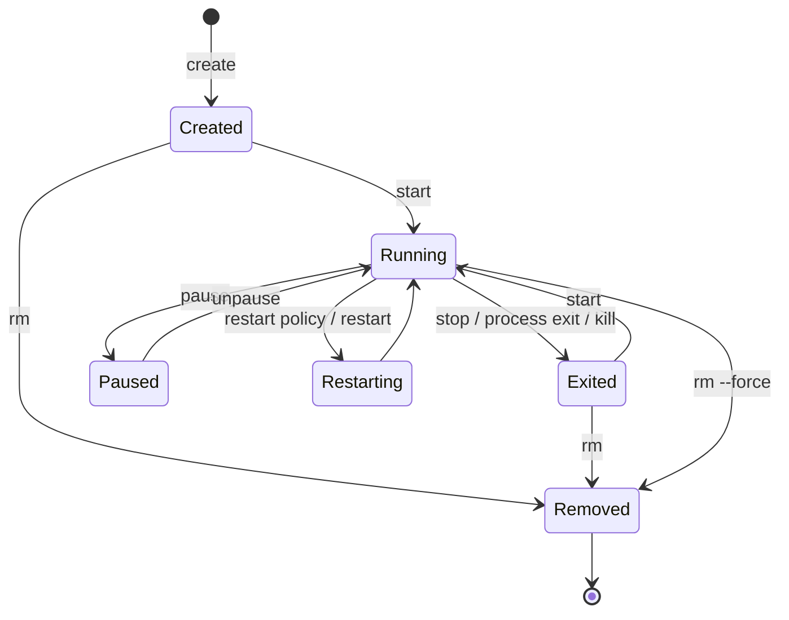

# 4. Container Lifecycle

> **Tóm tắt một câu:** Lifecycle của Container là vòng đời của một object có process chính; dừng process không xóa object, còn remove kết thúc khả năng start lại chính object đó.

> **Loại:** Explanation · **Cấp độ:** Beginner · **Thời gian:** Khoảng 35 phút<br>
> **Nguồn chính:** [Container lifecycle](https://docs.docker.com/get-started/docker-concepts/running-containers/) · [`docker container`](https://docs.docker.com/reference/cli/docker/container/)

> **Sau chapter này, bạn có thể:**
> - Mô tả các trạng thái `created`, `running`, `paused`, `exited`, `restarting`, `dead`.
> - Phân biệt `start`, `stop`, `restart`, `kill` và `rm`.
> - Đọc exit code và hiểu graceful shutdown.
> - Chọn lệnh lifecycle có mức phá hủy phù hợp.

[← 3. Tạo và chạy Container](03-tao-va-chay-container.md) · [Mục lục Part 02](README.md) · [5. Quan sát và debug Container →](05-quan-sat-va-debug-container.md)

---

## 1. Object còn tồn tại dù process đã dừng

Container gồm configuration, writable layer và runtime state. Khi process chính thoát, Container chuyển `exited`; tên, ID, log và writable layer vẫn có thể còn. Vì thế `docker container start` có thể chạy lại cùng object.



`Removed` không phải state có thể inspect lâu dài; nó biểu diễn object đã bị xóa. Muốn chạy lại workload sau remove, bạn phải tạo Container mới từ Image.

## 2. State và process chính

**Main process** là process có PID 1 trong namespace của Container. Lifecycle của Container bám vào process này: process chạy thì Container thường `running`; process kết thúc thì Container `exited`.

```bash
docker container inspect web --format 'Status={{.State.Status}} Running={{.State.Running}} Exit={{.State.ExitCode}}'
```

`Status` là nhãn tổng quát; `Running` là boolean; `ExitCode` có ý nghĩa sau khi process kết thúc. Exit code `0` thường biểu thị hoàn thành thành công theo quy ước process, giá trị khác `0` biểu thị lỗi hoặc kết thúc đặc biệt, nhưng ý nghĩa chính xác phụ thuộc ứng dụng và signal.

## 3. Start: chạy lại object cũ

```text
docker container start [OPTIONS] CONTAINER [CONTAINER...]
```

```bash
docker container start web
```

`web` giữ configuration đã tạo trước đó: port publishing, environment, mount và command không được định nghĩa lại bằng `start`. Nếu cần configuration khác, thường phải tạo Container mới.

`start --attach` có thể attach terminal khi start. Đừng nhầm với `run`, vì start không resolve một Image để tạo object mới.

## 4. Stop: yêu cầu kết thúc trật tự

```bash
docker container stop --time 20 web
```

Docker gửi signal dừng ban đầu tới process chính, thường là `SIGTERM` trên Linux, chờ timeout, rồi dùng signal cưỡng bức nếu process chưa thoát. **Graceful shutdown** là quá trình ứng dụng nhận tín hiệu và tự đóng kết nối, hoàn tất công việc đang xử lý, flush dữ liệu rồi thoát.

| Giai đoạn | Trạng thái/kỳ vọng |
|---|---|
| Trước stop | Container `running`. |
| Gửi signal mềm | Ứng dụng có cơ hội cleanup. |
| Chờ timeout | CLI/daemon đợi process thoát. |
| Hết timeout | Runtime kết thúc cưỡng bức. |
| Sau stop | Container `exited`, object còn. |

Timeout dài hơn không sửa được ứng dụng bỏ qua signal; cần kiểm tra signal handling và process model.

## 5. Kill: gửi signal ngay

```bash
docker container kill web
docker container kill --signal HUP web
```

Mặc định `kill` gửi `SIGKILL`, process không có cơ hội cleanup. Option `--signal` có thể gửi signal khác nếu ứng dụng hỗ trợ. `kill` không xóa Container.

> [!WARNING]
> Dùng kill mặc định có thể làm mất dữ liệu chưa flush hoặc để giao dịch dở dang. Chỉ dùng khi stop không phù hợp hoặc khi bạn chủ động cần signal cụ thể.

## 6. Restart: stop rồi start, không tạo mới

```bash
docker container restart --time 20 web
```

Restart tác động lên cùng Container ID và configuration. Nó không pull Image mới, không áp dụng Tag mới và không rebuild filesystem từ Image. Nếu repository Tag đã trỏ sang Image mới, restart Container cũ vẫn dùng Image ID gắn khi object được tạo.

Đây là khác biệt quan trọng giữa restart và recreate:

| Hành động | Container ID | Configuration create-time | Image mới theo Tag |
|---|---|---|---|
| `restart` | Giữ nguyên | Giữ nguyên | Không tự lấy/ap dụng |
| remove + `run` | ID mới | Được tạo lại | Dùng Image được resolve lúc run mới |

## 7. Pause và unpause

```bash
docker container pause web
docker container unpause web
```

Pause tạm ngưng thực thi process bằng cơ chế runtime/OS, không phải graceful shutdown. Process không hoàn thành cleanup và Container không chuyển `exited`. Use case của pause hẹp; không dùng nó thay stop khi cần giải phóng ứng dụng đúng cách.

## 8. Remove: xóa object

```bash
docker container rm web
```

Mặc định Container phải không chạy. Sau remove, tên, metadata và writable layer của Container bị loại; log theo logging driver cục bộ cũng không còn truy cập bằng Container ID đó.

```bash
docker container rm --force web
```

`--force` kết hợp kết thúc cưỡng bức và xóa. Nó không phải “stop nhanh hơn” mà là thay đổi phạm vi hậu quả: object không còn để inspect hoặc start lại.

## 9. Restart policy và trạng thái `restarting`

**Restart policy** là quy tắc daemon dùng để quyết định có tự khởi động lại Container sau khi process thoát hoặc daemon restart. Ví dụ `--restart on-failure:3` giới hạn số lần restart khi exit code khác 0.

```bash
docker container inspect web --format '{{json .HostConfig.RestartPolicy}}'
```

Restart policy không phải health recovery hoàn chỉnh. Process có thể vẫn chạy nhưng ứng dụng treo; nếu không thoát, policy không tự biết logic nghiệp vụ bị lỗi. Healthcheck và orchestration là lớp khác.

## 10. Quan niệm dễ gây hiểu nhầm

### 10.1 “Stopped Container đã biến mất”

- **Phân loại:** Sai.
- **Lỗi kỹ thuật:** `exited` Container vẫn có ID, config, log và writable layer cho đến khi remove.
- **Kiểm chứng:** `docker container ls --all` hiện object mà `docker container ls` mặc định ẩn.

### 10.2 “Restart cập nhật ứng dụng lên Image mới nhất”

- **Phân loại:** Sai.
- **Lỗi kỹ thuật:** Restart dùng cùng Container và Image ID; Tag di chuyển không thay dependency đã gắn.
- **Cách nói tốt hơn:** Muốn áp dụng Image mới cần pull/build rồi recreate Container.

### 10.3 “Stop và kill chỉ khác tốc độ”

- **Phân loại:** Sai về semantics.
- **Lỗi kỹ thuật:** Stop tạo cơ hội graceful shutdown; kill mặc định kết thúc không thể xử lý.
- **Tác động:** Database hoặc ứng dụng ghi file có thể chịu rủi ro khác nhau rõ rệt.

## 11. Tự kiểm tra mental model

1. Vì sao `start` không nhận lại các option như `--publish` để đổi port?
2. Sau `stop`, dữ liệu nào của Container còn tồn tại?
3. Vì sao restart không bảo đảm dùng content mới của cùng Tag?
4. Khi nào `kill --signal HUP` có thể hợp lý hơn kill mặc định?

## 12. Tóm tắt

1. Container object và process chính có liên quan nhưng không đồng nhất.
2. `stop` ưu tiên graceful shutdown; `kill` gửi signal trực tiếp.
3. `start` và `restart` dùng lại object cũ; recreate tạo object mới.
4. `rm` xóa object và writable state; `--force` mở rộng hậu quả.
5. Restart policy phản ứng với process exit, không thay thế health monitoring.

## 13. Học tiếp

Đọc [5. Quan sát và debug Container](05-quan-sat-va-debug-container.md) để thu thập bằng chứng trước khi chọn lifecycle action.

## Tài liệu tham khảo

- Docker CLI, [`docker container start`](https://docs.docker.com/reference/cli/docker/container/start/)
- Docker CLI, [`docker container stop`](https://docs.docker.com/reference/cli/docker/container/stop/)
- Docker CLI, [`docker container kill`](https://docs.docker.com/reference/cli/docker/container/kill/)
- Docker Docs, [Start containers automatically](https://docs.docker.com/engine/containers/start-containers-automatically/)

[← 3. Tạo và chạy Container](03-tao-va-chay-container.md) · [Mục lục Part 02](README.md) · [5. Quan sát và debug Container →](05-quan-sat-va-debug-container.md)
