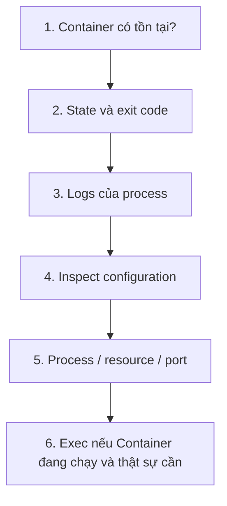

# 5. Quan sát và Debug Container

> **Tóm tắt một câu:** Debug Container hiệu quả là thu thập đúng loại bằng chứng theo thứ tự, không phải vào shell và thử sửa file ngay lập tức.

> **Loại:** Explanation · **Cấp độ:** Beginner · **Thời gian:** Khoảng 40 phút<br>
> **Nguồn chính:** [`docker container ls`](https://docs.docker.com/reference/cli/docker/container/ls/) · [`docker container inspect`](https://docs.docker.com/reference/cli/docker/inspect/) · [`docker container logs`](https://docs.docker.com/reference/cli/docker/container/logs/) · [`docker container exec`](https://docs.docker.com/reference/cli/docker/container/exec/)

> **Sau chapter này, bạn có thể:**
> - Chọn lệnh dựa trên câu hỏi cần trả lời.
> - Phân biệt metadata, log stream và trạng thái process.
> - Dùng `exec` đúng điều kiện và hiểu giới hạn.
> - Xây một luồng debug có bằng chứng trước khi thay đổi.

[← 4. Container lifecycle](04-container-lifecycle.md) · [Mục lục Part 02](README.md) · [6. Dọn dẹp tài nguyên →](06-don-dep-tai-nguyen.md)

---

## 1. Chọn công cụ theo loại câu hỏi

| Câu hỏi | Lệnh đầu tiên phù hợp |
|---|---|
| Container có tồn tại và state gì? | `docker container ls --all` |
| Nó được tạo với config nào? | `docker container inspect` |
| Process đã ghi gì ra stdout/stderr? | `docker container logs` |
| Process nào đang chạy? | `docker container top` |
| CPU/memory hiện tại ra sao? | `docker container stats` |
| Port nào được publish? | `docker container port` |
| Cần chạy lệnh chẩn đoán bên trong? | `docker container exec` |

Luồng cơ bản:



Thứ tự này giảm việc “chữa bệnh khi chưa đo”. `exec` nằm sau vì nó yêu cầu Container đang chạy và dễ khiến người học sửa trạng thái tạm thời thay vì tìm nguyên nhân cấu hình.

## 2. `container ls`: inventory và state tóm tắt

```bash
docker container ls --all
```

`docker ps -a` là alias phổ biến. Không có `--all`, view mặc định chỉ hiện Container đang chạy.

| Cột | Điều cần đọc |
|---|---|
| `CONTAINER ID` | ID rút gọn để tham chiếu. |
| `IMAGE` | Image reference/ID đã dùng. |
| `COMMAND` | Command hiển thị rút gọn, không luôn là toàn bộ argv. |
| `CREATED` | Tuổi của object, không phải uptime hiện tại. |
| `STATUS` | State, thời gian và có thể health status. |
| `PORTS` | Publish/binding đã cấu hình. |
| `NAMES` | Tên dễ đọc. |

Filter giúp giảm nhiễu:

```bash
docker container ls --all --filter name=web --filter status=exited
```

Hai filter cùng key hoặc khác key có semantics phụ thuộc loại filter; luôn đọc help khi xây truy vấn phức tạp. Reference chi tiết: [`docker container ls`](../../reference/commands/docker-ps.md).

## 3. Inspect: nguồn sự thật về configuration và state

```bash
docker container inspect web
```

Output JSON thường lớn vì chứa nhiều nhóm:

| Nhánh | Câu hỏi trả lời |
|---|---|
| `.State` | Running, exit code, error, started/finished time, health. |
| `.Config` | Env, command, entrypoint, labels, image config đã áp dụng. |
| `.HostConfig` | Mount/bind, restart policy, resource và network mode từ host. |
| `.NetworkSettings` | IP, network attachment, port binding runtime. |
| `.Mounts` | Mount nào thực sự được gắn và source/destination. |

Format giúp lấy đúng bằng chứng:

```bash
docker container inspect web --format 'Status={{.State.Status}} Exit={{.State.ExitCode}} Image={{.Image}}'
```

Template `{{...}}` được Docker CLI/Go template engine xử lý, không phải shell bên trong Container. Dấu nháy đơn hoạt động trong Bash và PowerShell cho chuỗi literal đơn giản; khi nội dung có quoting phức tạp, kiểm tra theo shell đang dùng.

## 4. Logs: đọc output do logging driver thu thập

```bash
docker container logs --tail 100 web
docker container logs --follow --since 10m web
```

| Option | Ý nghĩa |
|---|---|
| `--tail 100` | Chỉ lấy 100 dòng cuối. |
| `--follow` | Tiếp tục stream log mới cho tới khi ngắt. |
| `--since 10m` | Chỉ lấy log từ 10 phút gần đây. |
| `--timestamps` | Thêm timestamp do log record cung cấp. |

`logs` không đọc tùy ý mọi file `/var/log/...` trong Container. Nó lấy log mà logging driver đã thu thập, thường từ stdout/stderr của process. Nếu ứng dụng chỉ ghi file nội bộ, `docker logs` có thể trống dù file có dữ liệu.

Reference: [`docker container logs`](../../reference/commands/docker-logs.md).

## 5. Exec: tạo process phụ trong Container đang chạy

```text
docker container exec [OPTIONS] CONTAINER COMMAND [ARG...]
```

```bash
docker container exec --interactive --tty web sh
```

| Token | Scope | Ý nghĩa |
|---|---|---|
| `--interactive` (`-i`) | Docker exec | Giữ stdin mở. |
| `--tty` (`-t`) | Docker exec | Cấp pseudo-terminal để tương tác. |
| `web` | Docker exec | Container đang chạy mục tiêu. |
| `sh` | Process mới bên trong | Executable cần tồn tại trong filesystem Container. |

Exec không “đi vào process chính”; nó yêu cầu runtime tạo process phụ trong namespace và filesystem view của Container. Process phụ kết thúc không nhất thiết làm Container dừng.

> [!IMPORTANT]
> `exec` yêu cầu Container đang chạy. Với Container crash ngay, hãy dùng `inspect` và `logs`; không thể sửa bằng cách exec vào object `exited`.

`bash` không phải mặc định phổ quát. Thử `sh` khi Image tối giản có shell; một số distroless Image không có shell nào.

Reference: [`docker container exec`](../../reference/commands/docker-exec.md).

## 6. Stats, top và port

```bash
docker container stats --no-stream web
docker container top web
docker container port web
```

- `stats --no-stream` chụp một snapshot CPU, memory, network và block I/O thay vì stream liên tục.
- `top` yêu cầu daemon hiển thị process đang chạy trong Container; output và option phụ thuộc host platform.
- `port` đọc mapping port đã publish, không kiểm tra ứng dụng bên trong có thực sự listen hay trả response đúng.

Các lệnh này cung cấp bằng chứng khác nhau. Memory cao không giải thích nguyên nhân; port mapping tồn tại không chứng minh network path hoạt động end-to-end.

## 7. Attach khác exec

| `attach` | `exec` |
|---|---|
| Nối terminal vào stdio của process chính. | Tạo process phụ mới. |
| Phím/tín hiệu có thể ảnh hưởng process chính. | Tác động trực tiếp lên command phụ. |
| Không cần shell riêng nếu process chính có stdio. | Command yêu cầu executable tồn tại. |
| Hữu ích để quan sát interactive process. | Hữu ích cho chẩn đoán có mục tiêu. |

Attach không phải cách “mở shell” trừ khi process chính vốn là shell.

## 8. Quy trình chẩn đoán startup failure

Giả sử `web` không xuất hiện trong `docker container ls`:

```bash
docker container ls --all --filter name=web
docker container inspect web --format 'Status={{.State.Status}} Exit={{.State.ExitCode}} Error={{.State.Error}}'
docker container logs --tail 100 web
docker container inspect web --format '{{json .Config.Cmd}} {{json .Config.Env}}'
```

1. `ls --all` xác nhận object có tồn tại hay bị nhầm tên.
2. `.State` phân biệt create/runtime error với process exit.
3. Logs tìm bằng chứng từ ứng dụng.
4. Config kiểm tra command và environment thực tế, không dựa trên điều bạn nhớ đã gõ.

Chỉ sau đó mới quyết định recreate, đổi env, sửa Image hay mở rộng sang network/storage.

## 9. Quan niệm dễ gây hiểu nhầm

### 9.1 “`docker logs` chứa mọi log trong Container”

- **Phân loại:** Sai.
- **Lỗi kỹ thuật:** Lệnh phụ thuộc logging driver và stream được thu thập, không quét toàn filesystem.
- **Cách nói tốt hơn:** `docker logs` đọc log stream của Container theo logging configuration.

### 9.2 “Exec vào rồi sửa file là đã fix deployment”

- **Phân loại:** Chỉ là thay đổi tạm thời và thường sai quy trình.
- **Lỗi kỹ thuật:** Sửa file nằm trong writable layer của một Container; recreate sẽ mất thay đổi và các replica khác không nhận được.
- **Cách nói tốt hơn:** Dùng exec để thu thập bằng chứng; sửa nguồn cấu hình, Image hoặc mount rồi recreate có kiểm soát.

### 9.3 “Container running nghĩa là service ready”

- **Phân loại:** Sai.
- **Lỗi kỹ thuật:** Running chỉ cho biết process chính chưa thoát. Ứng dụng có thể đang khởi tạo, deadlock hoặc không listen đúng port.
- **Kiểm chứng:** Kết hợp logs, health status và request thực tế.

## 10. Tóm tắt

1. Bắt đầu bằng existence/state, sau đó đọc exit code, logs và configuration.
2. `inspect` cung cấp metadata/state; `logs` cung cấp stream; chúng không thay thế nhau.
3. `exec` tạo process phụ và chỉ dùng được khi Container đang chạy.
4. `stats`, `top`, `port` trả lời các câu hỏi hẹp, không tự kết luận root cause.
5. Debug tốt tạo bằng chứng trước khi thay đổi.

## 11. Học tiếp

Đọc [6. Dọn dẹp tài nguyên](06-don-dep-tai-nguyen.md) để xóa tài nguyên demo sau khi đã xác nhận phạm vi. Tra nhanh tại [`docker logs`](../../reference/commands/docker-logs.md) và [`docker exec`](../../reference/commands/docker-exec.md).

## Tài liệu tham khảo

- Docker CLI, [`docker container ls`](https://docs.docker.com/reference/cli/docker/container/ls/)
- Docker CLI, [`docker container inspect`](https://docs.docker.com/reference/cli/docker/inspect/)
- Docker CLI, [`docker container logs`](https://docs.docker.com/reference/cli/docker/container/logs/)
- Docker CLI, [`docker container exec`](https://docs.docker.com/reference/cli/docker/container/exec/)

[← 4. Container lifecycle](04-container-lifecycle.md) · [Mục lục Part 02](README.md) · [6. Dọn dẹp tài nguyên →](06-don-dep-tai-nguyen.md)
