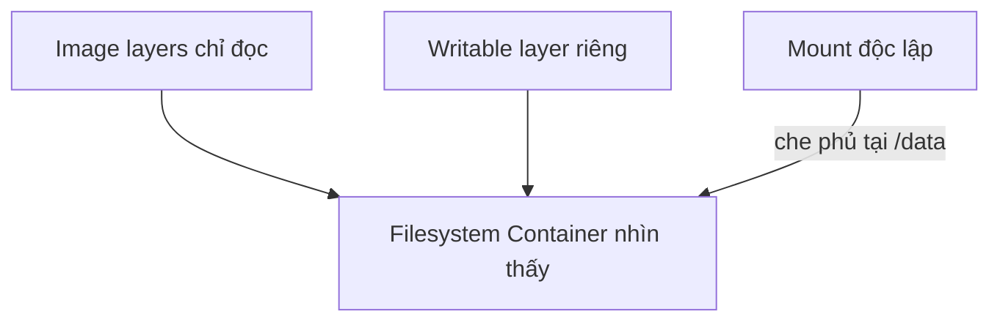

# 1. Dữ liệu trong Container

> **Tóm tắt một câu:** File được ghi trong writable layer có thể tồn tại qua thao tác stop/start của cùng Container, nhưng biến mất khi Container bị remove; dữ liệu cần vòng đời độc lập phải được đưa ra một mount phù hợp.

> **Loại:** Explanation · **Cấp độ:** Beginner · **Thời gian:** Khoảng 25 phút  
> **Nguồn chính:** [Docker storage overview](https://docs.docker.com/engine/storage/)

[Mục lục Storage & Networking](README.md) · [2. Docker Volume →](02-docker-volume.md)

---

## 1. Vấn đề cần giải quyết

Ứng dụng đang chạy liên tục tạo dữ liệu: database ghi bảng, service ghi file upload, package manager tạo cache và process tạo file tạm. Nếu tất cả chỉ nằm trong writable layer, tuổi thọ của dữ liệu bị buộc vào một Container cụ thể.

Điểm dễ nhầm là stop không giống remove. Stop kết thúc process nhưng giữ Container object và writable layer. Remove xóa object cùng lớp ghi đó.

## 2. Ba phạm vi filesystem

Một process trong Container có thể nhìn thấy file đến từ ba nguồn:

1. **Image layers** — các lớp chỉ đọc tạo nên filesystem ban đầu.
2. **Writable layer** — lớp ghi riêng của Container, dùng cho thay đổi không đi qua mount.
3. **Mount** — một nguồn dữ liệu được gắn vào một đường dẫn trong Container.

**Mount** là thao tác làm cho một nguồn storage xuất hiện tại một vị trí trong filesystem khác. Trong Docker, nguồn có thể là Volume, đường dẫn host hoặc vùng nhớ tmpfs; **mount destination** là đường dẫn mà process trong Container nhìn thấy.



Nếu mount vào `/data`, nội dung vốn có tại `/data` trong Image không bị xóa khỏi Image, nhưng bị mount che khuất trong góc nhìn của Container khi mount đang hoạt động.

## 3. Vòng đời dữ liệu

| Hành động | Writable layer | Volume | Bind mount |
|---|---|---|---|
| Stop Container | Còn | Còn | Còn trên host |
| Start lại cùng Container | Thấy lại | Thấy lại | Thấy lại |
| Remove Container | Mất | Thường còn | Còn trên host |
| Tạo Container mới không khai báo mount | Không thấy dữ liệu cũ | Không được gắn | Không được gắn |

**Persistence** (tính bền vững) không có nghĩa dữ liệu tồn tại mãi. Nó nghĩa vòng đời dữ liệu không bị buộc vào lần chạy process hoặc Container đang dùng nó. Volume vẫn có thể bị xóa; bind mount vẫn có thể bị sửa từ host.

## 4. Quan sát trạng thái trước và sau

```bash
docker container run --name data-demo alpine sh -c "echo hello > /note.txt"
docker container start data-demo
docker container exec data-demo cat /note.txt
```

`/note.txt` nằm trong writable layer. Sau lần chạy đầu, Container ở trạng thái `exited`; start lại cùng object vẫn thấy file.

```bash
docker container rm data-demo
docker container run --name data-demo alpine cat /note.txt
```

Lần `run` sau tạo Container mới. Nó không kế thừa writable layer của object đã xóa, nên `cat` báo không có file.

## 5. Điều gì nên đặt ở đâu?

- Binary và dependency ổn định: build vào Image.
- Dữ liệu nghiệp vụ cần giữ: Volume hoặc storage bên ngoài thích hợp.
- Source code cần chỉnh trực tiếp khi phát triển: bind mount.
- Secret hoặc file tạm không muốn ghi xuống disk: cân nhắc tmpfs và cơ chế secret chuyên dụng.
- Cache có thể tái tạo: tùy chi phí tái tạo mà dùng writable layer, Volume hoặc cache chuyên biệt.

## 6. Quan niệm dễ gây hiểu nhầm

### “Container dừng là dữ liệu trong nó mất ngay.”

Sai ở mốc lifecycle. Stop chỉ kết thúc process; Container và writable layer vẫn còn. Dữ liệu mất khi object bị remove, storage bị xóa, hoặc ứng dụng tự xóa dữ liệu.

### “Dùng Volume thì dữ liệu không bao giờ mất.”

Volume tách vòng đời khỏi Container, không biến dữ liệu thành bất tử. `docker volume rm`, `docker compose down --volumes`, lỗi ứng dụng hoặc thiếu backup vẫn có thể làm mất dữ liệu.

## 7. Tự kiểm tra

1. Vì sao start lại cùng Container có thể thấy file nhưng `docker run` lại không?
2. Mount vào một thư mục đã có file trong Image làm file đó biến mất hay chỉ bị che khuất?
3. Backup giải quyết điều gì mà persistence chưa giải quyết?

## 8. Tóm tắt

Writable layer phù hợp cho trạng thái gắn với một Container. Dữ liệu cần tái sử dụng, backup hoặc sống qua việc thay Container cần storage có vòng đời độc lập. Stop, remove và xóa storage là ba hành động khác nhau.

## Tài liệu tham khảo

- Docker Docs, [Storage](https://docs.docker.com/engine/storage/)
- Docker Docs, [Persisting container data](https://docs.docker.com/get-started/docker-concepts/running-containers/persisting-container-data/)

[Mục lục Storage & Networking](README.md) · [2. Docker Volume →](02-docker-volume.md)
