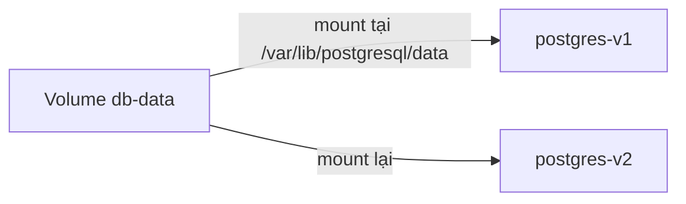

# 2. Docker Volume

> **Tóm tắt một câu:** Volume là storage object do Docker quản lý, có vòng đời độc lập với Container và được mount vào một đường dẫn cụ thể trong Container.

> **Loại:** Explanation · **Cấp độ:** Beginner · **Thời gian:** Khoảng 30 phút  
> **Nguồn chính:** [Volumes](https://docs.docker.com/engine/storage/volumes/)

[← 1. Dữ liệu trong Container](01-du-lieu-trong-container.md) · [Mục lục Storage & Networking](README.md) · [3. Bind mount →](03-bind-mount.md)

---

## 1. Hiểu đúng Volume

**Volume** là một Docker object biểu diễn vùng dữ liệu bền vững do Docker Engine quản lý. Container không cần biết đường dẫn vật lý thật trên host; nó chỉ biết Volume được mount tại đâu trong filesystem của mình.



Hai Container không cần tồn tại cùng lúc. `postgres-v1` có thể bị remove, sau đó `postgres-v2` mount lại `db-data` và đọc dữ liệu cũ nếu format dữ liệu tương thích.

## 2. Cú pháp `source:destination`

```bash
docker run --name db -v db-data:/var/lib/postgresql/data postgres:17
```

Cây cú pháp:

```text
-v db-data:/var/lib/postgresql/data
   └source┘ └──── destination ────┘
```

| Token | Scope | Giá trị đã resolve |
|---|---|---|
| `-v` | Docker CLI | Khai báo một mount dạng rút gọn. |
| `db-data` | Docker Engine | Tên Volume; Docker tìm hoặc tạo object này. |
| `:` | Parser của `-v` | Phân tách source và destination. |
| `/var/lib/postgresql/data` | Filesystem Container | Đường dẫn tuyệt đối nơi Volume xuất hiện. |

Hai vế thuộc hai namespace đường dẫn khác nhau. `db-data` không phải file nằm cạnh terminal; destination không phải thư mục trên Windows host.

Dạng rõ nghĩa hơn:

```bash
docker run --mount type=volume,source=db-data,destination=/var/lib/postgresql/data postgres:17
```

`--mount` dùng cặp `key=value`, giúp phân biệt `type`, `source` và `destination`; phù hợp khi giải thích hoặc cấu hình phức tạp.

## 3. Trạng thái trước và sau

Trước lệnh, `db-data` có thể chưa tồn tại. Docker tạo Volume rỗng, tạo Container rồi gắn Volume vào destination. Sau khi database ghi file, dữ liệu thuộc Volume chứ không thuộc writable layer tại path đó.

```bash
docker volume inspect db-data
docker container inspect db --format '{{json .Mounts}}'
```

Lệnh đầu chứng minh Volume là object riêng; lệnh sau cho biết Container đang mount source nào vào destination nào.

## 4. Named và anonymous Volume

**Named Volume** có tên ổn định như `db-data`, dễ mount lại và quản lý. **Anonymous Volume** không có tên do người dùng chọn; Docker cấp một ID dài.

```bash
docker run -v /data alpine
```

Ở đây chỉ có destination. Docker tạo anonymous Volume làm source. Nó có thể còn sau khi Container bị remove nhưng khó nhận diện và dễ tạo rác nếu workflow không quản lý rõ.

## 5. Quyền và ownership

Volume không tự sửa quyền file cho ứng dụng. Process trong Container vẫn đọc/ghi theo user ID, group ID và permission của filesystem. Nếu Image chạy bằng non-root user nhưng dữ liệu trong Volume thuộc user khác, ứng dụng có thể gặp `Permission denied`.

Cần kiểm tra user mà process chạy, owner của thư mục và cách Image chính thức khởi tạo dữ liệu. Không nên giải quyết mặc định bằng cách chạy toàn bộ Container dưới quyền root.

## 6. Lỗi thường gặp

### “Xóa Container sẽ xóa luôn named Volume.”

Thông thường sai. Named Volume tồn tại độc lập. Tuy nhiên, các lệnh có option xóa Volume như `docker compose down --volumes` mở rộng phạm vi phá hủy và cần được đọc kỹ.

### “Volume là thư mục dự án được Docker đồng bộ.”

Đó gần với bind mount. Với Volume, Docker quản lý vị trí lưu trữ; người dùng nên thao tác qua Docker và Container thay vì phụ thuộc đường dẫn nội bộ trên host.

### “Có Volume là không cần backup.”

Volume bảo vệ khỏi việc thay Container, không bảo vệ khỏi xóa nhầm, hỏng dữ liệu hay lỗi host.

## 7. Tự kiểm tra

1. Trong `db-data:/var/lib/postgresql/data`, vế nào thuộc Docker Engine và vế nào thuộc Container?
2. Vì sao named Volume dễ vận hành hơn anonymous Volume?
3. Volume còn nhưng ứng dụng không ghi được: cần kiểm tra lớp quyền nào?

## 8. Tóm tắt

Volume là storage object độc lập, không phải writable layer và không phải đường dẫn source code trên host. Cú pháp mount luôn cần đọc theo scope. Persistence, permission và backup là ba vấn đề khác nhau.

## Tài liệu tham khảo

- Docker Docs, [Volumes](https://docs.docker.com/engine/storage/volumes/)
- Docker CLI, [docker volume](https://docs.docker.com/reference/cli/docker/volume/)

[← 1. Dữ liệu trong Container](01-du-lieu-trong-container.md) · [Mục lục Storage & Networking](README.md) · [3. Bind mount →](03-bind-mount.md)
