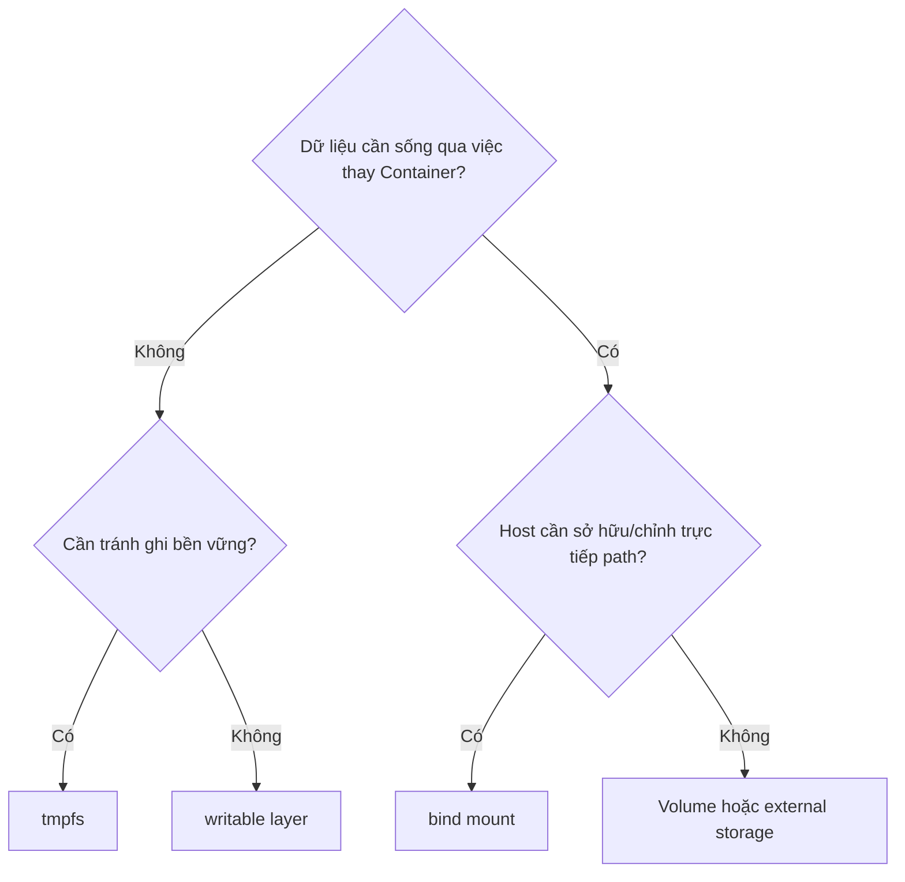

# 4. tmpfs và lựa chọn storage

> **Tóm tắt một câu:** tmpfs giữ dữ liệu trong memory của host runtime và không tồn tại sau khi Container dừng; lựa chọn storage phải dựa trên vòng đời, nguồn sở hữu, hiệu năng, bảo mật và khả năng backup.

> **Loại:** Explanation · **Cấp độ:** Beginner → Intermediate · **Thời gian:** Khoảng 25 phút  
> **Nguồn chính:** [tmpfs mounts](https://docs.docker.com/engine/storage/tmpfs/)

[← 3. Bind mount](03-bind-mount.md) · [Mục lục Storage & Networking](README.md) · [5. Docker Network →](05-docker-network.md)

---

## 1. tmpfs là gì?

**tmpfs mount** là mount tạm thời được lưu trong memory của Linux host/runtime thay vì được duy trì như dữ liệu bền vững trên disk. Khi Container dừng hoặc mount bị tháo, dữ liệu không được giữ cho lần chạy sau.

```bash
docker run --mount type=tmpfs,destination=/run/cache,tmpfs-size=64m alpine
```

| Token | Ý nghĩa |
|---|---|
| `type=tmpfs` | Chọn nguồn storage tạm trong memory. |
| `destination=/run/cache` | Path bên trong Container. Không có source path. |
| `tmpfs-size=64m` | Giới hạn kích thước được yêu cầu cho mount. |

tmpfs không có `source` vì không nối tới Volume hay host directory đã tồn tại. Runtime tạo vùng mount khi Container chạy.

## 2. Khi nào tmpfs phù hợp?

- File tạm nhạy cảm không muốn duy trì trên disk theo workflow thông thường.
- Cache rất ngắn hạn có thể tái tạo.
- Dữ liệu cần I/O nhanh và chấp nhận mất khi dừng.

Memory không đồng nghĩa “không bao giờ chạm disk” trong mọi môi trường: hệ điều hành có thể swap memory, Docker Desktop có thêm lớp virtual machine và chính sách nền tảng khác nhau. Với secret, cần dùng cơ chế secret phù hợp và threat model rõ ràng.

## 3. Ma trận lựa chọn

| Nhu cầu | Lựa chọn thường phù hợp | Lý do |
|---|---|---|
| Binary ứng dụng bất biến | Image | Phân phối cùng version ứng dụng |
| Database data | Volume hoặc external storage | Vòng đời độc lập, dễ quản lý |
| Source code development | Bind mount | Host và Container cùng nhìn source |
| Config host cụ thể | Bind mount read-only | Chủ động chọn file nguồn |
| File tạm cần mất khi dừng | tmpfs | Không duy trì như persistent storage |
| Trạng thái không quan trọng của một Container | Writable layer | Không cần thêm object storage |

Không có lựa chọn “tốt nhất” tuyệt đối. Ví dụ Volume phù hợp dữ liệu database local, nhưng production có thể dùng managed database hoặc network storage với yêu cầu backup và availability riêng.

## 4. Cây quyết định



Cây này là điểm khởi đầu. Sau đó phải xét permission, backup, nhiều host, hiệu năng, mã hóa, dung lượng và recovery.

## 5. Các tiêu chí thường bị bỏ quên

**Ownership** trả lời ai quản lý dữ liệu: Docker, host administrator hay dịch vụ bên ngoài. **Portability** là khả năng chạy cấu hình trên host khác mà không phụ thuộc layout cũ. **Durability** là khả năng dữ liệu chịu được lỗi; nó mạnh hơn persistence và thường cần replication hoặc backup.

Storage đúng loại vẫn có thể sai cấu hình. Mount nhầm destination có thể che file ứng dụng; cấp quyền quá rộng tạo rủi ro; dùng local Volume trong cụm nhiều host không tự biến nó thành shared storage.

## 6. Quan niệm dễ gây hiểu nhầm

### “tmpfs nhanh nên dùng cho mọi cache.”

Memory là tài nguyên hữu hạn và cạnh tranh với ứng dụng. Cache lớn có thể gây áp lực memory; cache cần sống qua restart lại không phù hợp tmpfs.

### “Persistent nghĩa durable.”

Sai về mức đảm bảo. Một Volume có thể sống qua việc remove Container nhưng vẫn mất khi disk hỏng. Durability cần chiến lược chịu lỗi và khôi phục.

## 7. Tóm tắt

Chọn storage theo vòng đời và chủ sở hữu trước, sau đó mới xét cú pháp. tmpfs dành cho dữ liệu tạm; writable layer gắn với Container; bind mount gắn với host path; Volume tách khỏi Container nhưng vẫn cần backup và vận hành đúng.

## Tài liệu tham khảo

- Docker Docs, [tmpfs mounts](https://docs.docker.com/engine/storage/tmpfs/)
- Docker Docs, [Storage overview](https://docs.docker.com/engine/storage/)

[← 3. Bind mount](03-bind-mount.md) · [Mục lục Storage & Networking](README.md) · [5. Docker Network →](05-docker-network.md)
