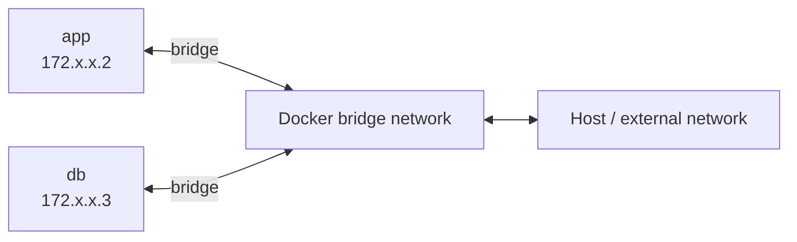

# 5. Docker Network

> **Tóm tắt một câu:** Docker Network kết nối các network endpoint của Container trong khi mỗi Container vẫn có network namespace, địa chỉ và `localhost` riêng.

> **Loại:** Explanation · **Cấp độ:** Beginner · **Thời gian:** Khoảng 30 phút  
> **Nguồn chính:** [Docker networking](https://docs.docker.com/engine/network/)

[← 4. tmpfs và lựa chọn storage](04-tmpfs-va-lua-chon-storage.md) · [Mục lục Storage & Networking](README.md) · [6. Port publishing →](06-port-publishing.md)

---

## 1. Vấn đề cần giải quyết

Container có process và network view được cô lập. Nhưng web service vẫn cần gọi database, nhận request từ host và truy cập Internet. Docker Network cung cấp kết nối có kiểm soát thay vì buộc mọi Container dùng trực tiếp network stack của host.

**Network namespace** là phạm vi network riêng của một Container trên Linux: interface, route, port và loopback riêng. **Network endpoint** là điểm Container tham gia một Docker Network.

## 2. Bridge network

**Bridge network** là mạng phần mềm trên một Docker host, nối các Container tham gia vào cùng segment logic. Docker thường tạo virtual interface và route để traffic đi giữa Container, bridge và host.



IP chỉ minh họa; không nên hard-code vì Docker có thể cấp lại. User-defined bridge network còn cung cấp DNS theo tên Container hoặc network alias.

## 3. Default bridge và user-defined bridge

```bash
docker network create app-net
docker run -d --name db --network app-net postgres:17
docker run -d --name app --network app-net myapp:1.0
```

| Token | Ý nghĩa |
|---|---|
| `network create` | Tạo Docker Network object. |
| `app-net` | Tên network dùng để attach endpoint. |
| `--network app-net` | Nối Container mới vào network đó. |

User-defined bridge giúp cô lập nhóm ứng dụng và hỗ trợ name resolution tốt hơn default bridge. Hai Container không cùng network không tự nhiên giao tiếp qua tên nội bộ, dù cùng chạy trên một host.

## 4. `localhost` thuộc về ai?

`localhost` và `127.0.0.1` trỏ về loopback của chính network namespace hiện tại.

- App chạy trên host gọi `localhost`: đang gọi host.
- App trong Container `api` gọi `localhost`: đang gọi chính `api`.
- App trong `api` muốn gọi Container `db`: dùng hostname/service name `db` và container port của database.

Đây là nguyên nhân phổ biến của lỗi “connection refused” khi cấu hình database URL là `localhost` trong Container.

## 5. Outbound và inbound

Container trên bridge thường có thể tạo kết nối outbound thông qua route/NAT do Docker thiết lập. Nhưng service bên ngoài không tự truy cập được mọi container port. Để nhận kết nối từ host hoặc bên ngoài, thường cần publish port hoặc một proxy/ingress phù hợp.

**NAT** (Network Address Translation) là cơ chế thay đổi thông tin địa chỉ khi packet đi qua ranh giới network. Nó giúp địa chỉ nội bộ giao tiếp ra ngoài nhưng không đồng nghĩa mọi cổng nội bộ được công khai.

## 6. Quan niệm dễ gây hiểu nhầm

### “Các Container cùng host luôn gọi được nhau.”

Sai vì kết nối phụ thuộc network attachment, policy và service đang listen. Cùng host không phải bằng chứng đủ.

### “Container có IP nên nên lưu IP đó vào config.”

IP là chi tiết runtime có thể đổi khi Container được thay. Tên service ổn định hơn và để DNS resolve IP hiện tại.

### “EXPOSE mở port ra Internet.”

`EXPOSE` trong Dockerfile mô tả port dự kiến của Image; nó không tạo host port mapping. Publishing là hành động runtime riêng.

## 7. Tự kiểm tra

1. `localhost` trong Container `api` có thể gọi `db` không?
2. Vì sao user-defined network tốt hơn hard-code IP?
3. Container gọi được Internet có chứng minh Internet gọi được Container không?

## 8. Tóm tắt

Mỗi Container có network scope riêng. Docker Network nối các endpoint; bridge tạo mạng logic trên một host; DNS giúp tìm service; publishing mới nối host port vào container port.

## Tài liệu tham khảo

- Docker Docs, [Networking overview](https://docs.docker.com/engine/network/)
- Docker Docs, [Bridge network driver](https://docs.docker.com/engine/network/drivers/bridge/)

[← 4. tmpfs và lựa chọn storage](04-tmpfs-va-lua-chon-storage.md) · [Mục lục Storage & Networking](README.md) · [6. Port publishing →](06-port-publishing.md)
