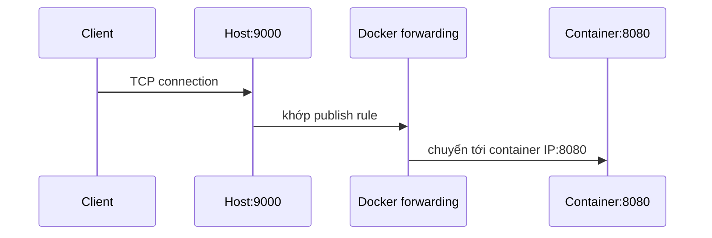

# 6. Port publishing

> **Tóm tắt một câu:** Port publishing tạo quy tắc chuyển kết nối từ một địa chỉ/port trên host đến port mà service lắng nghe trong Container; cú pháp luôn phải đọc theo chiều host → Container.

> **Loại:** Explanation · **Cấp độ:** Beginner · **Thời gian:** Khoảng 30 phút  
> **Nguồn chính:** [Publishing and exposing ports](https://docs.docker.com/get-started/docker-concepts/running-containers/publishing-ports/)

[← 5. Docker Network](05-docker-network.md) · [Mục lục Storage & Networking](README.md) · [7. DNS và service discovery →](07-dns-va-service-discovery.md)

---

## 1. Ba port dễ bị trộn lẫn

Một web app có thể listen trên port `8080` bên trong Container. Host có thể publish port `9000` tới đó. Client gọi `localhost:9000`; process trong Container vẫn nhận traffic tại container port `8080`.

**Listening port** là port process thực sự bind. **Container port** là port trong network namespace của Container. **Published host port** là cổng vào trên host được Docker ánh xạ tới container port.

## 2. Cú pháp `HOST:CONTAINER`

```bash
docker run --name web -p 9000:8080 myapp:1.0
```

```text
-p 9000:8080
   └host┘ └container┘
```

| Token | Scope | Ý nghĩa |
|---|---|---|
| `-p` / `--publish` | Docker CLI | Yêu cầu tạo port mapping. |
| `9000` | Host network | Port client kết nối vào host. |
| `:` | Publish parser | Phân tách host side và container side. |
| `8080` | Container network | Port đích; service phải listen tại đây. |

Luồng packet:



Nếu app thực tế listen `8081`, mapping `9000:8080` vẫn được tạo nhưng request thất bại vì không có process nhận ở port đích.

## 3. Bind address và phạm vi công khai

```bash
docker run -p 127.0.0.1:9000:8080 myapp:1.0
```

Cú pháp đầy đủ là `[host-ip:]host-port:container-port[/protocol]`. `127.0.0.1` giới hạn publish vào loopback host theo khả năng và cấu hình nền tảng; bỏ host IP thường bind rộng hơn.

> [!WARNING]
> Publish một database port trên mọi interface có thể làm service lộ ra network ngoài ý muốn. Luôn kiểm tra firewall, bind address và nhu cầu thật. Container-to-container trên cùng Docker Network thường không cần publish database port.

## 4. TCP, UDP và port tự động

```bash
docker run -p 5353:5353/udp mydns:1.0
docker run -p 8080 myapp:1.0
```

Ví dụ đầu chọn UDP; nếu bỏ protocol, mặc định thường là TCP. Ví dụ sau chỉ nêu container port, Docker chọn một host port khả dụng. Kiểm tra mapping bằng:

```bash
docker port web
docker container ls
```

## 5. `EXPOSE`, `expose` và `publish`

- Dockerfile `EXPOSE 8080`: metadata/documentation về port dự kiến.
- Compose `expose`: biểu đạt port dành cho giao tiếp nội bộ theo mô hình Compose; không tạo host mapping.
- CLI `-p` hoặc Compose `ports`: publish ra host.

Không có khai báo nào sửa ứng dụng để nó listen đúng port. App configuration vẫn phải khớp.

## 6. Trạng thái trước và sau

Trước `run -p`, host chưa có publish rule của Container. Sau khi tạo/chạy, Docker duy trì mapping gắn với Container. Stop làm endpoint không phục vụ; start lại cùng Container khôi phục mapping đã lưu trong cấu hình. Remove xóa Container và mapping đó.

## 7. Quan niệm dễ gây hiểu nhầm

### “`8080:80` nghĩa Container 8080 gọi host 80.”

Sai chiều. Nó nghĩa host port `8080` chuyển tới container port `80`.

### “Publish port giúp các Container gọi nhau.”

Không cần trong trường hợp thông thường. Các Container cùng network gọi trực tiếp service name và container port. Publish phục vụ kết nối qua host boundary.

### “Mở port trong Docker là đủ an toàn.”

Publishing chỉ tạo đường kết nối; authentication, TLS, firewall và application security vẫn cần được thiết kế riêng.

## 8. Tóm tắt

Đọc mapping từ trái sang phải: host → Container. Xác nhận app listen đúng container port, chọn bind address có chủ đích và không publish service nội bộ khi Docker Network đã đủ.

## Tài liệu tham khảo

- Docker Docs, [Publishing and exposing ports](https://docs.docker.com/get-started/docker-concepts/running-containers/publishing-ports/)
- Docker CLI, [docker run --publish](https://docs.docker.com/reference/cli/docker/container/run/#publish)

[← 5. Docker Network](05-docker-network.md) · [Mục lục Storage & Networking](README.md) · [7. DNS và service discovery →](07-dns-va-service-discovery.md)
