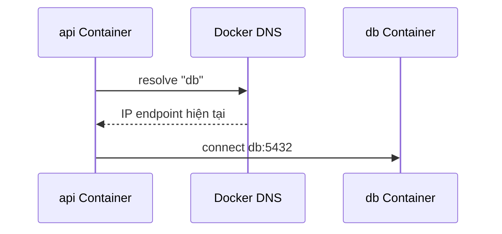

# 7. DNS và service discovery

> **Tóm tắt một câu:** Trên user-defined Docker Network, tên Container, service name hoặc network alias được DNS của Docker resolve thành endpoint hiện tại, giúp ứng dụng tránh phụ thuộc IP thay đổi.

> **Loại:** Explanation · **Cấp độ:** Beginner → Intermediate · **Thời gian:** Khoảng 25 phút  
> **Nguồn chính:** [Docker networking](https://docs.docker.com/engine/network/)

[← 6. Port publishing](06-port-publishing.md) · [Mục lục Storage & Networking](README.md)

---

## 1. Vì sao IP không phải contract tốt?

Container có thể bị remove và tạo lại với IP khác. Nếu app lưu `172.18.0.3`, cấu hình phụ thuộc một kết quả cấp phát runtime. Tên logic như `db` diễn tả dependency ổn định hơn.

**Service discovery** là cơ chế tìm endpoint hiện tại từ một tên logic. **Name resolution** là bước biến hostname thành địa chỉ mà network stack dùng để kết nối.

## 2. Luồng resolve và kết nối



DNS chỉ trả lời “địa chỉ nào”. Kết nối thành công còn phụ thuộc hai Container có network chung, process database listen đúng interface/port, policy cho phép và ứng dụng dùng protocol đúng.

## 3. Ví dụ bằng Docker CLI

```bash
docker network create app-net
docker run -d --name db --network app-net postgres:17
docker run --rm --network app-net alpine getent hosts db
```

| Thành phần | Ý nghĩa |
|---|---|
| `--network app-net` | Đặt client và `db` trong cùng phạm vi discovery. |
| `getent hosts db` | Yêu cầu resolver tìm địa chỉ của hostname `db`. |
| Output IP | Kết quả hiện tại, không phải giá trị nên hard-code. |

Không phải mọi Image đều có `getent`, `nslookup` hay `ping`. Thiếu công cụ chẩn đoán không chứng minh DNS hỏng.

## 4. Service name trong Compose

Trong Compose, các service cùng network mặc định thường gọi nhau bằng service name:

```yaml
services:
  api:
    image: example/api:1.0
    environment:
      DB_URL: jdbc:postgresql://db:5432/app
  db:
    image: postgres:17
```

`db` trong URL là hostname logic; `5432` là container port. Không dùng host-published port cho giao tiếp nội bộ này.

**Network alias** là tên bổ sung của endpoint trên một network. Một Container có thể có alias khác nhau trên các network khác nhau; alias thuộc network scope, không phải tên DNS toàn cục.

## 5. DNS không phải health check

Tên resolve được chỉ chứng minh endpoint được đăng ký. Database có thể còn khởi động, migration chưa xong hoặc ứng dụng bị lỗi. **Readiness** là khả năng service sẵn sàng xử lý request có ý nghĩa; nó cần health/readiness signal và retry phù hợp, không thể suy ra chỉ từ DNS.

DNS result cũng có thể được cache bởi ứng dụng hoặc runtime. Client dài hạn cần xử lý reconnect và thay đổi endpoint thay vì giả định một kết nối tồn tại mãi.

## 6. Checklist chẩn đoán

Khi `api` không gọi được `db`, kiểm tra theo lớp:

1. Hai Container có cùng Docker Network không?
2. Hostname dùng có đúng service name/alias không?
3. DNS resolve ra endpoint không?
4. Service có listen đúng container port và interface không?
5. Credentials, TLS và application protocol có đúng không?
6. Service đã ready hay chỉ mới được tạo?

## 7. Quan niệm dễ gây hiểu nhầm

### “Có DNS là có load balancer hoàn chỉnh.”

DNS-based discovery có thể trả endpoint, nhưng behavior cân bằng tải, health removal, connection reuse và failover phụ thuộc platform và client. Không nên suy rộng thành mọi đặc tính của load balancer.

### “Container name truy cập được từ mọi network.”

Tên được resolve theo network scope. Client không cùng network phù hợp không tự thấy endpoint.

### “Đổi IP làm app hỏng nên phải đặt static IP.”

Static IP thường che vấn đề discovery. Dùng tên logic, reconnect và readiness phù hợp tạo hệ thống linh hoạt hơn.

## 8. Tóm tắt

Docker DNS biến tên logic thành endpoint trong phạm vi network. Service-to-service dùng service name và container port; DNS không thay thế readiness, authentication hay retry.

## Tài liệu tham khảo

- Docker Docs, [Networking overview](https://docs.docker.com/engine/network/)
- Docker Docs, [Compose networking](https://docs.docker.com/compose/how-tos/networking/)

[← 6. Port publishing](06-port-publishing.md) · [Mục lục Storage & Networking](README.md)
