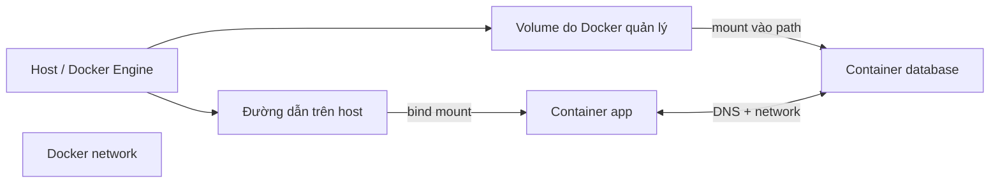

# Part 03. Docker Storage & Networking

Phần này giải thích hai câu hỏi xuất hiện ngay khi Container bắt đầu chạy ứng dụng thật: dữ liệu sẽ sống ở đâu, và các process giao tiếp với nhau bằng cách nào?

> **Loại:** Learning path index · **Cấp độ:** Beginner → Intermediate  
> **Điều kiện:** Đã hiểu Image, Container và lifecycle cơ bản  
> **Thời gian dự kiến:** Khoảng 4 giờ

## Phạm vi

- Phân biệt writable layer với dữ liệu được mount từ bên ngoài Container.
- Hiểu vòng đời, quyền sở hữu và cú pháp của Volume, bind mount và tmpfs mount.
- Chọn cơ chế storage theo mục đích thay vì dùng một loại cho mọi dữ liệu.
- Hiểu network namespace, bridge network, port publishing và `localhost`.
- Hiểu Docker DNS và service discovery giữa các Container.

## Lộ trình chapter

| Chapter | Câu hỏi trung tâm |
|---|---|
| [1. Dữ liệu trong Container](01-du-lieu-trong-container.md) | Vì sao dữ liệu trong writable layer không phải nơi lưu trữ bền vững? |
| [2. Docker Volume](02-docker-volume.md) | Docker quản lý dữ liệu độc lập với Container như thế nào? |
| [3. Bind mount](03-bind-mount.md) | Khi nào cần nối trực tiếp một đường dẫn host vào Container? |
| [4. tmpfs và lựa chọn storage](04-tmpfs-va-lua-chon-storage.md) | Chọn Volume, bind mount, tmpfs hay writable layer theo tiêu chí nào? |
| [5. Docker Network](05-docker-network.md) | Container có network riêng nhưng vẫn giao tiếp ra sao? |
| [6. Port publishing](06-port-publishing.md) | Cú pháp `HOST:CONTAINER` thực sự ánh xạ điều gì? |
| [7. DNS và service discovery](07-dns-va-service-discovery.md) | Vì sao Container nên gọi nhau bằng tên thay vì IP? |

## Mental model xuyên suốt

Storage và networking đều tạo một ranh giới rõ ràng. Mount nối một nguồn dữ liệu bên ngoài vào một đường dẫn trong filesystem của Container. Network nối các network endpoint mà không hợp nhất filesystem hay lifecycle của các Container.

## Checklist hoàn thành

Bạn hoàn thành phần này khi có thể:

- Dự đoán dữ liệu nào mất khi remove Container và dữ liệu nào còn.
- Đọc chính xác `source:destination` mà không nhầm host path với container path.
- Giải thích vì sao bind mount phụ thuộc host hơn Volume.
- Giải thích vì sao `localhost` trong app Container không phải database Container.
- Đọc `8080:80` theo đúng chiều host port → container port.
- Giải thích vì sao user-defined network cho phép gọi service bằng tên.

[← Mục lục sách](../../README.md)
