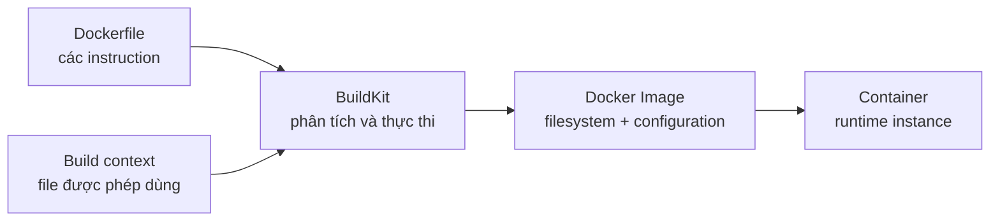

# 1. Dockerfile là gì?

> **Tóm tắt một câu:** Dockerfile là file văn bản chứa các instruction có thứ tự để builder tạo nội dung filesystem và cấu hình mặc định của Docker Image.

> **Loại:** Explanation · **Cấp độ:** Beginner · **Thời gian:** Khoảng 25 phút<br>
> **Nguồn chính:** [Dockerfile overview](https://docs.docker.com/build/concepts/dockerfile/)

[Mục lục Part 04](README.md) · [2. Build context và `.dockerignore` →](02-build-context-va-dockerignore.md)

---

## 1. Vấn đề Dockerfile giải quyết

Nếu chỉ cấu hình một máy bằng thao tác thủ công, hai developer có thể cài package khác phiên bản, đặt file ở vị trí khác hoặc quên một bước. Dockerfile chuyển quy trình đó thành một mô tả có thể đọc, review, lưu phiên bản và build lại.

Dockerfile không lưu Container đang chạy. Nó cũng không phải bản thân Image. Nó là **build definition** — bản mô tả đầu vào để một builder như BuildKit tạo Image.

## 2. Hiểu nhanh qua luồng build



Sơ đồ đọc từ trái sang phải. Dockerfile nói builder phải làm gì; build context cung cấp file mà `COPY` hoặc `ADD` có thể dùng; BuildKit xử lý từng bước và xuất Image. Chỉ khi `docker run` dùng Image thì Container mới xuất hiện.

## 3. Bốn khái niệm dễ bị trộn lẫn

| Khái niệm | Nghĩa chính xác |
|---|---|
| **Instruction** | Chỉ thị trong Dockerfile như `FROM`, `RUN`, `COPY`. |
| **Build step** | Một lần builder xử lý instruction và các đầu vào liên quan. |
| **Stage** | Một giai đoạn build bắt đầu bằng `FROM`; `FROM` tiếp theo mở stage mới. |
| **Layer** | Thành phần nội dung hoặc cấu hình góp phần tạo Image; không nên đồng nhất máy móc với mọi dòng Dockerfile. |

Một Dockerfile có đúng một `FROM` là **single-stage build** — build một giai đoạn — và hoàn toàn hợp lệ. Multi-stage không phải danh sách stage bắt buộc như “build, test, runtime”; nó chỉ xuất hiện khi file có nhiều `FROM`.

## 4. Dockerfile được đọc như thế nào?

Ví dụ tối thiểu:

```dockerfile
FROM nginx:alpine
COPY ./site/ /usr/share/nginx/html/
EXPOSE 80
```

Builder xử lý từ trên xuống:

1. `FROM` chọn Image nền và bắt đầu stage.
2. `COPY` lấy nội dung từ build context rồi thêm vào filesystem của stage hiện tại.
3. `EXPOSE` thêm metadata cho biết ứng dụng dự kiến lắng nghe port `80`; nó không tự mở port trên host.

Instruction có hai loại tác động lớn:

- Thay đổi filesystem, ví dụ `RUN`, `COPY`, `ADD`.
- Thay đổi Image configuration, ví dụ `ENV`, `WORKDIR`, `USER`, `ENTRYPOINT`, `CMD`.

Nhiều instruction vừa ảnh hưởng cách build tiếp diễn vừa trở thành mặc định runtime. Chẳng hạn `WORKDIR /app` làm các path tương đối của instruction sau resolve từ `/app`, đồng thời đặt working directory mặc định khi Container chạy.

## 5. Tên file và lệnh build

Tên mặc định là `Dockerfile` không có phần mở rộng:

```bash
docker build --tag demo-web:1.0 .
```

| Token | Vai trò |
|---|---|
| `docker build` | Yêu cầu builder tạo Image. |
| `--tag demo-web:1.0` | Gắn tên repository `demo-web` và Tag `1.0` cho kết quả. |
| `.` | Build context là thư mục hiện tại; không phải “đường dẫn đến Dockerfile”. |

Nếu Dockerfile có tên khác, dùng `--file`:

```bash
docker build --file docker/Dockerfile.prod --tag demo-web:1.0 .
```

Dockerfile nằm tại `docker/Dockerfile.prod`, nhưng context vẫn là `.`. Hai path giải quyết hai câu hỏi khác nhau: “đọc instruction ở đâu?” và “builder được thấy file nào?”.

## 6. Dockerfile không phải shell script

Một dòng `RUN` có thể gọi shell, nhưng parser đầu tiên vẫn là Dockerfile parser. Ví dụ:

```dockerfile
RUN apk add --no-cache curl
```

Dockerfile parser nhận `RUN`; nội dung còn lại mới được truyền cho shell mặc định của stage. Trong khi đó:

```dockerfile
COPY package.json /app/package.json
```

không phải lệnh shell `copy` hoặc `cp`; builder tự xử lý source từ build context và destination trong Image filesystem.

## 7. Quan niệm dễ gây hiểu nhầm

### 7.1 “Dockerfile là script chạy mỗi khi Container start.”

- **Vì sao nghe hợp lý:** File có các dòng giống command.
- **Sai ở đâu:** Dockerfile chủ yếu được xử lý ở build time. Khi start, Container dùng Image đã build và cấu hình `ENTRYPOINT`/`CMD`.
- **Cách nói đúng hơn:** Dockerfile mô tả cách tạo Image; Image configuration mô tả process mặc định khi Container chạy.

### 7.2 “Mỗi Dockerfile phải có build stage và runtime stage.”

- **Vì sao nghe hợp lý:** Nhiều ví dụ production dùng multi-stage.
- **Sai ở đâu:** Stage được xác định bằng `FROM`; một `FROM` tạo một stage hợp lệ.
- **Cách nói đúng hơn:** Dùng thêm stage khi cần tách tool, artifact hoặc trách nhiệm build.

### 7.3 “Dockerfile càng nhiều dòng thì Image chắc chắn càng lớn.”

- **Vì sao nghe hợp lý:** Mỗi dòng có vẻ tạo thêm dữ liệu.
- **Sai ở đâu:** Instruction cấu hình có thể không thêm filesystem content; kích thước phụ thuộc dữ liệu thực sự được thêm và cách layer được tạo.
- **Cách kiểm chứng:** So sánh `docker image history demo-web:1.0` với Dockerfile và quan sát các entry `0B`.

## 8. Tự kiểm tra mental model

1. Dockerfile, build context và Image khác nhau ở vai trò nào?
2. Điều gì trong file xác định số stage?
3. Tại sao `COPY` không đơn giản là một lệnh shell?
4. `EXPOSE 80` thay đổi filesystem hay configuration?

## 9. Tóm tắt

- Dockerfile là build definition, không phải Image, Container hay script khởi động.
- Builder kết hợp Dockerfile với build context để tạo Image.
- Instruction, build step, stage và layer có liên quan nhưng không đồng nghĩa.
- Một `FROM` tạo single-stage build; mỗi `FROM` bổ sung mở stage mới.

## 10. Học tiếp

Tiếp tục với [2. Build context và `.dockerignore`](02-build-context-va-dockerignore.md) để hiểu builder thật sự được đọc file nào và vì sao dấu `.` trong lệnh build rất quan trọng.

## Tài liệu tham khảo

- Docker Docs, [Dockerfile overview](https://docs.docker.com/build/concepts/dockerfile/)
- Docker Docs, [Build with Docker](https://docs.docker.com/build/)

[Mục lục Part 04](README.md) · [2. Build context và `.dockerignore` →](02-build-context-va-dockerignore.md)
