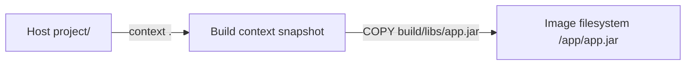

# 2. Build context và `.dockerignore`

> **Tóm tắt một câu:** Build context là tập file builder được phép sử dụng cho một build; `.dockerignore` loại bỏ file không cần thiết trước khi chúng tham gia context.

> **Loại:** Explanation · **Cấp độ:** Beginner · **Thời gian:** Khoảng 30 phút<br>
> **Nguồn chính:** [Docker build context](https://docs.docker.com/build/concepts/context/)

[← 1. Dockerfile là gì?](01-dockerfile-la-gi.md) · [Mục lục Part 04](README.md) · [3. Các instruction cơ bản →](03-cac-instruction-co-ban.md)

---

## 1. Dấu chấm cuối lệnh build là gì?

```bash
docker build --tag my-app:1.0 .
```

Cây cú pháp:

```text
docker
└── build
    ├── --tag
    │   └── my-app:1.0
    └── CONTEXT = .
```

| Token | Parser/scope | Giá trị đã resolve |
|---|---|---|
| `docker` | Docker CLI | Chọn chương trình Docker. |
| `build` | Docker CLI | Chọn hành động build Image. |
| `--tag` | Option của `build` | Đặt Image reference đầu ra. |
| `my-app:1.0` | Giá trị của `--tag` | Repository `my-app`, Tag `1.0`. |
| `.` | Positional argument `CONTEXT` | Thư mục hiện tại của terminal tại thời điểm chạy lệnh. |

Dấu `.` không có nghĩa “dùng Dockerfile ở đây”, dù mặc định CLI cũng tìm `Dockerfile` trong context. Nó trả lời câu hỏi: builder được nhận cây file nào làm đầu vào?

## 2. Ba filesystem cần phân biệt

Với cấu trúc:

```text
project/
├── Dockerfile
├── build/libs/app.jar
└── secret.env
```

và Dockerfile:

```dockerfile
WORKDIR /app
COPY build/libs/app.jar app.jar
```

| Path | Thuộc filesystem nào? | Resolve thành |
|---|---|---|
| `project/` | Host filesystem | Thư mục context khi chạy từ `project`. |
| `build/libs/app.jar` | Build context | Source `project/build/libs/app.jar`. |
| `app.jar` thứ hai | Image filesystem | `/app/app.jar` vì `WORKDIR` là `/app`. |

Hai chuỗi liên quan đến `app.jar` không trỏ cùng nơi. Builder đọc source trong context và tạo destination trong filesystem của stage hiện tại.



## 3. Vì sao `COPY ../file .` không hoạt động như mong đợi?

Builder không được tự do đọc toàn bộ máy host. Nếu context là `project/app`, file ở `project/shared/config.yml` nằm ngoài context và không phải đầu vào hợp lệ.

Giải pháp đúng tùy mục tiêu:

- Chọn context ở thư mục cha và chỉ định Dockerfile bằng `--file`.
- Di chuyển artifact cần thiết vào context trước build.
- Dùng named context hoặc cơ chế BuildKit phù hợp cho build nâng cao.

Không nên mở context lên cả ổ đĩa chỉ để `COPY` được một file; việc đó tăng dữ liệu đầu vào và nguy cơ gửi nhầm file nhạy cảm.

## 4. `.dockerignore` hoạt động ở đâu?

`.dockerignore` là file pattern dùng để loại path khỏi build context trước khi builder xử lý `COPY` thông thường.

```text
.git
.idea
.env
*.log
build/
!build/libs/
!build/libs/*.jar
```

| Pattern | Ý nghĩa |
|---|---|
| `.git` | Loại metadata Git. |
| `*.log` | Loại file log phù hợp pattern. |
| `build/` | Loại toàn bộ thư mục build. |
| `!build/libs/` | Mở lại đường dẫn cha cần đi qua. |
| `!build/libs/*.jar` | Giữ lại JAR trong `build/libs`. |

Pattern phủ định `!` cần được thiết kế cẩn thận: nếu thư mục cha đã bị loại và không được mở lại đúng cách, file con mong muốn có thể vẫn không vào context.

> [!IMPORTANT]
> `.dockerignore` giảm khả năng file tham gia build, nhưng không phải secret manager. Secret từng được copy hoặc dùng sai trong một layer có thể còn trong cache/history. Build secret cần cơ chế riêng của BuildKit.

## 5. Vì sao context nhỏ quan trọng?

Context nhỏ giúp:

- Giảm dữ liệu cần quét, đóng gói hoặc gửi cho builder.
- Giảm số file có thể làm thay đổi cache key của `COPY`.
- Tránh đưa `.git`, log, IDE metadata, local artifact và credential vào build ngoài ý muốn.
- Làm ý định của Dockerfile rõ hơn: chỉ những đầu vào cần thiết mới có mặt.

Context nhỏ không tự động làm Image nhỏ. Chỉ file thật sự được đưa vào Image qua `COPY`, `ADD` hoặc kết quả `RUN` mới ảnh hưởng filesystem Image.

## 6. Kiểm chứng context và `.dockerignore`

Build với progress dạng rõ ràng:

```bash
docker build --progress=plain --tag context-demo:1.0 .
```

Quan sát bước tải `.dockerignore` và build context. Nếu `COPY` báo file không tồn tại, kiểm tra lần lượt:

1. Context argument có đúng thư mục không?
2. Source path có tương đối với root context không?
3. `.dockerignore` có loại source không?
4. Tên file có sai chữ hoa/chữ thường khi build trên Linux không?

Có thể dùng Dockerfile kiểm tra tạm:

```dockerfile
FROM alpine:3.20
WORKDIR /check
COPY . .
RUN find . -maxdepth 3 -type f -print
```

Lệnh `find` cho thấy file nào thực sự đã được copy vào stage demo. Không dùng mẫu `COPY . .` một cách máy móc trong Image thật nếu context chứa nhiều dữ liệu không cần thiết.

## 7. Quan niệm dễ gây hiểu nhầm

### 7.1 “Dấu `.` là đường dẫn Dockerfile.”

- **Sai ở đâu:** `.` là context; Dockerfile mặc định chỉ được tìm theo quy ước.
- **Kiểm chứng:** `docker build -f docker/Dockerfile .` dùng Dockerfile trong `docker/` nhưng context vẫn là thư mục hiện tại.

### 7.2 “File không được `COPY` thì context lớn cũng không sao.”

- **Sai ở đâu:** File vẫn có thể phải được quét/gửi và có thể ảnh hưởng cache hoặc rò rỉ đầu vào cho builder.
- **Cách nói đúng hơn:** Context nên chỉ chứa đầu vào cần thiết, còn `COPY` quyết định phần nào đi vào stage.

### 7.3 “Thêm `.env` vào `.dockerignore` là đã quản lý secret an toàn.”

- **Sai ở đâu:** Nó chỉ ngăn file tham gia context theo pattern; credential còn có thể đi vào build qua `ARG`, command, cache hoặc nguồn khác.
- **Cách nói đúng hơn:** `.dockerignore` là hàng rào giảm phạm vi; secret build cần secret mount hoặc hệ thống secret phù hợp.

## 8. Tự kiểm tra mental model

1. Với `docker build -f deploy/Dockerfile .`, Dockerfile và context nằm ở đâu?
2. Source của `COPY src/app.jar /opt/app.jar` được resolve từ đâu?
3. Vì sao `.dockerignore` có thể cải thiện cache mà không trực tiếp làm Image nhỏ?
4. Khi `COPY` báo file missing, bạn kiểm tra bốn điều nào trước?

## 9. Tóm tắt

- Context là positional argument cuối của `docker build`.
- Source của `COPY` thuộc context; destination thuộc Image filesystem.
- `.dockerignore` loại file khỏi context, giúp giảm đầu vào, cache invalidation và rủi ro lộ file.
- Dockerfile path và context path là hai khái niệm độc lập.

## 10. Học tiếp

Đọc [3. Các instruction cơ bản](03-cac-instruction-co-ban.md) để phân tích từng instruction theo parser, scope và trạng thái trước/sau.

## Tài liệu tham khảo

- Docker Docs, [Build context](https://docs.docker.com/build/concepts/context/)
- Docker Docs, [`.dockerignore` files](https://docs.docker.com/build/concepts/context/#dockerignore-files)

[← 1. Dockerfile là gì?](01-dockerfile-la-gi.md) · [Mục lục Part 04](README.md) · [3. Các instruction cơ bản →](03-cac-instruction-co-ban.md)
