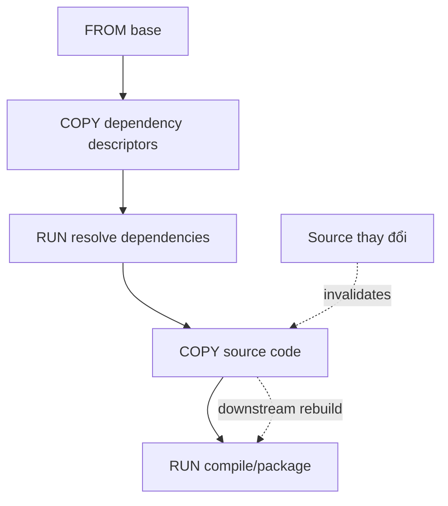

# 4. Layer và build cache

> **Tóm tắt một câu:** Build cache tái sử dụng kết quả build step khi instruction và đầu vào liên quan không đổi; thứ tự Dockerfile quyết định phạm vi cache bị mất.

> **Loại:** Explanation · **Cấp độ:** Intermediate · **Thời gian:** Khoảng 35 phút<br>
> **Nguồn chính:** [Docker build cache](https://docs.docker.com/build/cache/)

[← 3. Các instruction cơ bản](03-cac-instruction-co-ban.md) · [Mục lục Part 04](README.md) · [5. Multi-stage build →](05-multi-stage-build.md)

---

## 1. Layer và cache không phải cùng một thứ

**Filesystem layer** là tập thay đổi file có thứ tự trong Image. **Build cache** là kết quả trung gian builder có thể tái sử dụng để không thực hiện lại một build step.

Một instruction thay đổi configuration có thể xuất hiện trong history nhưng không thêm dữ liệu filesystem đáng kể. Vì vậy câu “mỗi dòng Dockerfile tạo một filesystem layer” quá đơn giản và dễ sai.

## 2. Builder quyết định cache hit như thế nào?

Ở mức mental model, builder xem:

- Instruction và option có giống không.
- Base/parent state có giống không.
- File metadata/nội dung đầu vào cho `COPY`/`ADD` có giống không.
- Mount, build argument và dependency liên quan có thay đổi không.

Nếu một step không còn hợp lệ, các step phụ thuộc phía sau thường phải tính lại.



Source thay đổi không nhất thiết làm mất cache bước resolve dependency nếu descriptor vẫn giữ nguyên và Dockerfile copy chúng trước.

## 3. Thứ tự instruction ảnh hưởng ra sao?

Dockerfile ít tận dụng cache:

```dockerfile
COPY . .
RUN ./gradlew dependencies
RUN ./gradlew bootJar
```

Bất kỳ file source, README hoặc log nào trong context thay đổi đều có thể làm `COPY . .` đổi, kéo theo hai `RUN` phía sau.

Mẫu có chủ đích hơn:

```dockerfile
COPY gradlew settings.gradle build.gradle ./
COPY gradle/ gradle/
RUN ./gradlew dependencies --no-daemon
COPY src/ src/
RUN ./gradlew bootJar --no-daemon
```

Dependency descriptor và Wrapper thay đổi ít hơn source, nên bước resolve dependency có cơ hội được tái sử dụng. Đây là nguyên tắc, không phải bảo đảm tuyệt đối: task Gradle cụ thể, plugin, network và cache mount vẫn ảnh hưởng kết quả.

## 4. Package manager cache và Image layer

Ví dụ Debian/Ubuntu:

```dockerfile
RUN apt-get update \
    && apt-get install -y --no-install-recommends curl \
    && rm -rf /var/lib/apt/lists/*
```

Ba thao tác nằm trong cùng `RUN` để metadata package được dùng và dọn trong cùng filesystem change. Nếu thêm file rồi xóa ở instruction sau, byte của file có thể vẫn tồn tại trong layer trước dù view cuối không thấy nó.

Không nên kết luận “gộp càng nhiều lệnh càng tốt”. Một `RUN` khổng lồ khó đọc, khó cache theo phần và khó debug. Gộp các thao tác có cùng vòng đời dữ liệu; tách các trách nhiệm ổn định khác nhau.

## 5. `--no-cache` thực sự làm gì?

```bash
docker build --no-cache --tag my-app:1.0 .
```

`--no-cache` yêu cầu không tái sử dụng cache cho Dockerfile steps. Nó làm build lại chậm hơn và không khiến ứng dụng runtime nhanh hơn. Nó cũng không nhất thiết kéo base Image mới nhất; dùng thêm `--pull` khi cần kiểm tra base mới theo reference.

```bash
docker build --pull --no-cache --tag my-app:1.0 .
```

## 6. Quan sát cache

Build hai lần:

```bash
docker build --progress=plain --tag cache-demo:1.0 .
docker build --progress=plain --tag cache-demo:1.0 .
```

Lần hai, quan sát step có chữ `CACHED`. Sau đó chỉ sửa một file trong `src/` và build lại. Nếu Dockerfile có ordering tốt, step dependency trước `COPY src/` vẫn cached.

Xem history:

```bash
docker image history cache-demo:1.0
```

History giúp xem step và kích thước đóng góp, nhưng không phải báo cáo cache đầy đủ và không ánh xạ một-một với filesystem layer.

## 7. Cache mount

BuildKit hỗ trợ cache mount để package manager tái sử dụng cache mà không đưa toàn bộ cache đó vào final Image layer:

```dockerfile
# syntax=docker/dockerfile:1
RUN --mount=type=cache,target=/root/.gradle \
    ./gradlew bootJar --no-daemon
```

`target=/root/.gradle` là path trong build step. Nội dung cache được builder quản lý và không tự trở thành nội dung final runtime Image. Cache mount cải thiện build lặp lại nhưng không phải dependency pinning; build vẫn cần version và repository ổn định.

## 8. Quan niệm dễ gây hiểu nhầm

### 8.1 “Mỗi instruction luôn tạo một filesystem layer.”

Sai vì instruction cấu hình có thể chỉ thay Image configuration/history. Hãy phân biệt build step, history entry và filesystem layer.

### 8.2 “Image ít layer luôn tốt hơn.”

Sai vì số layer chỉ là một tín hiệu. Khả năng cache, chia sẻ base layer, tính dễ đọc, dữ liệu thật và bảo mật quan trọng hơn việc ép số layer tối thiểu.

### 8.3 “`--no-cache` tối ưu Image chạy nhanh.”

Sai vì option này thay chiến lược build, không tối ưu JVM hay process runtime.

### 8.4 “Đổi thứ tự instruction không ảnh hưởng gì.”

Sai vì dependency chain của cache đi từ step trước sang step sau. Đặt nội dung thay đổi thường xuyên quá sớm làm phạm vi rebuild lớn hơn.

## 9. Tự kiểm tra mental model

1. Vì sao nên copy dependency descriptor trước source code?
2. Tại sao xóa file ở layer sau có thể không giảm byte của layer trước?
3. `--no-cache` và `--pull` giải quyết hai việc khác nhau nào?
4. Cache mount khác việc copy cache vào Image ra sao?

## 10. Tóm tắt

- Cache tái sử dụng build result; layer biểu diễn nội dung/cấu hình Image.
- Instruction ổn định nên đặt trước instruction thay đổi thường xuyên khi dependency cho phép.
- Gộp command khi dữ liệu cần được tạo và xóa trong cùng step, không gộp máy móc.
- Đánh giá tối ưu bằng thời gian build, kích thước, tính tái lập, bảo mật và khả năng bảo trì.

## Tài liệu tham khảo

- Docker Docs, [Build cache](https://docs.docker.com/build/cache/)
- Docker Docs, [Optimize cache usage](https://docs.docker.com/build/cache/optimize/)

[← 3. Các instruction cơ bản](03-cac-instruction-co-ban.md) · [Mục lục Part 04](README.md) · [5. Multi-stage build →](05-multi-stage-build.md)
