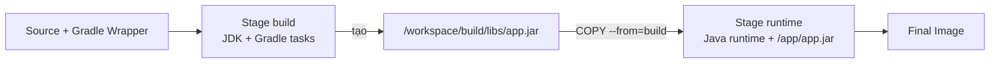

# 5. Multi-stage build

> **Tóm tắt một câu:** Multi-stage build dùng nhiều stage cô lập để tạo artifact bằng tool đầy đủ rồi chỉ chuyển kết quả cần chạy sang final runtime Image.

> **Loại:** Explanation · **Cấp độ:** Intermediate · **Thời gian:** Khoảng 40 phút<br>
> **Nguồn chính:** [Multi-stage builds](https://docs.docker.com/build/building/multi-stage/)

[← 4. Layer và build cache](04-layer-va-build-cache.md) · [Mục lục Part 04](README.md) · [6. Dockerfile cho Java →](06-dockerfile-cho-java.md)

---

## 1. Vấn đề của single-stage build

Ứng dụng thường cần compiler, package manager, test tool và source code để build; process production chỉ cần artifact và runtime. Nếu build và chạy trong cùng stage, final Image dễ mang theo Gradle/Maven, JDK compiler, source và cache không cần thiết.

Multi-stage cho phép hai môi trường có trách nhiệm khác nhau:

```text
Build stage: toolchain + source -> artifact
Runtime stage: runtime + artifact -> application process
```

## 2. Mỗi `FROM` mở một filesystem riêng

```dockerfile
FROM eclipse-temurin:21-jdk AS build
WORKDIR /workspace
COPY . .
RUN ./gradlew bootJar --no-daemon

FROM eclipse-temurin:21-jre AS runtime
WORKDIR /app
COPY --from=build /workspace/build/libs/app.jar app.jar
ENTRYPOINT ["java", "-jar", "/app/app.jar"]
```



Stage runtime không kế thừa filesystem của stage build. Chỉ nội dung được `COPY --from` hoặc cơ chế mount/chuyển rõ ràng mới đi qua ranh giới.

## 3. Phân tích `COPY --from`

```dockerfile
WORKDIR /app
COPY --from=build /workspace/build/libs/app.jar app.jar
```

Cây cú pháp:

```text
COPY
├── option --from=build
│   └── source filesystem: stage "build"
├── source /workspace/build/libs/app.jar
└── destination app.jar
    └── current stage filesystem: /app/app.jar
```

| Thành phần | Scope | Resolve |
|---|---|---|
| `--from=build` | Builder graph | Chọn stage đã đặt tên `build`. |
| `/workspace/build/libs/app.jar` | Filesystem stage `build` | Absolute source path trong build stage. |
| `app.jar` | Filesystem stage hiện tại | `/app/app.jar` vì runtime `WORKDIR /app`. |

Trước instruction, JAR tồn tại trong stage build nhưng chưa có trong runtime stage. Sau instruction, runtime stage có bản nội dung tại `/app/app.jar`; JDK, source và Gradle cache không tự đi theo.

## 4. Vì sao đặt tên stage?

Có thể dùng index `--from=0`, nhưng index thay đổi khi thêm/reorder `FROM`. Tên `AS build` diễn đạt ý nghĩa và ổn định hơn.

Tên stage chỉ tồn tại trong build graph, không trở thành tên Container hay layer runtime.

## 5. Final stage và `--target`

Mặc định, stage cuối là đầu ra Image. Có thể dừng ở stage cụ thể:

```bash
docker build --target build --tag my-app:build-stage .
```

`--target build` hữu ích để debug, test hoặc xuất variant, nhưng Image đó chứa tool build và không nên mặc định dùng làm runtime production.

Một Dockerfile có thể có stage chung:

```dockerfile
FROM eclipse-temurin:21-jre AS runtime-base
WORKDIR /app

FROM runtime-base AS development
# thêm công cụ phục vụ development

FROM runtime-base AS production
COPY --from=build /workspace/app.jar app.jar
ENTRYPOINT ["java", "-jar", "app.jar"]
```

## 6. Build cache có còn giữ stage build không?

“Không nằm trong final Image” không đồng nghĩa “biến mất khỏi máy builder”. BuildKit có thể giữ cache và intermediate result để build sau nhanh hơn. Khi push final Image, registry chỉ nhận nội dung reachable từ output Image, không tự nhận toàn bộ build cache.

Vì vậy:

- Multi-stage giảm nội dung final Image.
- Nó không phải công cụ xóa secret đã dùng sai trong build.
- Cache cleanup là hoạt động quản lý builder riêng.

## 7. Khi nào multi-stage đáng dùng?

- Ngôn ngữ compile thành artifact: Java, Go, Rust, C/C++.
- Frontend build ra static assets rồi serve bằng Nginx.
- Cần stage test/lint riêng.
- Cần nhiều output từ cùng source.

Không cần thêm stage chỉ để “trông production”. Nếu ứng dụng đã có artifact được build và kiểm chứng bên ngoài Docker, single-stage runtime Image copy artifact vào có thể là lựa chọn rõ ràng; đổi lại build không còn self-contained hoàn toàn.

## 8. Quan niệm dễ gây hiểu nhầm

### 8.1 “Multi-stage xóa mọi dấu vết build tool khỏi máy.”

Sai: build tool không nằm trong final Image, nhưng builder cache có thể còn dữ liệu trung gian.

### 8.2 “Stage sau tự nhìn thấy file stage trước.”

Sai: filesystem cô lập; phải dùng `COPY --from` với source path đúng.

### 8.3 “Runtime Image dùng JRE nên chắc chắn an toàn và nhanh hơn.”

Sai: runtime-only distribution thường nhỏ hơn và ít tool hơn, nhưng bảo mật còn phụ thuộc base patch, user, dependency, secret, configuration; tốc độ ứng dụng không được đảm bảo chỉ bởi kích thước Image.

### 8.4 “Multi-stage luôn tốt hơn build artifact ở CI rồi copy vào Image.”

Không tuyệt đối. Multi-stage tăng tính self-contained; artifact-first pipeline có thể tách build/test/signing rõ hơn. Hãy chọn theo ownership và khả năng tái lập của pipeline.

## 9. Tự kiểm tra mental model

1. Điều gì xác định stage mới?
2. Source và destination của `COPY --from` thuộc filesystem nào?
3. Vì sao Gradle cache không tự có trong final Image?
4. `--target` thay đổi output build ra sao?

## 10. Tóm tắt

- Mỗi `FROM` mở stage mới với filesystem riêng.
- Named stage giúp `COPY --from` rõ và ổn định.
- Final Image chỉ chứa nội dung từ final stage và phần được chuyển vào nó.
- Multi-stage tách trách nhiệm, nhưng không thay thế quản lý cache, secret hoặc pipeline security.

## Tài liệu tham khảo

- Docker Docs, [Multi-stage builds](https://docs.docker.com/build/building/multi-stage/)
- Docker Docs, [BuildKit](https://docs.docker.com/build/buildkit/)

[← 4. Layer và build cache](04-layer-va-build-cache.md) · [Mục lục Part 04](README.md) · [6. Dockerfile cho Java →](06-dockerfile-cho-java.md)
