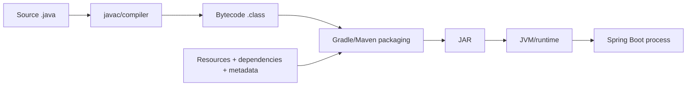

# 6. Dockerfile cho Java: JAR, JDK và runtime

> **Tóm tắt một câu:** Dockerfile Java tốt bắt đầu từ việc hiểu artifact: JDK biến source thành bytecode/JAR, còn runtime dùng JVM để thực thi artifact tương thích.

> **Loại:** Explanation · **Cấp độ:** Beginner → Intermediate · **Thời gian:** Khoảng 60 phút<br>
> **Nguồn chính:** [Spring Boot container images](https://docs.spring.io/spring-boot/reference/packaging/container-images/index.html)

[← 5. Multi-stage build](05-multi-stage-build.md) · [Mục lục Part 04](README.md) · [7. Bảo mật và tối ưu Image →](07-bao-mat-va-toi-uu-image.md)

---

## 1. Luồng artifact Java hoàn chỉnh



Java source không được JVM production chạy trực tiếp trong luồng phổ biến. Compiler tạo **bytecode** — mã trung gian trong file `.class`. Gradle hoặc Maven đóng gói bytecode cùng resource, metadata và có thể cả dependency thành JAR. Runtime cung cấp JVM và `java` launcher để chạy JAR.

## 2. JAR là gì?

**JAR (Java Archive)** là định dạng đóng gói dựa trên ZIP cho nội dung Java. Một JAR có thể chứa:

- Bytecode `.class`.
- Resource như `application.yml`, template hoặc static file.
- Metadata trong `META-INF/`.
- Dependency, nếu kiểu packaging nhúng chúng.

Không phải mọi JAR đều giống nhau:

| Kiểu | Đặc điểm |
|---|---|
| Library JAR | Thư viện để ứng dụng khác dùng; thường không chạy độc lập bằng `java -jar`. |
| Thin JAR | Chứa code ứng dụng nhưng dependency nằm bên ngoài/classpath riêng. |
| Fat/Uber JAR | Gom code và dependency để phân phối như một artifact lớn. |
| Spring Boot executable JAR | Có layout và launcher của Spring Boot để chạy bằng `java -jar`. |

## 3. Bên trong Spring Boot executable JAR

Cấu trúc rút gọn:

```text
application.jar
├── META-INF/
│   └── MANIFEST.MF
├── BOOT-INF/
│   ├── classes/
│   │   ├── com/example/Application.class
│   │   └── application.yml
│   └── lib/
│       ├── spring-boot-*.jar
│       └── ...dependency jars
└── org/springframework/boot/loader/
    └── ...launcher classes
```

Các trường manifest quan trọng thường gồm:

- `Main-Class`: launcher của Spring Boot Loader.
- `Start-Class`: class ứng dụng có `main` method.

Kiểm tra artifact:

```bash
jar --list --file build/libs/application.jar
unzip -p build/libs/application.jar META-INF/MANIFEST.MF
```

Lệnh đầu đọc danh sách entry; lệnh hai in manifest. Trên PowerShell nếu không có `unzip`, có thể mở bằng JDK `jar` sau khi giải nén vào thư mục tạm hoặc dùng `tar -xf` nếu môi trường hỗ trợ ZIP.

> [!IMPORTANT]
> JAR chứa ứng dụng, không chứa “Java runtime” theo nghĩa JVM đầy đủ. `java -jar` chỉ hoạt động khi môi trường đã có Java launcher/JVM tương thích.

## 4. Gradle tạo artifact nào?

| Task | Vai trò thường gặp |
|---|---|
| `jar` | Tạo JAR chuẩn của Java plugin; với Spring Boot nó có thể không phải executable artifact mong muốn. |
| `bootJar` | Tạo Spring Boot executable JAR. |
| `assemble` | Tạo artifact mà không nhất thiết chạy toàn bộ verification. |
| `build` | Thường phụ thuộc assemble và check/test theo cấu hình project. |

```bash
./gradlew clean bootJar --no-daemon
```

`clean` xóa output trước đó, giúp tránh chọn nhầm artifact cũ nhưng cũng làm mất incremental output. `bootJar` tạo executable JAR. `--no-daemon` phù hợp môi trường build ngắn hạn nhưng không phải quy tắc hiệu năng tuyệt đối.

`-x test` loại task `test` khỏi graph:

```bash
./gradlew bootJar -x test
```

Build có thể nhanh hơn, nhưng artifact không được test bởi bước đó. Chỉ dùng khi test đã chạy và được ràng buộc ở pipeline khác; đừng coi flag là boilerplate trung tính.

## 5. Maven tạo artifact nào?

Maven chạy theo lifecycle phase. `package` thực thi các phase trước nó và tạo package:

```bash
./mvnw package
```

Spring Boot Maven Plugin có goal `repackage` để chuyển JAR thành executable layout. Với cấu hình Spring Boot thông thường, goal này được gắn vào lifecycle.

```bash
./mvnw package -DskipTests
```

`-DskipTests` thường vẫn compile test source nhưng bỏ chạy test; `-Dmaven.test.skip=true` có thể bỏ cả compile test tùy plugin. Cả hai thay đổi mức bằng chứng của build, nên pipeline phải ghi rõ test được chạy ở đâu.

## 6. Vì sao build stage thường cần JDK?

**JDK (Java Development Kit)** cung cấp toolchain phát triển, thường gồm JVM/runtime, compiler `javac` và các công cụ như `jar`, `javadoc`, `jcmd` tùy distribution.

Build có thể cần:

- Compile `.java` thành `.class`.
- Chạy annotation processor như Lombok hoặc MapStruct.
- Process resource và generate source.
- Compile/chạy test.
- Đóng gói JAR và tạo metadata.

Gradle hoặc Maven điều phối build nhưng không thay thế compiler. Wrapper (`gradlew`, `mvnw`) tải/chọn phiên bản build tool; JDK vẫn cung cấp Java toolchain mà build tool chạy trên đó và/hoặc dùng để compile.

## 7. Vì sao runtime thường chỉ cần runtime distribution?

Một Spring Boot executable JAR điển hình cần:

- `java` launcher.
- JVM.
- Java runtime libraries/modules cần thiết.
- JAR ứng dụng và runtime configuration.

Nó thường không cần `javac`, source, Gradle, Maven hay dependency cache. Runtime-only Image có thể giảm kích thước và số tool sẵn có, qua đó giảm attack surface — số thành phần kẻ tấn công có thể lợi dụng.

Đây không phải luật tuyệt đối. Vận hành có thể cần `jcmd`, `jstack`, Java Flight Recorder hoặc tool thuộc JDK distribution. Khi đó dùng JDK runtime Image có thể hợp lý nếu lợi ích quan sát/debug lớn hơn chi phí kích thước và bề mặt tấn công.

Runtime nhỏ hơn không bảo đảm ứng dụng nhanh hơn và không tự làm Image an toàn. Patch level, dependency, user, secret và cấu hình vẫn quyết định rủi ro.

## 8. Compatibility giữa build và runtime

Bytecode có class file version. Nếu compile target Java 21 rồi chạy trên Java 17, JVM có thể báo:

```text
java.lang.UnsupportedClassVersionError
```

Ba lớp cần tương thích:

1. JDK chạy Gradle/Maven và compiler.
2. Target/release bytecode của project.
3. JVM trong runtime Image.

Build bằng JDK mới nhưng đặt `--release 17` có thể tạo bytecode cho Java 17, miễn source/API/dependency tương thích. Chiều runtime mới chạy bytecode cũ thường thuận lợi hơn, nhưng vẫn cần test vì dependency và hành vi runtime có thể khác.

Kiểm chứng:

```bash
java -version
javap -verbose -classpath build/libs/application.jar com.example.Application
```

Trong thực tế class nằm bên trong Spring Boot layout nên có thể cần extract trước khi `javap`; mục tiêu là so major version, không phải ghi nhớ số một cách máy móc.

## 9. Dockerfile Java canonical

```dockerfile
# syntax=docker/dockerfile:1
FROM eclipse-temurin:21-jdk AS build
WORKDIR /workspace

COPY gradlew settings.gradle build.gradle ./
COPY gradle/ gradle/
RUN --mount=type=cache,target=/root/.gradle \
    ./gradlew dependencies --no-daemon

COPY src/ src/
RUN --mount=type=cache,target=/root/.gradle \
    ./gradlew bootJar --no-daemon \
    && cp build/libs/application.jar /workspace/app.jar

FROM eclipse-temurin:21-jre AS runtime
WORKDIR /app
COPY --from=build /workspace/app.jar app.jar
USER 10001:10001
EXPOSE 8080
ENTRYPOINT ["java", "-jar", "/app/app.jar"]
```

Điểm quan trọng:

- Builder dùng JDK vì compile/package cần toolchain.
- Runtime dùng JRE distribution vì chỉ chạy artifact.
- Artifact được đổi thành tên ổn định `/workspace/app.jar`; tránh wildcard match nhầm plain JAR, test JAR hoặc artifact cũ.
- `COPY --from` chuyển đúng một artifact, không chuyển source/tool/cache.
- `ENTRYPOINT` exec form giúp JVM là process chính và nhận signal trực tiếp.

> [!NOTE]
> Tên artifact `application.jar` phụ thuộc cấu hình Gradle. Tutorial sẽ chỉ cách đặt `archiveFileName` ổn định. Nếu không đặt, phải biết chính xác output thay vì giả định wildcard luôn chỉ match một file.

## 10. Quan niệm dễ gây hiểu nhầm

### 10.1 “JAR chứa sẵn Java nên runtime Image có thể trống.”

Sai: JAR chứa bytecode/artifact; cần JVM hoặc native image phù hợp để thực thi.

### 10.2 “Mọi JAR đều chạy bằng `java -jar`.”

Sai: JAR phải có entrypoint/manifest và dependency layout phù hợp.

### 10.3 “Đổi tên JAR làm đổi ứng dụng bên trong.”

Sai trong trường hợp thông thường: đổi filename ngoài không sửa entry bên trong. Script/config tham chiếu tên cũ có thể hỏng, nhưng bytecode không tự đổi.

### 10.4 “Dependency trong fat JAR trở thành Docker layer riêng.”

Sai: `COPY app.jar` thêm một file archive vào filesystem change. Docker không tự tách từng nested dependency JAR thành layer riêng. Muốn layer hóa Spring Boot artifact cần kỹ thuật packaging/build khác.

## 11. Tự kiểm tra mental model

1. Gradle/Maven, JDK và JVM giữ vai trò khác nhau nào?
2. Vì sao Spring Boot executable JAR chạy được nhưng library JAR thường không?
3. Khi nào runtime JDK hợp lý hơn runtime-only distribution?
4. Vì sao wildcard `*.jar` có thể làm build không xác định?

## 12. Tóm tắt

- JDK phục vụ compile, processing, test và packaging; runtime chủ yếu cần JVM/launcher và artifact.
- JAR là ZIP-based Java archive, không phải Java runtime.
- Spring Boot executable JAR có loader, manifest, classes và dependency layout riêng.
- Version build target và runtime phải tương thích; Image nhỏ hơn không tự bảo đảm nhanh hoặc an toàn.

## Tài liệu tham khảo

- Spring Boot, [Container Images](https://docs.spring.io/spring-boot/reference/packaging/container-images/index.html)
- Spring Boot Gradle Plugin, [Packaging executable archives](https://docs.spring.io/spring-boot/gradle-plugin/packaging.html)
- Spring Boot Maven Plugin, [Packaging OCI images and executable archives](https://docs.spring.io/spring-boot/maven-plugin/)

[← 5. Multi-stage build](05-multi-stage-build.md) · [Mục lục Part 04](README.md) · [7. Bảo mật và tối ưu Image →](07-bao-mat-va-toi-uu-image.md)
