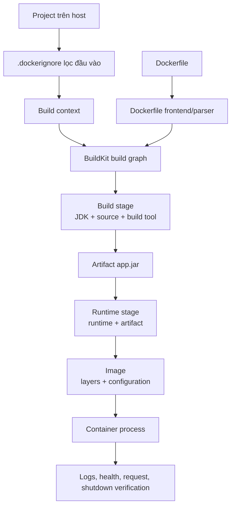

# 8. Bức tranh build hoàn chỉnh

> **Tóm tắt một câu:** Một build đáng tin nối đúng context, instruction, cache, stage, artifact, Image configuration và bước kiểm chứng runtime thành một chuỗi có thể giải thích.

> **Loại:** Explanation · **Cấp độ:** Intermediate · **Thời gian:** Khoảng 30 phút<br>
> **Nguồn chính:** [Docker Build overview](https://docs.docker.com/build/concepts/overview/)

[← 7. Bảo mật và tối ưu Image](07-bao-mat-va-toi-uu-image.md) · [Mục lục Part 04](README.md)

---

## 1. Luồng end-to-end



Mỗi mũi tên là một ranh giới cần hiểu:

1. `.dockerignore` quyết định file nào không vào context.
2. Parser hiểu instruction; BuildKit tạo build graph và quyết định cache.
3. Build stage tạo artifact bằng toolchain.
4. `COPY --from` chuyển artifact sang runtime stage.
5. Final stage xuất filesystem layer và Image configuration.
6. `docker run` tạo Container để kiểm tra process thực sự.

## 2. Dockerfile mẫu có chú giải

```dockerfile
# syntax=docker/dockerfile:1
FROM eclipse-temurin:21-jdk AS build
WORKDIR /workspace

COPY gradlew settings.gradle build.gradle ./
COPY gradle/ gradle/
RUN --mount=type=cache,target=/root/.gradle \
    ./gradlew dependencies --no-daemon

COPY src/ src/
RUN --mount=type=cache,target=/root/.gradle \
    ./gradlew bootJar --no-daemon \
    && cp build/libs/application.jar /workspace/app.jar

FROM eclipse-temurin:21-jre AS runtime
WORKDIR /app
COPY --from=build /workspace/app.jar app.jar
USER 10001:10001
EXPOSE 8080
ENTRYPOINT ["java", "-jar", "/app/app.jar"]
```

### Stage build

- `FROM ...-jdk AS build`: mở filesystem có JDK/toolchain.
- `WORKDIR /workspace`: mọi path tương đối sau đó resolve từ đây.
- Copy descriptor/Wrapper trước source: tạo ranh giới cache ổn định hơn.
- Cache mount giữ Gradle cache ở builder, không đưa nó vào final Image.
- `bootJar` tạo artifact; `cp` đặt tên đầu ra ổn định để stage sau không dùng wildcard.

### Stage runtime

- `FROM ...-jre AS runtime`: mở filesystem mới, không kế thừa build stage.
- `COPY --from=build`: source ở `/workspace/app.jar` của stage build; destination là `/app/app.jar` của runtime stage.
- `USER`: đặt identity runtime; base Image/filesystem phải cho phép đọc artifact và ghi nơi cần thiết.
- `EXPOSE`: metadata port dự kiến, không publish host port.
- `ENTRYPOINT`: cấu hình process mặc định; chưa chạy JVM trong lúc build.

## 3. Build, inspect, run, verify

```bash
docker build --progress=plain --tag sample-api:1.0 .
```

Kiểm tra Image:

```bash
docker image inspect sample-api:1.0 --format '{{json .Config}}'
docker image history sample-api:1.0
```

Quan sát `WorkingDir`, `User`, `Entrypoint`, `ExposedPorts` và history. Sau đó chạy:

```bash
docker run --detach --name sample-api --publish 8080:8080 sample-api:1.0
docker logs --follow sample-api
```

`--publish 8080:8080` ánh xạ host port `8080` đến Container port `8080`; nó là runtime configuration, không đến từ `EXPOSE`.

Xác minh endpoint:

```bash
curl http://localhost:8080/actuator/health
```

Nếu app không có Actuator, dùng endpoint thật của project. Thành công cần chứng minh process chạy, port đúng và request nhận response mong đợi; chỉ thấy Container `running` chưa đủ chứng minh ứng dụng ready.

Cleanup:

```bash
docker rm --force sample-api
docker image rm sample-api:1.0
```

> [!WARNING]
> `docker rm --force` dừng cưỡng bức và xóa Container; dữ liệu chỉ nằm trong writable layer sẽ mất. Lệnh cleanup ở đây dành cho Container demo không giữ dữ liệu cần bảo toàn.

## 4. Cách điều tra build lỗi theo ranh giới

| Hiện tượng | Ranh giới cần kiểm tra |
|---|---|
| `COPY` source not found | Context root, source path, `.dockerignore`, chữ hoa/thường |
| `./gradlew: permission denied` | Execute bit, filesystem source, lệnh `chmod`, line ending |
| Không tìm thấy JAR | Task packaging, artifact name, output path, wildcard |
| `UnsupportedClassVersionError` | JDK/target/runtime Java version |
| App chạy nhưng host không truy cập | Bind address, Container port, publish mapping, firewall |
| Permission denied lúc runtime | `USER`, ownership, writable directory/mount |
| Container exit ngay | `ENTRYPOINT`/`CMD`, logs, exit code, missing runtime dependency |

Debug có hệ thống nghĩa là xác định lỗi thuộc host/context, build stage, artifact, runtime stage hay runtime configuration trước khi đổi Dockerfile.

## 5. Checklist thiết kế Dockerfile mới

1. Artifact cuối là gì và command nào tạo nó?
2. Build cần JDK/compiler/tool nào; runtime thật sự cần gì?
3. Context root ở đâu và file nào phải bị ignore?
4. Instruction nào ổn định, instruction nào đổi thường xuyên?
5. Source/destination của mỗi `COPY` thuộc filesystem nào?
6. Artifact name có xác định không?
7. Process chạy user nào, ghi file ở đâu, nhận signal thế nào?
8. Port/config/secret được cung cấp ở build hay runtime?
9. Kiểm chứng Image configuration và endpoint bằng lệnh nào?
10. Cleanup/recovery của demo là gì?

## 6. Quan niệm dễ gây hiểu nhầm

### 6.1 “Build thành công nghĩa là Image chạy đúng.”

Sai: build chỉ chứng minh graph tạo được output. Runtime có thể lỗi command, permission, port, config hoặc compatibility; luôn cần smoke test phù hợp.

### 6.2 “Container `running` nghĩa là ứng dụng healthy.”

Sai: process có thể chạy nhưng chưa ready, dependency lỗi hoặc endpoint trả lỗi. Cần log/health/request verification.

### 6.3 “Dockerfile production là một template dùng nguyên cho mọi project.”

Sai: structure có thể tái sử dụng, nhưng artifact, toolchain, cache boundary, permission và operational requirement phải resolve theo project.

## 7. Tóm tắt Part 04

- Dockerfile và context là hai đầu vào khác nhau của builder.
- Syntax phải được đọc theo scope và state, đặc biệt với `COPY`, `RUN`, `ARG`/`ENV`, `ENTRYPOINT`/`CMD`.
- Cache hiệu quả đến từ dependency graph và ordering, không phải mẹo giảm số dòng.
- Multi-stage tách build tool khỏi final runtime Image.
- Java build cần hiểu JAR/JDK/JVM và version compatibility trước khi chọn base Image.
- Một Image chỉ được coi là sẵn sàng khi đã inspect và kiểm chứng runtime theo mục tiêu ứng dụng.

## 8. Thực hành tiếp

- [Dockerize Spring Boot với Gradle](../../tutorials/dockerize-spring-boot-gradle.md)
- [Dockerize Spring Boot với Maven](../../tutorials/dockerize-spring-boot-maven.md)
- Tra cứu [Dockerfile instructions](../../reference/dockerfile/instructions.md)

## Tài liệu tham khảo

- Docker Docs, [Build overview](https://docs.docker.com/build/concepts/overview/)
- Docker Docs, [Dockerfile best practices](https://docs.docker.com/build/building/best-practices/)

[← 7. Bảo mật và tối ưu Image](07-bao-mat-va-toi-uu-image.md) · [Mục lục Part 04](README.md) · [Tutorial Gradle →](../../tutorials/dockerize-spring-boot-gradle.md)
