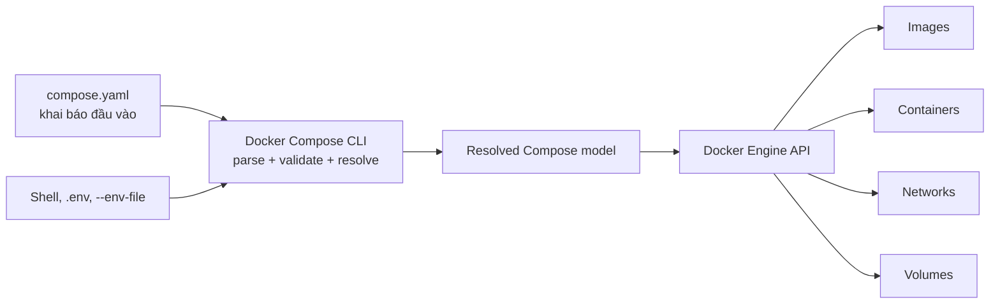

# 1. Docker Compose là gì?

> **Tóm tắt một câu:** Docker Compose đọc một application model được khai báo bằng YAML, resolve các giá trị rồi yêu cầu Docker Engine tạo và quản lý tập Service, Container, Network và Volume như một project thống nhất.

> **Loại:** Explanation · **Cấp độ:** Beginner · **Thời gian:** Khoảng 25 phút  
> **Nguồn chính:** [Docker Compose overview](https://docs.docker.com/compose/) · [Compose Specification](https://compose-spec.io/)

> **Sau chapter này, bạn có thể:**
> - Nêu đúng vấn đề Compose giải quyết.
> - Phân biệt Dockerfile với Compose file.
> - Giải thích luồng từ `compose.yaml` đến các Docker object.
> - Hiểu project, service và declarative model ở mức nền tảng.

[Mục lục Part 05](README.md) · [2. Cách đọc Compose YAML →](02-cach-doc-compose-yaml.md)

---

## 1. Vấn đề cần giải quyết

Docker CLI có thể tạo từng Container bằng `docker run`. Nhưng một ứng dụng thực tế thường cần nhiều thành phần: backend, database, cache, Network chung, Volume lưu dữ liệu, environment và thứ tự khởi động. Khi mọi cấu hình nằm trong nhiều lệnh terminal dài, người dùng phải tự nhớ:

- Container nào dùng Image nào.
- Port nào được publish.
- Volume nào được mount vào path nào.
- Các Container tham gia Network nào.
- Cấu hình nào cần lặp lại sau khi xóa và tạo lại môi trường.

Compose đưa các lựa chọn đó vào một file có cấu trúc, thường là `compose.yaml`, rồi cung cấp một nhóm lệnh để áp dụng và quản lý toàn bộ mô hình.

## 2. Hiểu nhanh: bản mô tả ứng dụng

Dockerfile trả lời câu hỏi: “Image này được build như thế nào?”

Compose file trả lời câu hỏi rộng hơn: “Ứng dụng này gồm những Service nào, mỗi Service chạy bằng Image nào, kết nối và lưu dữ liệu ra sao?”

**Declarative model** — mô hình khai báo trạng thái mong muốn. Bạn mô tả kết quả cần có, ví dụ một Service `backend` chạy từ Image cụ thể và tham gia Network mặc định; Compose tính các thao tác cần thực hiện để tiến gần trạng thái đó.

Điều này không có nghĩa Compose là một hệ thống orchestration production đầy đủ. Compose rất hữu ích cho local development, test, demo, CI và deployment đơn giản trên một Docker host; nó không tự cung cấp toàn bộ scheduling, self-healing hay multi-node orchestration.

## 3. Định nghĩa chính xác

Docker Compose gồm hai phần cần phân biệt:

1. **Compose Specification** — đặc tả mô hình dữ liệu và ý nghĩa các key như `services`, `networks`, `volumes`, `build`, `ports`.
2. **Docker Compose CLI** — công cụ được gọi bằng `docker compose`, đọc file, resolve model và giao tiếp với Docker Engine.

**Application model** — biểu diễn đã được Compose hiểu sau khi đọc YAML, nội suy biến, gộp file và áp dụng giá trị mặc định. File YAML là đầu vào; resolved model mới là cấu hình mà Compose thực sự áp dụng.

**Project** — ranh giới logic Compose dùng để nhóm tài nguyên của một lần triển khai mô hình. Project có tên; tên này thường trở thành prefix trong tên Container, Network và Volume do Compose quản lý.

Ví dụ project `shop` với Service `backend` có thể tạo Container mang tên gần giống `shop-backend-1`. Đây là tên runtime được sinh ra, không phải bằng chứng rằng Service và Container là cùng một khái niệm.

## 4. Luồng hoạt động



Luồng đọc từ trái sang phải:

1. Compose đọc một hoặc nhiều file YAML và các nguồn biến liên quan.
2. Parser kiểm tra cấu trúc YAML; Compose kiểm tra các key theo Specification.
3. Interpolation và merge tạo resolved model.
4. CLI gửi yêu cầu tới Docker Engine.
5. Engine pull/build Image, tạo Network/Volume và tạo hoặc thay thế Container khi cần.

Compose không “chạy file YAML”. YAML chỉ là dữ liệu cấu hình. Process thật chạy trong Container do Docker Engine quản lý.

## 5. Ví dụ nhỏ và cây sở hữu

```yaml
services:
  web:
    image: nginx:alpine
    ports:
      - "8080:80"
```

Có thể đọc cấu trúc bằng đường dẫn:

```text
services
└── web
    ├── image = nginx:alpine
    └── ports[0] = "8080:80"
```

- `services` là top-level key của Compose model.
- `web` là tên Service do người viết chọn.
- `image` thuộc Service `web`, không thuộc toàn project.
- `ports` là danh sách; phần tử đầu tiên publish host port `8080` tới container port `80`.

Khi chạy `docker compose up -d`, Compose thường tạo Network mặc định và một Container cho `web`. Nếu scale Service thành nhiều replica, một Service có thể tương ứng nhiều Container; host port cố định có thể gây xung đột và cần thiết kế khác.

## 6. Dockerfile, Compose và lệnh `docker run`

| Thành phần | Mục đích chính | Kết quả trực tiếp |
|---|---|---|
| Dockerfile | Mô tả cách build một Image | Image |
| `docker build` | Thực thi quy trình build | Image trong local store |
| `docker run` | Tạo và chạy một Container cụ thể | Một Container mới |
| Compose file | Mô tả ứng dụng nhiều Service và tài nguyên liên quan | Application model |
| `docker compose up` | Áp dụng model vào Docker Engine | Container, Network, Volume và Image cần thiết |

Compose không thay thế Dockerfile. Key `build` trong Compose chỉ nói Compose phải dùng build context và Dockerfile nào; quy tắc tạo Image vẫn nằm trong Dockerfile.

## 7. Project name ảnh hưởng điều gì?

Compose cần tên project để tách hai lần triển khai có cùng tên Service. Nguồn tên có thể đến từ option `-p`, biến `COMPOSE_PROJECT_NAME`, top-level `name`, hoặc tên thư mục dự án theo quy tắc ưu tiên của Compose.

```bash
docker compose -p demo up -d
```

| Token | Vai trò |
|---|---|
| `docker compose` | Chọn Compose CLI. |
| `-p demo` | Global option đặt project name thành `demo`. |
| `up` | Áp dụng application model. |
| `-d` | Option của `up`, chạy Container ở chế độ detached. |

`-p` thuộc Compose CLI trước command `up`; `-d` thuộc command `up`. Đổi vị trí tùy tiện có thể làm parser hiểu sai hoặc từ chối option.

## 8. Quan niệm dễ gây hiểu nhầm

### 8.1 “Compose là công cụ chạy nhiều lệnh `docker run`.”

- **Vì sao nghe hợp lý:** Kết quả dễ thấy là nhiều Container xuất hiện.
- **Điểm sai:** Compose quản lý một model và nhiều loại resource, theo dõi project identity, dependency, Network, Volume, build và khả năng reconcile cấu hình.
- **Cách nói tốt hơn:** Compose biến application model thành tập Docker resource có quan hệ và lifecycle chung.

### 8.2 “Compose file build ứng dụng.”

- **Vì sao nghe hợp lý:** `docker compose up --build` có thể tạo Image.
- **Điểm sai:** Compose chọn build configuration; Dockerfile/build system mới định nghĩa từng bước tạo artifact và Image.
- **Cách nói tốt hơn:** Compose điều phối build khi model có `build`; bản thân YAML không thay thế Dockerfile, Maven hoặc Gradle.

### 8.3 “Một Service luôn là một Container.”

- **Vì sao nghe hợp lý:** Mặc định `up` thường tạo một Container mỗi Service.
- **Điểm sai:** Service là desired configuration có thể tạo lại hoặc scale thành nhiều Container.
- **Cách nói tốt hơn:** Service là mẫu cấu hình runtime; Container là instance cụ thể được tạo từ mẫu đó.

## 9. Tự kiểm tra mental model

1. Vì sao xóa một Container của project chưa đồng nghĩa xóa định nghĩa Service?
2. File YAML và resolved Compose model khác nhau ở điểm nào?
3. Dockerfile và Compose file cùng nhắc đến Image nhưng trả lời hai câu hỏi khác nhau ra sao?
4. Project name giúp tránh loại xung đột nào?

## 10. Tóm tắt

1. Compose quản lý application model, không chỉ là cách viết ngắn của `docker run`.
2. Service mô tả trạng thái mong muốn; Container là runtime instance.
3. Compose CLI parse, resolve rồi gọi Docker Engine tạo Image, Container, Network và Volume.
4. Dockerfile định nghĩa build; Compose chọn cách các Image được dùng hoặc được build trong toàn ứng dụng.
5. Project name tạo ranh giới và thường ảnh hưởng tên runtime resource.

## 11. Học tiếp

Đọc [2. Cách đọc Compose YAML](02-cach-doc-compose-yaml.md) để hiểu vì sao indentation và vị trí của key quyết định object nào sở hữu cấu hình.

## Tài liệu tham khảo

- Docker Docs, [Docker Compose](https://docs.docker.com/compose/)
- Docker Docs, [How Compose works](https://docs.docker.com/compose/intro/compose-application-model/)
- Compose Specification, [The Compose Specification](https://compose-spec.io/compose-spec/)
- Docker Docs, [Specify a project name](https://docs.docker.com/compose/how-tos/project-name/)

[Mục lục Part 05](README.md) · [2. Cách đọc Compose YAML →](02-cach-doc-compose-yaml.md)
