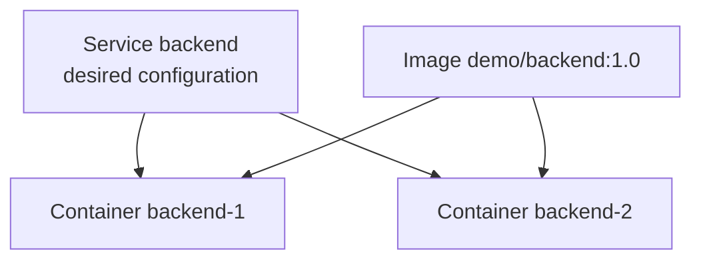

# 3. Service, Image và build

> **Tóm tắt một câu:** Service là cấu hình mong muốn cho một workload; `image` chọn hoặc đặt tên Image, còn `build` mô tả cách Compose yêu cầu builder tạo Image trước khi Service được triển khai.

> **Loại:** Explanation · **Cấp độ:** Beginner · **Thời gian:** Khoảng 35 phút  
> **Nguồn chính:** [Compose services](https://docs.docker.com/reference/compose-file/services/) · [Compose build specification](https://docs.docker.com/reference/compose-file/build/)

[← 2. Cách đọc Compose YAML](02-cach-doc-compose-yaml.md) · [Mục lục Part 05](README.md) · [4. Ports và Network →](04-ports-va-network.md)

---

## 1. Service không phải Container

**Service** — phần khai báo cấu hình dùng để tạo và quản lý một loại workload trong Compose project. Nó có thể quy định Image, command, environment, mount, Network, healthcheck và nhiều runtime setting khác.

**Container** — instance cụ thể do Docker Engine tạo từ Image cùng runtime settings đã resolve.



Một Service có thể tạo một Container theo mặc định, nhiều Container khi scale, hoặc Container mới thay Container cũ khi cấu hình đổi. Service name ổn định trong model; Container ID là identity runtime cụ thể.

## 2. `image`: chọn Image reference

```yaml
services:
  database:
    image: mysql:8.4
```

Cây cú pháp:

```text
services
└── database
    └── image = mysql:8.4
```

| Token | Scope | Giá trị đã hiểu |
|---|---|---|
| `services` | Compose model | Tập Service. |
| `database` | Project | Logical service name. |
| `image` | Service `database` | Image reference dùng để tạo Container. |
| `mysql` | Image reference | Repository/name. |
| `8.4` | Image reference | Tag, không phải Digest cố định. |

Nếu Image chưa có local và pull policy cho phép, Compose pull Image từ Registry. `image` không tự build source code và cũng không đảm bảo Tag luôn trỏ cùng nội dung theo thời gian.

## 3. `build`: chọn build configuration

Short syntax:

```yaml
services:
  backend:
    build: ./backend
```

Chuỗi `./backend` là build context, không phải path Dockerfile. Theo mặc định builder tìm file `Dockerfile` trong context đó.

Long syntax:

```yaml
services:
  backend:
    build:
      context: ./backend
      dockerfile: Dockerfile
```

| Key | Owner | Ý nghĩa |
|---|---|---|
| `build` | Service `backend` | Build configuration. |
| `context` | `build` object | Thư mục hoặc nguồn được gửi làm build context. |
| `dockerfile` | `build` object | Dockerfile được chọn; path được resolve theo context theo quy tắc build. |

Giả sử cấu trúc:

```text
project/
├── compose.yaml
└── backend/
    ├── Dockerfile
    ├── pom.xml
    └── src/
```

Với `context: ./backend`, builder nhìn thấy nội dung bên trong `backend/`. Trong Dockerfile, `COPY pom.xml .` lấy `backend/pom.xml` từ build context. Dockerfile không thể tùy ý `COPY ../secret.txt` ở ngoài context.

## 4. Khi có cả `image` và `build`

```yaml
services:
  backend:
    image: example/backend:1.0
    build:
      context: ./backend
```

Hai key không trùng vai trò:

- `build` nói Image được build từ đâu và bằng Dockerfile nào.
- `image` cung cấp tên/tag cho Image kết quả và reference Service dùng.

Hành vi pull/build còn phụ thuộc command và pull policy. `docker compose build` chủ động build; `docker compose up --build` build trước khi áp dụng; `docker compose pull` liên quan Image từ Registry. Đừng kết luận “có `build` là lúc nào Compose cũng build lại”.

Dùng:

```bash
docker compose build backend
docker compose images
```

Lệnh đầu build Image của Service `backend`; lệnh sau cho thấy Image mà các Service đang tham chiếu.

## 5. `command` không phải Dockerfile `RUN`

```yaml
services:
  backend:
    image: example/backend:1.0
    command: ["java", "-jar", "/app/app.jar"]
```

`command` là runtime configuration, thường ghi đè command mặc định của Image. Nó chạy khi Container start. Dockerfile `RUN` chạy trong quá trình build và tạo layer; hai thời điểm hoàn toàn khác nhau.

**Exec form** — dạng danh sách tách sẵn executable và argument. Ở ví dụ trên:

```text
command[0] = java
command[1] = -jar
command[2] = /app/app.jar
```

Dạng này tránh phụ thuộc shell cho việc tách chuỗi. Dạng string có quy tắc khác và không nên mặc định rằng Compose luôn chạy nó qua shell giống Dockerfile `CMD-SHELL`.

## 6. Build arguments khác runtime environment

```yaml
services:
  backend:
    build:
      context: ./backend
      args:
        JAVA_VERSION: "21"
    environment:
      SPRING_PROFILES_ACTIVE: docker
```

| Giá trị | Thời điểm | Scope |
|---|---|---|
| `build.args.JAVA_VERSION` | Build Image | Có thể được Dockerfile `ARG` sử dụng; không tự trở thành runtime env. |
| `environment.SPRING_PROFILES_ACTIVE` | Tạo Container | Đi vào environment của process trong Container. |

Không truyền secret bằng build arg rồi nghĩ rằng nó chỉ tồn tại tạm thời. Build metadata, cache hoặc layer có thể làm lộ dữ liệu tùy cách Dockerfile sử dụng. Dùng cơ chế build secret phù hợp khi thật sự cần secret trong build.

## 7. Recreate khi cấu hình thay đổi

Compose so sánh model mong muốn với resource hiện có. Khi Image hoặc cấu hình Service thay đổi, `docker compose up` có thể dừng và recreate Container để áp dụng model mới.

```text
Trước: Service backend -> Container ID A -> Image old
Thay đổi/build lại Image
Sau up: Service backend -> Container ID B -> Image new
```

Đây là lý do không nên xem Container là “server duy nhất phải giữ mãi”. Dữ liệu cần bền vững phải nằm ngoài writable layer của Container.

## 8. `container_name` và trade-off

```yaml
services:
  backend:
    container_name: fixed-backend
```

Key này ép tên Container cụ thể, nhưng làm mất lợi ích naming theo project và gây cản trở scaling vì nhiều replica không thể dùng cùng một tên. Thông thường Service name và tên do Compose sinh đã đủ cho giao tiếp nội bộ và quản lý.

## 9. Quan niệm dễ gây hiểu nhầm

### 9.1 “Service là tên đẹp của Container.”

Sai: Service là desired configuration; Container là một instance có ID và lifecycle. Recreate đổi Container nhưng Service vẫn tồn tại trong model.

### 9.2 “Có `build` nghĩa là Compose build mỗi lần `up`.”

Sai: build phụ thuộc command, cache, policy và trạng thái Image. Dùng `up --build` khi muốn yêu cầu build trước khi up.

### 9.3 “`image` và `build` loại trừ nhau.”

Sai: chúng có thể phối hợp; `build` xác định nguồn build, `image` đặt reference cho kết quả.

### 9.4 “`command` dùng để cài dependency vào Image.”

Sai: `command` chạy lúc Container start; cài dependency cần nằm trong quy trình build nếu muốn Image có thể lặp lại.

## 10. Tự kiểm tra

1. Vì sao build context và Dockerfile path không phải cùng một khái niệm?
2. Sau recreate, phần nào giữ identity logic và phần nào đổi identity runtime?
3. Khi nào nên dùng cả `image` và `build`?
4. Vì sao `container_name` thường không cần thiết?

## 11. Tóm tắt

1. Service mô tả workload; Container hiện thực một instance của cấu hình đó.
2. `image` chọn Image reference; `build` mô tả build context và Dockerfile.
3. `build.args` thuộc build-time; `environment` thuộc runtime.
4. `command` ghi đè runtime command, không tạo Image layer.
5. Compose có thể recreate Container để reconcile model mới.

## Tài liệu tham khảo

- Docker Docs, [Services top-level element](https://docs.docker.com/reference/compose-file/services/)
- Docker Docs, [Compose Build Specification](https://docs.docker.com/reference/compose-file/build/)
- Docker Docs, [docker compose build](https://docs.docker.com/reference/cli/docker/compose/build/)

[← 2. Cách đọc Compose YAML](02-cach-doc-compose-yaml.md) · [Mục lục Part 05](README.md) · [4. Ports và Network →](04-ports-va-network.md)
