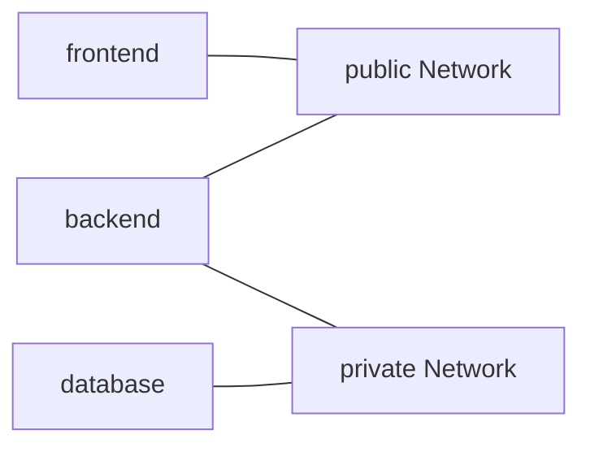

# 4. Ports và Network trong Compose

> **Tóm tắt một câu:** Các Service trong cùng Compose Network giao tiếp bằng service name và container port; `ports` chỉ cần khi publish một endpoint từ Container ra host hoặc bên ngoài Network đó.

> **Loại:** Explanation · **Cấp độ:** Beginner · **Thời gian:** Khoảng 35 phút  
> **Nguồn chính:** [Compose networking](https://docs.docker.com/compose/how-tos/networking/) · [Compose ports](https://docs.docker.com/reference/compose-file/services/#ports)

[← 3. Service, Image và build](03-service-image-va-build.md) · [Mục lục Part 05](README.md) · [5. Environment và interpolation →](05-environment-va-interpolation.md)

---

## 1. Hai hướng giao tiếp cần tách biệt

Một backend kết nối database trong Compose không cần đi vòng qua port của host. Hai Service trên cùng Network có thể dùng DNS nội bộ:

```text
backend Container -> database:3306 -> database Container
```

Trình duyệt trên máy host không ở trong Compose Network, nên muốn truy cập backend cần publish port:

```text
host localhost:8080 -> published port -> backend Container:8080
```

Nhầm hai đường đi này thường dẫn đến cấu hình backend dùng `localhost` để tìm database. Bên trong backend Container, `localhost` trỏ về chính backend Container, không trỏ tới Service `database` hay máy host.

## 2. Default Network và service discovery

Nếu không khai báo Network riêng, Compose thường tạo một default Network cho project và gắn các Service vào đó.

```yaml
services:
  backend:
    image: example/backend:1.0
  database:
    image: mysql:8.4
```

Service `backend` có thể kết nối hostname `database` trên port mà MySQL lắng nghe trong Container. **Service discovery** — cơ chế tìm endpoint bằng logical name thay vì hard-code IP. IP Container có thể thay đổi sau recreate; service name là contract ổn định hơn trong project Network.

## 3. Short syntax của `ports`

```yaml
services:
  web:
    image: nginx:alpine
    ports:
      - "127.0.0.1:8080:80/tcp"
```

Dạng tổng quát:

```text
[HOST_IP:]PUBLISHED:TARGET[/PROTOCOL]
```

| Phần | Giá trị ví dụ | Owner và ý nghĩa |
|---|---|---|
| `HOST_IP` | `127.0.0.1` | Địa chỉ trên host dùng để bind; giới hạn truy cập vào loopback của host. |
| `PUBLISHED` | `8080` | Port trên host. |
| `TARGET` | `80` | Port ứng dụng lắng nghe bên trong Container. |
| `PROTOCOL` | `tcp` | Giao thức; thường mặc định là TCP nếu bỏ qua. |

Trước `up`, host port `127.0.0.1:8080` chưa được Compose project bind. Sau `up`, traffic tới endpoint đó được chuyển tới target port `80` của Container.

Hai số giống nhau trong `"8080:8080"` vẫn thuộc hai network namespace khác nhau: số đầu là published port trên host, số sau là target port trong Container.

> [!WARNING]
> Bỏ `HOST_IP` thường bind trên các interface theo hành vi nền tảng, có thể làm dịch vụ truy cập được từ mạng ngoài máy. Với database chỉ cần cho local tool, cân nhắc `127.0.0.1:3306:3306` hoặc không publish nếu không cần host truy cập.

## 4. Long syntax của `ports`

```yaml
services:
  web:
    ports:
      - name: http
        target: 80
        published: "8080"
        host_ip: 127.0.0.1
        protocol: tcp
```

Long syntax tách field nên dễ đọc và mở rộng. `target` thuộc endpoint trong Container; `published` thuộc host publishing configuration. Quote `published` giúp biểu diễn đúng type theo Compose Specification hiện đại.

## 5. `expose` khác `ports`

```yaml
services:
  backend:
    expose:
      - "8080"
```

`expose` mô tả port nội bộ của Service mà không publish ra host. Tuy nhiên các Container cùng Network thường vẫn có thể kết nối tới port ứng dụng đang lắng nghe dù không có `expose`; Network connectivity không phải firewall rule được tạo chỉ bởi key này.

`EXPOSE` trong Dockerfile cũng chủ yếu là metadata/documentation cho port dự kiến, không tự publish host port. Chỉ `ports` hoặc option publish tương ứng mới tạo host publishing.

## 6. Custom Networks và segmentation

```yaml
services:
  frontend:
    image: example/frontend:1.0
    networks: [public]

  backend:
    image: example/backend:1.0
    networks: [public, private]

  database:
    image: mysql:8.4
    networks: [private]

networks:
  public:
  private:
```



Frontend và database không có Network chung nên không có đường kết nối trực tiếp qua hai Network này. Backend đóng vai trò thành phần tham gia cả hai vùng. Đây là **network segmentation** — chia kết nối thành các vùng nhằm giảm phạm vi giao tiếp không cần thiết.

## 7. Scope của hai key `networks`

Giống Volume, `networks` xuất hiện ở hai scope:

| Đường dẫn | Ý nghĩa |
|---|---|
| `services.backend.networks` | Gắn Container của Service `backend` vào các Network nào. |
| `networks.private` | Khai báo Network logical resource trong Compose model. |

Tên runtime thường có project prefix, ví dụ `shop_private`. Bên trong Network, Service thường được tìm qua service name như `database`, không cần biết runtime Network name hay IP cụ thể.

## 8. Port conflict và scaling

Nếu hai Service hoặc hai project cùng bind `0.0.0.0:8080`, Container sau có thể không start vì host port đã được dùng. Target port trong các Container có thể giống nhau vì mỗi Container có network namespace riêng; published port trên cùng host phải tránh xung đột.

Scale một Service có fixed published port cũng gặp vấn đề: nhiều replica không thể cùng bind chính xác một host IP/port. Production routing thường cần load balancer/reverse proxy hoặc cơ chế publish khác thay vì gắn một host port cố định cho từng replica.

## 9. Cách quan sát

```bash
docker compose ps
docker compose port web 80
docker compose exec backend getent hosts database
```

- `ps` hiển thị Container và published port của project.
- `port web 80` tra host endpoint đang map tới target port `80`.
- `exec ... getent hosts database` minh họa DNS lookup từ Container; lệnh phụ thuộc utility có trong Image.

PowerShell và Bash giống nhau với các lệnh một dòng trên. Khi xuống dòng, Bash dùng `\`, PowerShell dùng backtick và không được có space sau backtick.

## 10. Quan niệm dễ gây hiểu nhầm

### 10.1 “Muốn hai Container nói chuyện phải publish port.”

Sai: Service chung Network dùng container port trực tiếp. Publish chủ yếu mở đường từ host/ngoài Network.

### 10.2 “Backend dùng `localhost:3306` để vào database Container.”

Sai: `localhost` trong backend Container là backend Container. Dùng `database:3306` khi service name là `database`.

### 10.3 “`EXPOSE 8080` đã mở port ra máy thật.”

Sai: `EXPOSE` không tạo host binding; `ports` mới publish.

### 10.4 “Container IP là địa chỉ nên lưu vào config.”

Sai về độ bền: IP có thể đổi khi recreate. Dùng service discovery qua service name.

## 11. Tóm tắt

1. Container-to-container dùng service name và target port trên Network chung.
2. Host-to-container cần published port khi host phải truy cập.
3. Short syntax ports là `[HOST_IP:]PUBLISHED:TARGET[/PROTOCOL]`.
4. `networks` ở Service scope là attachment; top-level là resource declaration.
5. Service name bền hơn Container IP cho cấu hình nội bộ.

## Tài liệu tham khảo

- Docker Docs, [Networking in Compose](https://docs.docker.com/compose/how-tos/networking/)
- Docker Docs, [Ports](https://docs.docker.com/reference/compose-file/services/#ports)
- Docker Docs, [Networks top-level element](https://docs.docker.com/reference/compose-file/networks/)

[← 3. Service, Image và build](03-service-image-va-build.md) · [Mục lục Part 05](README.md) · [5. Environment và interpolation →](05-environment-va-interpolation.md)
