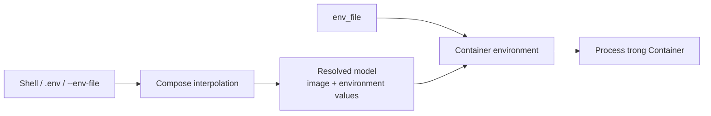

# 5. Environment và interpolation

> **Tóm tắt một câu:** Compose interpolation thay `${VAR}` trong model trước khi tạo resource; `environment` và `env_file` lại tạo environment cho process trong Container — hai cơ chế có nguồn, thời điểm và đích đến khác nhau.

> **Loại:** Explanation · **Cấp độ:** Beginner · **Thời gian:** Khoảng 40 phút  
> **Nguồn chính:** [Environment variables in Compose](https://docs.docker.com/compose/how-tos/environment-variables/) · [Interpolation](https://docs.docker.com/reference/compose-file/interpolation/)

[← 4. Ports và Network](04-ports-va-network.md) · [Mục lục Part 05](README.md) · [6. Volume trong Compose →](06-volume-trong-compose.md)

---

## 1. Một chữ “environment” nhưng hai luồng dữ liệu

Xét file:

```yaml
services:
  backend:
    image: "example/backend:${APP_TAG}"
    environment:
      DB_HOST: database
      DB_PASSWORD: "${DB_PASSWORD}"
```

`${APP_TAG}` và `${DB_PASSWORD}` được Compose CLI nội suy khi đọc model. Sau đó mapping `environment` trở thành cấu hình environment gửi vào Container.



**Interpolation** — thay biểu thức giữ chỗ trong giá trị Compose bằng dữ liệu từ nguồn biến trước khi model được áp dụng. **Container environment** — tập cặp key-value mà process thấy khi chạy.

## 2. `.env` không giống `env_file`

### `.env`: nguồn cho Compose CLI

File `.env` thường cung cấp giá trị cho interpolation:

```dotenv
APP_TAG=1.0
HOST_PORT=8080
```

```yaml
services:
  backend:
    image: "example/backend:${APP_TAG}"
    ports:
      - "${HOST_PORT}:8080"
```

Sau resolve, model gần tương đương:

```yaml
services:
  backend:
    image: example/backend:1.0
    ports:
      - mode: ingress
        target: 8080
        published: "8080"
        protocol: tcp
```

Các biến trong `.env` không tự động đi vào Container chỉ vì file tồn tại. Chúng chỉ đi vào nếu model sử dụng chúng ở `environment`, `env_file` hoặc field khác.

### `env_file`: nguồn environment cho Service Container

```yaml
services:
  backend:
    env_file:
      - ./config/backend.env
```

`backend.env`:

```dotenv
SPRING_PROFILES_ACTIVE=docker
DB_HOST=database
```

Các cặp này được đưa vào environment của Container. `env_file` thuộc Service; nó không phải top-level nguồn interpolation tổng quát cho toàn Compose model.

## 3. Cú pháp interpolation quan trọng

| Cú pháp | Ý nghĩa |
|---|---|
| `${VAR}` | Dùng giá trị `VAR`; có thể thành rỗng/cảnh báo nếu thiếu. |
| `${VAR:-default}` | Dùng `default` nếu `VAR` unset hoặc rỗng. |
| `${VAR-default}` | Dùng `default` chỉ nếu `VAR` unset. |
| `${VAR:?message}` | Báo lỗi nếu unset hoặc rỗng. |
| `${VAR?message}` | Báo lỗi nếu unset. |
| `${VAR:+replacement}` | Dùng replacement nếu VAR được set và không rỗng. |
| `$$` | Escape để tạo một dấu `$` literal, tránh Compose nội suy. |

Ví dụ beginner-safe:

```yaml
services:
  backend:
    image: "example/backend:${APP_TAG:-latest}"
    environment:
      DB_PASSWORD: "${DB_PASSWORD:?DB_PASSWORD must be set}"
```

`APP_TAG` có default; password thì fail sớm thay vì âm thầm thành chuỗi rỗng.

## 4. Nguồn interpolation và cách kiểm tra

Giá trị có thể đến từ shell chạy Compose, `.env`, hoặc file được chỉ định bằng `--env-file`, với precedence theo quy tắc Compose CLI. Thay vì nhớ mơ hồ, dùng:

```bash
docker compose config --environment
docker compose config
```

- `config --environment` cho biết environment Compose dùng để interpolation.
- `config` render resolved model.

> [!WARNING]
> Output `docker compose config` có thể chứa giá trị nhạy cảm sau resolve. Không đăng log hoặc đưa output này vào ticket công khai nếu model có secret.

## 5. Environment của Container và precedence

Một biến runtime có thể đến từ nhiều nơi: CLI `docker compose run -e`, `environment` sau interpolation, `env_file`, hoặc `ENV` trong Image. Ở mức beginner-safe, hãy nhớ nguyên tắc:

```text
Giá trị override lúc chạy
-> environment trong Compose
-> env_file của Service
-> ENV mặc định trong Image
```

Chi tiết precedence còn phụ thuộc việc giá trị được nội suy hoặc lấy trực tiếp; khi có xung đột, tra bảng chính thức và kiểm tra Container thực tế thay vì chỉ dựa vào thứ tự file.

Ví dụ:

```yaml
services:
  backend:
    env_file:
      - ./config/backend.env
    environment:
      LOG_LEVEL: debug
```

Nếu `backend.env` có `LOG_LEVEL=info`, mapping `environment` đặt `debug` có precedence cao hơn cho Service này.

Kiểm tra:

```bash
docker compose run --rm backend printenv LOG_LEVEL
```

Lệnh tạo one-off Container, in biến rồi xóa Container sau khi process kết thúc. Image phải có utility `printenv`; nếu không, dùng command phù hợp với Image.

## 6. Mapping syntax và list syntax của `environment`

Mapping:

```yaml
environment:
  DB_HOST: database
  DB_PORT: "3306"
```

List:

```yaml
environment:
  - DB_HOST=database
  - DB_PORT=3306
```

Mapping thường dễ đọc và review hơn vì key/value tách rõ. Với mapping, quote số và boolean nếu ứng dụng cần chuỗi chính xác.

Dạng chỉ có tên:

```yaml
environment:
  - API_TOKEN
```

Yêu cầu Compose lấy `API_TOKEN` từ môi trường chạy CLI. Nếu không có, hành vi có thể không tạo cảnh báo rõ như `${API_TOKEN:?message}`. Với biến bắt buộc, interpolation có error form giúp fail sớm hơn.

## 7. Shell environment khác Container environment

PowerShell:

```powershell
$env:APP_TAG = '1.2.0'
$env:DB_PASSWORD = 'local-only'
docker compose config
```

Bash:

```bash
export APP_TAG='1.2.0'
export DB_PASSWORD='local-only'
docker compose config
```

Các lệnh đặt biến trong process environment của shell hiện tại. Compose CLI đọc chúng. Chỉ những giá trị được model truyền vào `environment` mới trở thành Container environment.

## 8. Secret không nên được coi là environment bình thường

Environment tiện lợi nhưng có thể xuất hiện trong inspect output, process diagnostics, log hoặc config rendering. Không commit password thật vào Compose file hay `.env` được track.

Compose hỗ trợ `secrets` cho một số workflow, thường mount secret dưới dạng file vào Container. Tuy vậy mức bảo vệ phụ thuộc platform và cách triển khai; đừng quảng bá environment variable như một secret store.

## 9. Quan niệm dễ gây hiểu nhầm

### 9.1 “Đặt biến trong `.env` thì Container tự nhận.”

Sai: `.env` chủ yếu cấp biến cho interpolation; phải tham chiếu qua model hoặc dùng `env_file`/`environment`.

### 9.2 “`env_file` có thể thay `${VAR}` ở mọi nơi.”

Sai: `env_file` thuộc Service và tạo Container environment; nó không phải nguồn interpolation chung cho `image`, `ports` hay tên Volume.

### 9.3 “Environment là nơi an toàn để lưu secret vì nằm ngoài Image.”

Sai: ngoài Image không đồng nghĩa bí mật. Giá trị vẫn có thể bị quan sát qua nhiều bề mặt.

### 9.4 “Giá trị số trong environment là number.”

Sai ở đích process: environment variable là chuỗi. Quote giúp ý định rõ hơn trong YAML.

## 10. Tóm tắt

1. Interpolation tạo resolved Compose model; environment tạo biến cho process.
2. `.env` và `--env-file` có thể cấp nguồn cho interpolation; service `env_file` cấp runtime variables.
3. `environment` thường override cùng key từ service `env_file`.
4. `${VAR:?message}` giúp fail sớm với biến bắt buộc.
5. Dùng `docker compose config` để quan sát resolve nhưng bảo vệ output có secret.

## Tài liệu tham khảo

- Docker Docs, [Environment variables in Compose](https://docs.docker.com/compose/how-tos/environment-variables/)
- Docker Docs, [Interpolation](https://docs.docker.com/reference/compose-file/interpolation/)
- Docker Docs, [Environment variables precedence](https://docs.docker.com/compose/how-tos/environment-variables/envvars-precedence/)

[← 4. Ports và Network](04-ports-va-network.md) · [Mục lục Part 05](README.md) · [6. Volume trong Compose →](06-volume-trong-compose.md)
