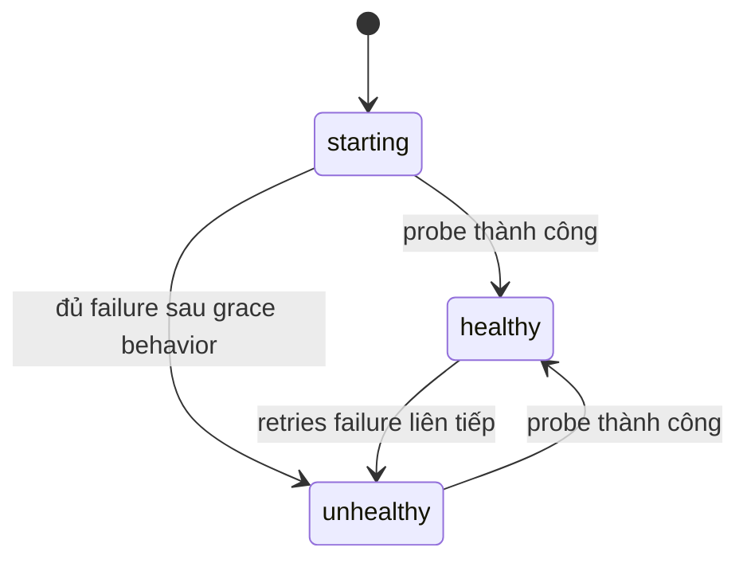
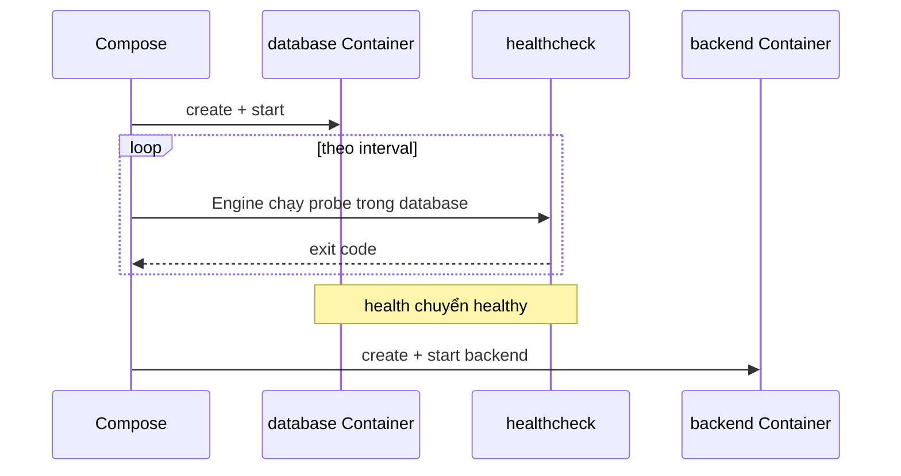

# 7. Healthcheck và dependency

> **Tóm tắt một câu:** Healthcheck biến một lệnh kiểm tra thành trạng thái health của Container; `depends_on` dùng trạng thái đó để điều phối startup, nhưng không thay thế retry, timeout và reconnect trong ứng dụng khi dependency hỏng lúc runtime.

> **Loại:** Explanation · **Cấp độ:** Beginner đến Intermediate · **Thời gian:** Khoảng 45 phút  
> **Nguồn chính:** [Compose healthcheck](https://docs.docker.com/reference/compose-file/services/#healthcheck) · [Compose depends_on](https://docs.docker.com/reference/compose-file/services/#depends_on)

[← 6. Volume trong Compose](06-volume-trong-compose.md) · [Mục lục Part 05](README.md) · [8. Compose CLI và lifecycle →](08-compose-cli-va-lifecycle.md)

---

## 1. “Container đã chạy” chưa có nghĩa “dịch vụ đã sẵn sàng”

Database process có thể đã start nhưng vẫn đang recovery, migrate hoặc mở data files. Backend start ngay thời điểm Container database chuyển sang `running` có thể nhận connection refused.

Phân biệt:

- **Started** — process chính đã được khởi động.
- **Ready** — dịch vụ có khả năng phục vụ loại request mà consumer cần.
- **Healthy** — trạng thái Docker suy ra từ healthcheck command và ngưỡng cấu hình.

Healthy chỉ chính xác bằng phép kiểm tra được viết. Một lệnh chỉ kiểm tra process tồn tại không chứng minh database chấp nhận query thật.

## 2. Cây syntax của `healthcheck`

```yaml
services:
  database:
    image: mysql:8.4
    healthcheck:
      test: ["CMD", "mysqladmin", "ping", "-h", "localhost"]
      interval: 10s
      timeout: 5s
      retries: 5
      start_period: 30s
```

```text
services.database.healthcheck
├── test
│   ├── [0] = CMD
│   ├── [1] = mysqladmin
│   ├── [2] = ping
│   ├── [3] = -h
│   └── [4] = localhost
├── interval = 10s
├── timeout = 5s
├── retries = 5
└── start_period = 30s
```

| Key | Ý nghĩa |
|---|---|
| `test` | Command được chạy bên trong Container để đánh giá health. |
| `interval` | Khoảng thời gian giữa các lần kiểm tra theo semantics của Engine. |
| `timeout` | Thời gian tối đa cho một lần kiểm tra trước khi bị coi thất bại. |
| `retries` | Số thất bại liên tiếp cần thiết để chuyển thành unhealthy. |
| `start_period` | Khoảng ân hạn cho process khởi tạo; failure trong giai đoạn này được xử lý đặc biệt và không tính như failure ổn định. |

Healthcheck command chạy trong Container, nên executable như `mysqladmin`, `curl`, `wget` hoặc shell phải thật sự có trong Image.

## 3. `CMD` và `CMD-SHELL`

### `CMD`: exec form

```yaml
test: ["CMD", "mysqladmin", "ping", "-h", "localhost"]
```

`CMD` yêu cầu chạy executable trực tiếp với argument đã tách. Không có shell tự mở rộng pipe, `&&`, glob hoặc environment theo cú pháp shell.

### `CMD-SHELL`: shell form

```yaml
test: ["CMD-SHELL", "mysqladmin ping -h localhost || exit 1"]
```

`CMD-SHELL` chạy chuỗi qua default shell của Container, thường là `/bin/sh` trên Linux Image. Nó hỗ trợ toán tử shell nhưng phụ thuộc shell tồn tại và cách quote đúng.

Short string:

```yaml
test: mysqladmin ping -h localhost
```

Trong Compose, string form tương ứng cách chạy qua shell theo semantics healthcheck. Dạng list explicit dễ review hơn vì cho biết rõ `CMD` hay `CMD-SHELL`.

### `NONE`

```yaml
healthcheck:
  test: ["NONE"]
```

Dùng để tắt healthcheck kế thừa từ Image trong trường hợp được hỗ trợ. Tắt kiểm tra không làm dịch vụ khỏe hơn; nó chỉ loại bỏ health signal.

## 4. Exit code và state transition

Healthcheck thường diễn giải exit code `0` là thành công, `1` là không khỏe; mã khác có thể có ý nghĩa dành riêng. Docker lưu output ngắn của các lần probe để inspect.



Health status nằm cạnh lifecycle status. Container có thể `running` nhưng `unhealthy`; Docker Compose không mặc định restart Container chỉ vì health chuyển unhealthy.

Kiểm tra:

```bash
docker compose ps
docker inspect --format '{{json .State.Health}}' <container>
```

Trong PowerShell, single quote giữ template nguyên vẹn tương tự ví dụ; trong Bash cũng dùng single quote thuận tiện.

## 5. `depends_on` short syntax

```yaml
services:
  backend:
    depends_on:
      - database
  database:
    image: mysql:8.4
```

Short syntax diễn tả startup/shutdown order ở mức dependency đã start. Nó không chờ database healthy trừ khi dùng long syntax với condition phù hợp.

`database` là service name, không phải Container name và không phải hostname tùy ý bên ngoài project.

## 6. `depends_on` long syntax

```yaml
services:
  backend:
    depends_on:
      database:
        condition: service_healthy
        restart: true
        required: true
```

| Key | Ý nghĩa |
|---|---|
| `database` | Dependency Service. |
| `condition` | Điều kiện Compose chờ trước khi tạo/start dependent theo flow command. |
| `restart` | Khi Compose chủ động update dependency, có thể restart dependent; không phải runtime restart policy của Container. |
| `required` | Nếu false, dependency thiếu có thể chỉ tạo cảnh báo thay vì chặn; cần phiên bản Compose hỗ trợ. |

Các condition chính:

- `service_started`: dependency đã được start; gần với short syntax.
- `service_healthy`: dependency có healthcheck và đạt healthy.
- `service_completed_successfully`: dependency chạy xong với exit code thành công; phù hợp job như migration.

## 7. Luồng startup với `service_healthy`



Điều được bảo đảm: trong flow startup do Compose quản lý, backend được chờ tới khi health signal của database đạt điều kiện.

Điều không được bảo đảm: database sẽ luôn khỏe sau đó, backend sẽ tự reconnect, request không timeout, hay dữ liệu đã sẵn sàng theo mọi nghiệp vụ.

## 8. Healthcheck tốt cần kiểm tra điều gì?

Probe nên:

- Kiểm tra đúng capability consumer cần.
- Chạy nhanh và có timeout.
- Không thay đổi dữ liệu hay gây side effect lớn.
- Không phụ thuộc dịch vụ ngoài không liên quan, tránh health cascade.
- Không chứa secret trực tiếp trong command nếu inspect có thể làm lộ.

Ví dụ HTTP:

```yaml
healthcheck:
  test: ["CMD", "curl", "--fail", "--silent", "http://localhost:8080/actuator/health/readiness"]
  interval: 10s
  timeout: 3s
  retries: 5
  start_period: 20s
```

`curl` phải tồn tại trong Image. Endpoint readiness nên phản ánh khả năng phục vụ, nhưng không nên biến mỗi probe thành truy vấn nặng.

## 9. Dependency lúc runtime vẫn cần application resilience

Sau startup, database có thể restart hoặc Network gián đoạn. `depends_on` không giữ backend ở trạng thái chờ lại và không viết retry logic thay ứng dụng.

Backend vẫn cần:

- Connection timeout hợp lý.
- Retry có backoff cho lỗi tạm thời.
- Connection pool có khả năng loại connection hỏng.
- Reconnect và circuit-breaking phù hợp.
- Error handling không làm mất dữ liệu hoặc tạo retry storm.

**Backoff** — tăng khoảng nghỉ giữa các lần retry để dependency có thời gian phục hồi và tránh tạo tải dồn dập.

## 10. Quan niệm dễ gây hiểu nhầm

### 10.1 “`depends_on` bảo đảm database luôn sẵn sàng.”

Sai: nó điều phối startup; runtime failure vẫn phải được consumer xử lý.

### 10.2 “Container running nghĩa là healthy.”

Sai: lifecycle state và health state tách biệt.

### 10.3 “`restart: true` trong `depends_on` là restart policy.”

Sai: key này liên quan Compose-managed dependency updates; restart policy của Service là key `restart` ở scope Service.

### 10.4 “Healthcheck dùng command bất kỳ trên host.”

Sai: command chạy trong Container và chỉ dùng được executable/filesystem/environment Container nhìn thấy.

## 11. Tóm tắt

1. `healthcheck.test` chạy trong Container và dùng exit code tạo health status.
2. `CMD` chạy executable trực tiếp; `CMD-SHELL` dùng shell và hỗ trợ toán tử shell.
3. `interval`, `timeout`, `retries`, `start_period` kiểm soát nhịp và ngưỡng đánh giá.
4. `depends_on` short syntax chờ started; long syntax có thể chờ healthy hoặc job hoàn thành.
5. Startup ordering không thay thế resilience lúc runtime.

## Tài liệu tham khảo

- Docker Docs, [healthcheck](https://docs.docker.com/reference/compose-file/services/#healthcheck)
- Docker Docs, [depends_on](https://docs.docker.com/reference/compose-file/services/#depends_on)
- Docker Docs, [Control startup order](https://docs.docker.com/compose/how-tos/startup-order/)

[← 6. Volume trong Compose](06-volume-trong-compose.md) · [Mục lục Part 05](README.md) · [8. Compose CLI và lifecycle →](08-compose-cli-va-lifecycle.md)
