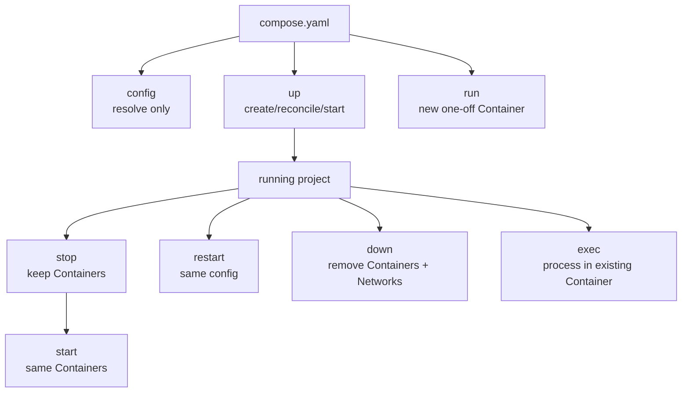

# 8. Compose CLI và lifecycle

> **Tóm tắt một câu:** Compose CLI quản lý project model qua các hành động khác nhau: `up` reconcile và có thể recreate, `stop/start/restart` giữ Container, `down` xóa project resource, còn `exec` và `run` nhắm tới hai loại runtime context khác nhau.

> **Loại:** Explanation · **Cấp độ:** Beginner · **Thời gian:** Khoảng 50 phút  
> **Nguồn chính:** [Docker Compose CLI](https://docs.docker.com/reference/cli/docker/compose/)

[← 7. Healthcheck và dependency](07-healthcheck-va-dependency.md) · [Mục lục Part 05](README.md)

---

## 1. Ngữ pháp tổng quát

```text
docker compose [GLOBAL OPTIONS] COMMAND [COMMAND OPTIONS] [SERVICE...]
```

Ví dụ:

```bash
docker compose -f deploy/compose.yaml -p shop up -d --build backend
```

| Token | Parser/scope | Ý nghĩa |
|---|---|---|
| `docker` | Docker CLI | Chọn CLI chính. |
| `compose` | Docker CLI | Chọn Compose command group. |
| `-f deploy/compose.yaml` | Global Compose option | Chọn file trước khi command được parse. |
| `-p shop` | Global Compose option | Đặt project name. |
| `up` | Compose command | Reconcile model và start resource. |
| `-d` | Option của `up` | Detached mode. |
| `--build` | Option của `up` | Build Image trước khi start. |
| `backend` | Service argument | Giới hạn target vào Service `backend` và dependency cần thiết. |

Global option phải nằm ở vị trí mà Compose parser sở hữu; option của command nằm sau command. Hiểu grammar giúp tránh học lệnh như một chuỗi phép thuật.

## 2. Project discovery và naming

Compose cần tìm file và project. Tên project ảnh hưởng nhóm resource. Hai terminal ở hai thư mục khác nhau có thể nhắm hai project khác dù file trông giống nhau.

```bash
docker compose ls
docker compose -p shop ps
```

`ls` liệt kê Compose project đang biết; `-p shop ps` quan sát Container thuộc project `shop` theo file/model được chọn.

Nguồn project name có precedence; cách rõ nhất trong script là truyền `-p` hoặc thiết lập top-level `name` có chủ đích. Không hard-code `container_name` chỉ để nhận diện project.

## 3. `config`: kiểm tra model trước khi chạy

```bash
docker compose config
docker compose config --services
docker compose config --images
```

`config` không tạo Container. Nó parse, merge, interpolate, validate và render model.

- `--services` in logical service names.
- `--images` in Image references sau resolve.

Đây là bước kiểm tra nhanh khi nghi ngờ indentation, variable, multiple files hoặc relative path.

## 4. `up`: create, start và reconcile

```bash
docker compose up -d --build
```

Trạng thái khái quát:

```text
Compose model + resource hiện có
        │ compare/reconcile
        ├── thiếu -> create
        ├── stopped phù hợp -> start
        ├── config/image đổi -> recreate khi cần
        └── đang đúng -> giữ/reuse
```

`up` không chỉ “start”. Nó có thể pull/build Image, tạo Network/Volume, create Container, start theo dependency và recreate Container có cấu hình lệch.

`-d` trả terminal sau khi start; không có `-d`, log được attach vào terminal. `--build` yêu cầu build trước khi start nhưng vẫn có thể dùng cache.

## 5. `ps` và `logs`: quan sát project

```bash
docker compose ps
docker compose logs --follow --tail 100 backend
```

`ps` hiển thị state, health và port. `logs` đọc stdout/stderr do Container logging mechanism thu thập.

| Token | Ý nghĩa |
|---|---|
| `logs` | Command đọc log của Service Container. |
| `--follow` | Tiếp tục chờ log mới. |
| `--tail 100` | Chỉ lấy 100 dòng cuối mỗi nguồn trước khi follow. |
| `backend` | Service filter, không phải file log path. |

Thoát follow bằng `Ctrl+C` không đồng nghĩa dừng detached Container.

## 6. `stop`, `start` và `restart`

```bash
docker compose stop backend
docker compose start backend
docker compose restart backend
```

- `stop` dừng process nhưng giữ Container object, writable layer và cấu hình đã tạo.
- `start` khởi động lại Container đã tồn tại; nó không đọc thay đổi Compose file để recreate.
- `restart` dừng rồi start lại Container hiện có; nó không phải cách đáng tin cậy để áp dụng environment/port/volume mới.

Nếu Compose file đổi, dùng `docker compose up -d` để reconcile. Đây là khác biệt quan trọng giữa “restart process trong object cũ” và “recreate object theo model mới”.

## 7. `down` và `rm`

```bash
docker compose down
docker compose rm -f -s backend
```

`down` nhắm project: dừng và xóa Container cùng Network do `up` tạo theo phạm vi command. Named Volume được giữ mặc định.

`rm` xóa stopped Service Container; `-s` stop trước nếu cần, `-f` không hỏi xác nhận. Nó không mang cùng semantics project teardown như `down`.

> [!WARNING]
> `docker compose down --volumes` xóa Volume của project và có thể phá dữ liệu. `down --rmi all` còn xóa Image theo phạm vi option. Đọc danh sách resource bằng `ps`, `images` và `volumes` trước khi dùng option phá hủy.

## 8. `exec` và `run` khác nhau về object

### `exec`: chạy trong Container đang chạy

```bash
docker compose exec backend sh
```

`exec` chọn một Container hiện có của Service `backend` rồi tạo thêm process `sh` bên trong nó. Filesystem, network identity và environment nền thuộc Container hiện tại.

### `run`: tạo one-off Container mới

```bash
docker compose run --rm backend java -version
```

`run` lấy cấu hình Service làm nền rồi tạo Container mới cho one-off command. `--rm` xóa one-off Container khi kết thúc. Theo mặc định, `run` có hành vi port khác `up` để tránh collision; dùng option publish phù hợp nếu thật sự cần.

```text
exec -> existing Container -> extra process
run  -> new one-off Container -> main process riêng -> optional remove
```

Đừng dùng `run` với giả định bạn đang kiểm tra đúng writable state của Container backend đang phục vụ request; đó là Container khác.

## 9. `build`, `pull` và `images`

```bash
docker compose build backend
docker compose pull database
docker compose images
```

- `build` build Image cho Service có build configuration; không start application.
- `pull` tải Image cho Service theo reference/policy; không recreate Container đang chạy.
- `images` liệt kê Image được Container của project sử dụng.

Sau build/pull, chạy `up -d` để model sử dụng Image mới nếu Container hiện tại chưa được recreate.

## 10. Bash và PowerShell multiline

Bash:

```bash
docker compose \
  -f deploy/compose.yaml \
  -p shop \
  up -d --build backend
```

PowerShell:

```powershell
docker compose `
  -f deploy/compose.yaml `
  -p shop `
  up -d --build backend
```

> [!WARNING]
> Trong PowerShell, backtick phải là ký tự cuối dòng. Một khoảng trắng sau backtick làm line continuation hỏng. Với script quan trọng, array argument hoặc lệnh một dòng thường ít lỗi hơn.

Chaining khi chỉ chạy bước sau nếu bước trước thành công:

Bash:

```bash
docker compose config && docker compose up -d
```

PowerShell 7+ hỗ trợ `&&`:

```powershell
docker compose config && docker compose up -d
```

Với Windows PowerShell cũ:

```powershell
docker compose config
if ($LASTEXITCODE -eq 0) { docker compose up -d }
```

## 11. Lifecycle map



Sơ đồ nhấn mạnh `start/restart` làm việc với object đã có; `up` quay lại model để reconcile; `down` teardown project resource; `run` tạo object riêng.

## 12. Quan niệm dễ gây hiểu nhầm

### 12.1 “Sửa Compose file rồi `restart` là đủ.”

Sai: restart dùng cấu hình Container cũ. `up` mới reconcile model và recreate khi cần.

### 12.2 “`down` giống `stop`.”

Sai: stop giữ Container; down xóa Container và Network theo project scope.

### 12.3 “`exec` và `run` đều chỉ chạy một command.”

Sai ở object/lifecycle: exec thêm process vào Container có sẵn; run tạo one-off Container mới.

### 12.4 “`build` xong ứng dụng đang chạy tự dùng Image mới.”

Sai: Container hiện tại vẫn gắn với Image đã dùng lúc create. Cần `up`/recreate.

## 13. Tóm tắt

1. Grammar Compose tách global option, command option và service argument.
2. `config` quan sát resolved model mà không tạo resource.
3. `up` reconcile; `start/restart` giữ Container hiện có; `down` xóa project resource.
4. `exec` dùng existing Container; `run` tạo one-off Container.
5. `build` và `pull` thay đổi Image availability, không tự thay Container đang chạy.
6. Option xóa Volume/Image phải có kiểm tra và backup phù hợp.

## Học tiếp

- Dùng [Compose file keys](../../reference/compose/compose-file-keys.md) để tra key theo scope.
- Dùng [Compose commands](../../reference/compose/compose-commands.md) để chọn command theo state transition.
- Quay lại [Mục lục Part 05](README.md) và tự trả lời checklist hoàn thành.

## Tài liệu tham khảo

- Docker Docs, [docker compose](https://docs.docker.com/reference/cli/docker/compose/)
- Docker Docs, [docker compose up](https://docs.docker.com/reference/cli/docker/compose/up/)
- Docker Docs, [docker compose down](https://docs.docker.com/reference/cli/docker/compose/down/)
- Docker Docs, [docker compose run](https://docs.docker.com/reference/cli/docker/compose/run/)
- Docker Docs, [docker compose exec](https://docs.docker.com/reference/cli/docker/compose/exec/)

[← 7. Healthcheck và dependency](07-healthcheck-va-dependency.md) · [Mục lục Part 05](README.md)
