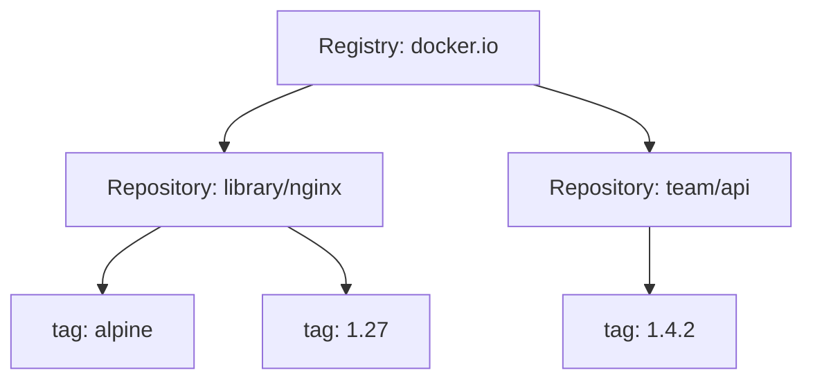

# 2. Registry, repository và Docker Hub

> **Tóm tắt một câu:** Registry là dịch vụ lưu trữ/phân phối content, repository là không gian tên tập hợp các version liên quan, còn Docker Hub là một sản phẩm Registry công cộng cụ thể.

> **Loại:** Explanation · **Cấp độ:** Beginner · **Thời gian:** Khoảng 25 phút  
> **Nguồn chính:** [Registry](https://docs.docker.com/get-started/docker-concepts/the-basics/what-is-a-registry/)

[← 1. Image reference](01-image-reference.md) · [Mục lục Registry & Delivery](README.md) · [3. Login, tag, push và pull →](03-login-tag-push-pull.md)

---

## 1. Ba cấp khái niệm

**Registry** là server/service nhận, lưu và phân phối image manifests, indexes, configurations và layer blobs. **Repository** là tập hợp các Image reference liên quan dưới một tên, thường chứa nhiều tag. **Docker Hub** là Registry service do Docker cung cấp, kèm account, organization, automated build và policy riêng.

Tag không chứa layer. Nó là tên tham chiếu trong repository; manifests và blobs mới biểu diễn artifact content.

## 2. Content-addressable storage

**Blob** là khối dữ liệu nhị phân như layer hoặc configuration. **Manifest** là tài liệu metadata liên kết configuration và layer bằng digest. Registry có thể tái sử dụng blob có cùng digest, nên push không nhất thiết upload lại mọi byte.

**Content-addressable** nghĩa object được nhận diện từ hash của nội dung. Nếu nội dung đổi, digest đổi. Điều này hỗ trợ integrity check và deduplication, nhưng quyền truy cập và trust vẫn cần policy riêng.

## 3. Public và private Registry

- Public repository cho phép pull theo policy công khai.
- Private repository yêu cầu identity và permission phù hợp.
- Self-hosted Registry do tổ chức vận hành.
- Cloud Registry là dịch vụ managed của nhà cung cấp.

“Private” không tự đồng nghĩa an toàn hoàn chỉnh. Cần kiểm soát credentials, TLS, vulnerability scanning, retention, audit và quyền push/delete.

## 4. Registry không phải source repository

Git repository lưu source, lịch sử commit và review workflow. Image Registry lưu artifact đã build. Một Image có thể mang label trỏ về commit, nhưng Registry không thay Git; Git cũng không thay nơi phân phối layer hiệu quả.

**Artifact** là đầu ra đóng gói có thể được phân phối, ví dụ container image. **Provenance** là thông tin về nguồn gốc và quá trình tạo artifact: source commit, builder, workflow, thời gian và attestation nếu có.

## 5. Authentication và authorization

**Authentication** trả lời “bạn là ai”; **authorization** trả lời “identity này được pull, push hoặc delete repository nào”. Đăng nhập thành công Registry không đảm bảo có quyền với mọi repository trong Registry đó.

Quyền nên theo nguyên tắc **least privilege**: CI chỉ cần push phạm vi được giao; runtime production thường chỉ cần pull; developer không nên dùng chung admin token dài hạn.

## 6. Quan niệm dễ gây hiểu nhầm

### “Docker Hub chính là Docker Registry duy nhất.”

Sai. Docker Hub là một implementation/service phổ biến. Image reference có thể trỏ tới GHCR, ECR, ACR, GCR/Artifact Registry hoặc Registry nội bộ.

### “Repository là một Image.”

Repository thường chứa nhiều tag và nhiều version content. Một tag cũng có thể đổi target theo thời gian.

### “Registry lưu một file Image nguyên khối.”

Registry quản lý nhiều object liên kết bằng manifest/index và digest; layer blob có thể được dùng lại.

## 7. Tóm tắt

Registry là dịch vụ; repository là phạm vi đặt tên; Docker Hub là một Registry product. Content được tổ chức thành manifest/index, config và blobs, còn policy quyết định ai được làm gì.

## Tài liệu tham khảo

- Docker Docs, [What is a registry?](https://docs.docker.com/get-started/docker-concepts/the-basics/what-is-a-registry/)
- OCI, [Image Manifest Specification](https://github.com/opencontainers/image-spec/blob/main/manifest.md)

[← 1. Image reference](01-image-reference.md) · [Mục lục Registry & Delivery](README.md) · [3. Login, tag, push và pull →](03-login-tag-push-pull.md)
