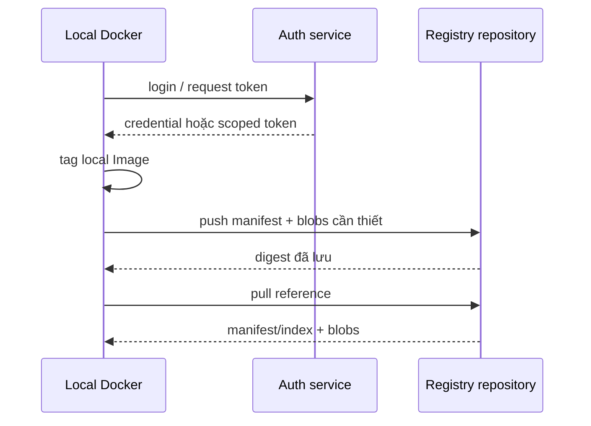

# 3. Login, tag, push và pull

> **Tóm tắt một câu:** `login` thiết lập credentials cho một Registry; `tag` tạo reference local; `push` truyền các object cần thiết lên repository; `pull` resolve reference và đưa content về local store.

> **Loại:** Explanation · **Cấp độ:** Beginner · **Thời gian:** Khoảng 35 phút  
> **Nguồn chính:** [docker login](https://docs.docker.com/reference/cli/docker/login/) · [docker push](https://docs.docker.com/reference/cli/docker/image/push/)

[← 2. Registry, repository và Docker Hub](02-registry-repository-va-docker-hub.md) · [Mục lục Registry & Delivery](README.md) · [4. Tag, digest và versioning →](04-tag-digest-va-versioning.md)

---

## 1. Luồng đầy đủ



## 2. `docker login` và auth scope

```bash
docker login registry.example.com
```

| Token | Ý nghĩa |
|---|---|
| `docker login` | Khởi tạo luồng authentication. |
| `registry.example.com` | Registry server mà credential áp dụng; không phải repository. |

Nếu bỏ server, CLI dùng Docker Hub theo hành vi mặc định. Credentials thường được lưu qua credential store/helper hoặc file cấu hình tùy hệ điều hành và cấu hình Docker.

> [!WARNING]
> Tránh đưa password trực tiếp vào command history. Với automation, dùng token ngắn hạn hoặc secret store và `--password-stdin` khi phù hợp. Không ghi token vào Dockerfile, Compose file hay Git.

```bash
printf '%s' "$REGISTRY_TOKEN" | docker login registry.example.com --username ci-bot --password-stdin
```

Shell mở rộng biến trước; Docker đọc secret từ standard input. Trong PowerShell, pipeline và biến có cú pháp khác, cần tránh copy nguyên mẫu Bash mà không kiểm tra.

Authentication scope là Registry host; authorization token có thể bị giới hạn theo repository/action như `pull` hoặc `push`. Login thành công nhưng push nhận `denied` thường là vấn đề quyền, tên repository hoặc token scope.

## 3. `docker tag`

```bash
docker image tag my-api:local registry.example.com/team/my-api:1.4.2
```

| Vị trí | Scope |
|---|---|
| `my-api:local` | Source reference trong local image store. |
| `registry.example.com/team/my-api:1.4.2` | Target reference được thêm vào cùng Image content. |

Trước lệnh, target name chưa tồn tại local. Sau lệnh, target trỏ tới cùng Image ID. Không có network transfer và không tạo layer mới.

## 4. `docker push`

```bash
docker image push registry.example.com/team/my-api:1.4.2
```

CLI chọn Registry từ reference, lấy credentials phù hợp, kiểm tra/upload blobs còn thiếu, rồi push manifest hoặc index và cập nhật tag trong repository theo quyền được cấp. Output cuối thường có digest; cần ghi nhận nó làm định danh artifact đã phát hành.

Nếu target chỉ là `my-api:1.4.2`, lệnh sẽ nhắm Registry mặc định theo reference, không tự biết repository private mà bạn “đang nghĩ tới”.

## 5. `docker pull`

```bash
docker image pull registry.example.com/team/my-api:1.4.2
```

Registry resolve tag thành manifest/index hiện tại. Docker tải metadata và blob chưa có, kiểm tra digest rồi cập nhật reference local. Pull không tạo Container.

Pull lại cùng tag sau khi publisher di chuyển tag có thể nhận content khác. Pull theo digest khóa object được yêu cầu:

```bash
docker pull registry.example.com/team/my-api@sha256:<digest>
```

## 6. Verification tối thiểu

```bash
docker image inspect registry.example.com/team/my-api:1.4.2 --format '{{json .RepoDigests}}'
docker buildx imagetools inspect registry.example.com/team/my-api:1.4.2
```

Lệnh đầu quan sát digest local được biết. Lệnh sau đọc metadata remote/multi-platform khi Buildx có sẵn. Cần so digest từ push, Registry và deployment thay vì chỉ thấy tag giống nhau.

## 7. Lỗi thường gặp

- `unauthorized`: chưa authentication hoặc credential sai Registry.
- `denied`: identity có thể hợp lệ nhưng thiếu quyền repository/action.
- `name unknown`: repository/reference không tồn tại theo Registry.
- Push nhầm Docker Hub: target tag không chứa Registry mong muốn.
- Tag đúng nhưng artifact sai: source local reference trỏ nhầm Image ID.

## 8. Tóm tắt

Login, tag, push và pull là bốn state transition khác nhau. Luôn kiểm tra Registry trong reference, auth scope, source Image ID và digest được Registry trả về.

## Tài liệu tham khảo

- Docker CLI, [docker login](https://docs.docker.com/reference/cli/docker/login/)
- Docker CLI, [docker image tag](https://docs.docker.com/reference/cli/docker/image/tag/)
- Docker CLI, [docker image push](https://docs.docker.com/reference/cli/docker/image/push/)
- Docker CLI, [docker image pull](https://docs.docker.com/reference/cli/docker/image/pull/)

[← 2. Registry, repository và Docker Hub](02-registry-repository-va-docker-hub.md) · [Mục lục Registry & Delivery](README.md) · [4. Tag, digest và versioning →](04-tag-digest-va-versioning.md)
