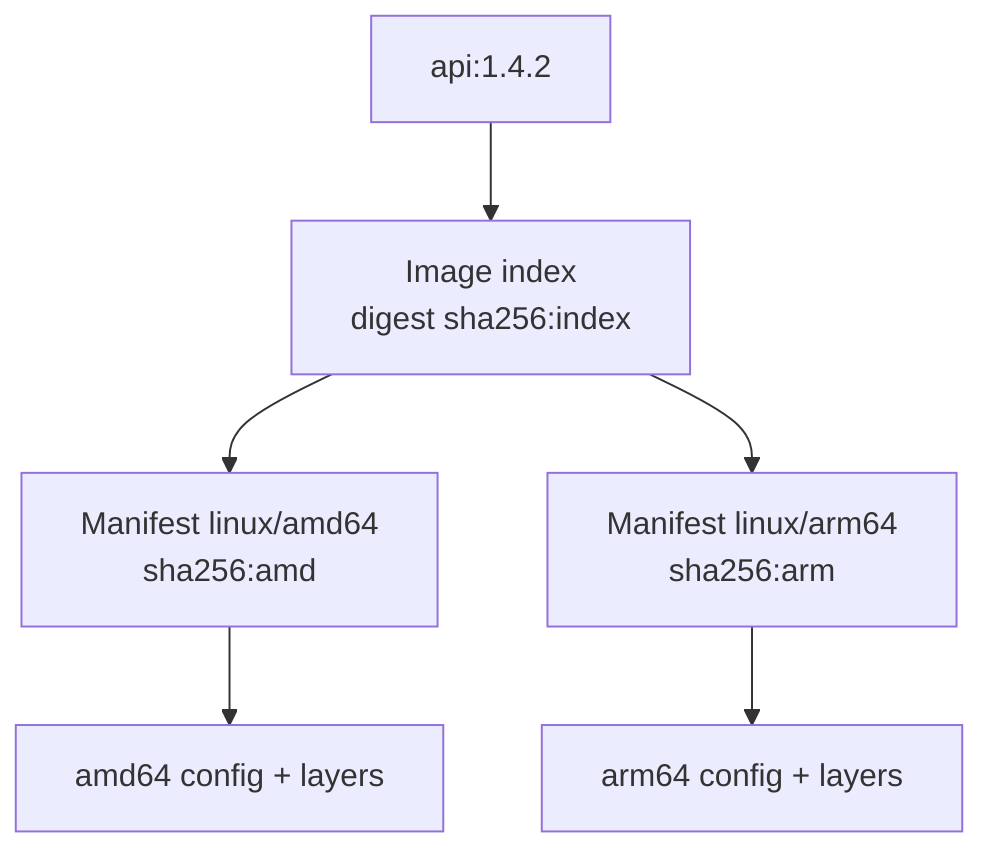

# 5. Multi-platform image

> **Tóm tắt một câu:** Multi-platform image dùng một image index để ánh xạ cùng reference tới manifest và layer phù hợp với từng cặp operating system/architecture.

> **Loại:** Explanation · **Cấp độ:** Intermediate · **Thời gian:** Khoảng 30 phút  
> **Nguồn chính:** [Multi-platform builds](https://docs.docker.com/build/building/multi-platform/)

[← 4. Tag, digest và versioning](04-tag-digest-va-versioning.md) · [Mục lục Registry & Delivery](README.md) · [6. Delivery flow →](06-delivery-flow.md)

---

## 1. Vấn đề platform

Binary được build cho `amd64` không mặc nhiên chạy native trên `arm64`. Base Image cũng chứa binary theo architecture. Nếu cùng một ứng dụng cần chạy trên laptop ARM và server AMD64, Registry cần phân phối biến thể phù hợp.

**Platform** thường được biểu diễn `OS/architecture[/variant]`, ví dụ `linux/amd64`, `linux/arm64` hoặc `linux/arm/v7`.

## 2. Image index và platform manifest



**Image index** (OCI index, thường được gọi là manifest list) là object liệt kê các manifest con và platform tương ứng. **Platform manifest** mô tả config và layer cho một platform cụ thể.

Khi pull, client gửi/biết platform cần dùng, Registry trả metadata và runtime chọn manifest phù hợp. Cùng tag có thể dẫn hai máy tới layer khác nhau nhưng vẫn thuộc cùng bộ phát hành multi-platform.

## 3. Build nhiều platform

```bash
docker buildx build \
  --platform linux/amd64,linux/arm64 \
  --tag registry.example.com/team/api:1.4.2 \
  --push .
```

| Token | Ý nghĩa |
|---|---|
| `buildx build` | Dùng BuildKit/Buildx workflow. |
| `--platform ...` | Danh sách target platform, phân tách bằng dấu phẩy. |
| `--tag ...` | Reference remote cho kết quả. |
| `--push` | Xuất kết quả multi-platform trực tiếp lên Registry. |
| `.` | Build context của shell hiện tại. |

Dấu `\` là line continuation của Bash. PowerShell thường dùng backtick, nhưng backtick dễ lỗi nếu có space phía sau; có thể viết một dòng để tránh nhầm shell syntax.

## 4. Ba chiến lược build

1. **Emulation** dùng QEMU để chạy instruction của architecture khác; dễ bắt đầu nhưng có thể chậm.
2. **Multiple native nodes** dùng builder node đúng architecture; nhanh và sát môi trường hơn nhưng cần hạ tầng.
3. **Cross-compilation** compiler tạo binary target khác; hiệu quả cho ngôn ngữ hỗ trợ nhưng Dockerfile/build system phải quản lý platform rõ.

Build thành công chưa đảm bảo ứng dụng đúng trên mọi platform. Native dependency, JNI library, shell script và package repository có thể khác nhau; cần test từng platform quan trọng.

## 5. Inspect đúng cấp

```bash
docker buildx imagetools inspect registry.example.com/team/api:1.4.2
```

Quan sát media type, index digest, danh sách manifest digest và platform. Khi audit deployment, ghi lại cả reference release và digest cấp phù hợp.

`docker image inspect` sau pull thường mô tả Image local đã chọn cho platform hiện tại, không nhất thiết hiển thị toàn bộ index remote. Chọn công cụ theo câu hỏi cần trả lời.

## 6. Quan niệm dễ gây hiểu nhầm

### “Một Image binary chạy được trên mọi CPU vì Container trừu tượng hóa hardware.”

Container cô lập process nhưng không tạo instruction set mới. Binary và kernel interface vẫn phải tương thích platform runtime, trừ khi có emulation.

### “Cùng tag và khác digest nghĩa Registry bị lỗi.”

Nếu so platform manifest digest trên hai architecture, khác nhau là bình thường. Cần xem chúng có cùng index digest/reference hay không.

### “Build multi-platform nghĩa đã test multi-platform.”

Build chỉ tạo artifact. Test runtime trên từng target vẫn là bước riêng.

## 7. Tóm tắt

Một tag multi-platform thường trỏ tới index; index chọn manifest theo platform; mỗi manifest có config/layer riêng. Verification phải nói rõ cấp digest và platform đang kiểm tra.

## Tài liệu tham khảo

- Docker Docs, [Multi-platform builds](https://docs.docker.com/build/building/multi-platform/)
- OCI, [Image Index](https://github.com/opencontainers/image-spec/blob/main/image-index.md)

[← 4. Tag, digest và versioning](04-tag-digest-va-versioning.md) · [Mục lục Registry & Delivery](README.md) · [6. Delivery flow →](06-delivery-flow.md)
