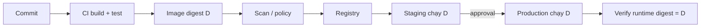

# 6. Delivery flow

> **Tóm tắt một câu:** Delivery đáng tin cậy build artifact một lần, ghi nhận digest và provenance, kiểm tra content trong Registry, rồi promote chính artifact đó tới môi trường đích thay vì build lại.

> **Loại:** Explanation · **Cấp độ:** Intermediate · **Thời gian:** Khoảng 35 phút  
> **Nguồn chính:** [Build, tag and publish an image](https://docs.docker.com/get-started/docker-concepts/building-images/build-tag-and-publish-an-image/)

[← 5. Multi-platform image](05-multi-platform-image.md) · [Mục lục Registry & Delivery](README.md)

---

## 1. Artifact delivery khác source delivery

Source commit là đầu vào. Container Image là artifact đã build. Nếu staging và production tự build lại từ cùng commit, dependency, timestamp, base image hoặc builder khác vẫn có thể tạo digest khác. “Cùng source” chưa chắc “cùng artifact”.

Nguyên tắc chính:

```text
Build once -> verify -> publish -> promote by digest -> deploy -> verify runtime
```

## 2. Luồng trạng thái



**Promotion** là việc đưa cùng artifact đã kiểm chứng sang stage/môi trường tiếp theo, thường bằng cách cập nhật deployment reference hoặc thêm release metadata/tag mà không rebuild.

## 3. Contract của một release

Một release record nên đủ để trả lời:

- Source commit nào tạo artifact?
- Workflow/builder nào thực hiện?
- Image reference dễ đọc là gì?
- Index hoặc manifest digest nào được phát hành?
- Target platform nào đã build và test?
- Kết quả test/scan/policy tại thời điểm phát hành?
- Môi trường nào đang chạy digest nào?

**Attestation** là metadata được ký hoặc liên kết có cấu trúc để đưa ra tuyên bố về artifact, ví dụ provenance hoặc SBOM. **SBOM** (Software Bill of Materials) là danh sách thành phần phần mềm trong artifact. Chúng tăng khả năng audit nhưng chỉ hữu ích khi consumer có policy kiểm tra.

## 4. Verification theo từng ranh giới

### Sau build

- Test application và startup contract.
- Inspect labels/platform/user/entrypoint quan trọng.
- Ghi nhận digest của output thực tế.

### Sau push

- Inspect reference remote, không chỉ local tag.
- So digest Registry trả về với release record.
- Kiểm tra đủ platform manifest dự kiến.

### Trước deploy

- Resolve tag thành digest hoặc dùng digest đã phê duyệt.
- Kiểm tra deployment config không trỏ nhầm repository/Registry.
- Bảo đảm runtime có pull permission nhưng không có quyền push không cần thiết.

### Sau deploy

- Kiểm tra workload thực tế dùng Image ID/digest nào.
- Health check chứng minh service hoạt động, không chỉ Container tồn tại.
- Đối chiếu version endpoint/log/label với release record nếu hệ thống hỗ trợ.

## 5. Ví dụ reference promotion

CI push:

```text
registry.example.com/team/api:git-a1b2c3d
digest: sha256:abc...
```

Sau khi staging đạt yêu cầu, production deployment nên chọn `sha256:abc...`. Có thể gắn thêm tag `1.4.2` hoặc `stable` cho con người, nhưng việc gắn tag không được làm mất record digest đã duyệt.

Rollback chọn digest release trước đó. Nếu chỉ rollback về tag `stable`, tag có thể đã di chuyển và không còn trỏ tới artifact cũ.

## 6. Authentication trong pipeline

- Developer identity dành cho thao tác cá nhân.
- CI publisher identity chỉ push repository cần thiết.
- Deployment/runtime identity chỉ pull.
- Token ngắn hạn tốt hơn credential dài hạn dùng chung.
- Secret không xuất hiện trong build layer, command log hoặc artifact metadata.

Registry authentication không thay application authentication; đây là hai trust boundary khác nhau.

## 7. Failure modes thường gặp

### Build lại theo môi trường

Staging và production nhận digest khác nên kết quả staging không chứng minh production artifact đã được test.

### Chỉ lưu tag

Không thể chứng minh tag trỏ content nào tại thời điểm deploy hoặc rollback chính xác.

### Chỉ kiểm tra push exit code

Push thành công chứng minh Registry chấp nhận thao tác, chưa chứng minh đủ platform, đúng repository hay deployment đã pull đúng artifact.

### Dùng credential quá rộng

Một pipeline bị xâm nhập có thể sửa hoặc xóa nhiều repository hơn phạm vi cần thiết.

## 8. Checklist delivery tối thiểu

1. Build một lần từ commit xác định.
2. Test artifact, không chỉ test source ngoài Image.
3. Push reference chứa Registry/repository rõ ràng.
4. Ghi nhận digest remote và platform.
5. Promote cùng digest.
6. Deploy bằng identity chỉ có quyền cần thiết.
7. Xác minh runtime đang chạy digest đã duyệt.
8. Giữ release record để rollback và audit.

## 9. Tóm tắt

Delivery không kết thúc ở `docker push`. Chuỗi đảm bảo phải nối source, build, Registry content và runtime deployment bằng digest cùng metadata nguồn gốc. Tag hỗ trợ con người; digest tạo bằng chứng artifact xuyên suốt.

## Tài liệu tham khảo

- Docker Docs, [Build, tag and publish](https://docs.docker.com/get-started/docker-concepts/building-images/build-tag-and-publish-an-image/)
- Docker Docs, [Build attestations](https://docs.docker.com/build/metadata/attestations/)
- OCI, [Image and Distribution Specifications](https://opencontainers.org/)

[← 5. Multi-platform image](05-multi-platform-image.md) · [Mục lục Registry & Delivery](README.md)
