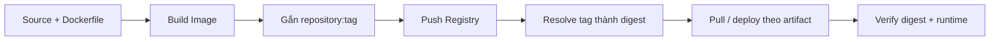

# Part 06. Docker Registry & Delivery

Phần này nối quá trình build trên máy developer với việc một môi trường khác pull và chạy đúng artifact đã được phát hành.

> **Loại:** Learning path index · **Cấp độ:** Beginner → Intermediate  
> **Điều kiện:** Đã hiểu Image và các lệnh Docker CLI cơ bản  
> **Thời gian dự kiến:** Khoảng 3 giờ 30 phút

## Phạm vi

- Đọc đầy đủ Image reference: registry, namespace, repository, tag và digest.
- Phân biệt Registry, repository và Docker Hub.
- Hiểu authentication scope của `login`, cùng luồng `tag`, `push`, `pull`.
- Phân biệt mutable tag với immutable content digest.
- Hiểu multi-platform image, image index và platform manifest.
- Thiết kế delivery flow có kiểm chứng artifact từ build đến deploy.

## Lộ trình chapter

| Chapter | Câu hỏi trung tâm |
|---|---|
| [1. Image reference](01-image-reference.md) | Docker phân tích một tên Image như thế nào? |
| [2. Registry, repository và Docker Hub](02-registry-repository-va-docker-hub.md) | Những khái niệm này khác nhau ở cấp nào? |
| [3. Login, tag, push và pull](03-login-tag-push-pull.md) | Image đi từ local store lên Registry và về máy khác ra sao? |
| [4. Tag, digest và versioning](04-tag-digest-va-versioning.md) | Làm sao cân bằng tên dễ đọc với tính tái lập? |
| [5. Multi-platform image](05-multi-platform-image.md) | Cùng một tag phục vụ nhiều CPU/OS bằng cách nào? |
| [6. Delivery flow](06-delivery-flow.md) | Làm sao chứng minh môi trường đích chạy đúng artifact đã build? |

## Bức tranh tổng thể

Registry phân phối artifact; nó không tự quyết định versioning policy, quyền truy cập, chất lượng Image hay việc deployment đã chạy đúng. Những đảm bảo đó đến từ cách nhóm gắn tên, xác thực, kiểm tra digest và ghi nhận provenance của artifact.

## Checklist hoàn thành

- Phân tích được `registry.example.com/team/api:1.4.2@sha256:...` theo từng token.
- Giải thích vì sao `docker tag` không upload hay copy toàn bộ layer.
- Biết credentials của `docker login` áp dụng cho Registry nào.
- Giải thích vì sao cùng tag không đảm bảo cùng nội dung.
- Phân biệt digest của image index với digest của platform manifest.
- Xác minh artifact sau push và trước/sau deploy bằng digest.

[← Mục lục sách](../../README.md)
