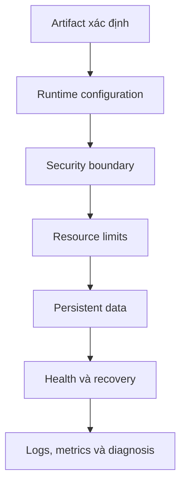

# 1. Production readiness

> **Tóm tắt một câu:** Một workload production-ready không chỉ khởi động được; nó phải có artifact xác định, cấu hình an toàn, giới hạn tài nguyên, dữ liệu bền vững và tín hiệu để phát hiện sai lệch.

> **Loại:** Explanation · **Cấp độ:** Intermediate · **Thời gian:** Khoảng 25 phút  
> **Nguồn chính:** [Docker security](https://docs.docker.com/engine/security/) · [Resource constraints](https://docs.docker.com/engine/containers/resource_constraints/)

> **Sau chapter này, bạn có thể:**
> - Đánh giá workload theo nhiều lớp thay vì chỉ nhìn `running`.
> - Phân biệt reliability, security và operability.
> - Nhận ra những giả định local thường thất bại trong production.
> - Chuyển một nhận định “có vẻ ổn” thành câu hỏi có bằng chứng kiểm chứng.

[Mục lục Production](README.md) · [2. Runtime security →](02-runtime-security.md)

---

## 1. `running` chỉ là trạng thái process

Docker báo Container `running` khi process chính chưa kết thúc. Trạng thái đó không chứng minh ứng dụng trả kết quả đúng, kết nối được database, còn đủ memory, dùng đúng configuration hay ghi dữ liệu vào nơi bền vững. Process bị deadlock vẫn có thể `running`; API trả toàn lỗi 500 cũng vậy.

**Production readiness** là mức sẵn sàng để workload hoạt động trong điều kiện thực tế: request biến động, dependency tạm lỗi, host khởi động lại, deploy phiên bản mới, dung lượng tăng và có người cần điều tra khi xảy ra sự cố.

**Workload** — đơn vị công việc đang chạy, gồm application process cùng runtime configuration và tài nguyên nó phụ thuộc. **Failure mode** — cách một thành phần có thể thất bại, chẳng hạn hết memory, mất kết nối hoặc ghi đầy disk. Production readiness không yêu cầu “không bao giờ lỗi”; nó yêu cầu failure mode quan trọng đã được dự đoán, giới hạn và quan sát.

## 2. Bảy lớp cần kiểm soát



| Lớp | Câu hỏi cần trả lời |
|---|---|
| Artifact | Image nào đang chạy, được build từ source nào, có pull lại đúng nội dung không? |
| Configuration | Giá trị nào thay đổi theo môi trường và ai sở hữu chúng? |
| Security | Process chạy với quyền nào và truy cập được tài nguyên gì? |
| Resources | Workload được phép dùng bao nhiêu CPU, memory và process? |
| Data | Dữ liệu nào mất khi Container bị recreate, dữ liệu nào có backup? |
| Recovery | Khi process hoặc dependency lỗi, hệ thống phát hiện và phục hồi ra sao? |
| Observability | Có bằng chứng nào để biết chuyện gì đã xảy ra? |

**Reliability** là khả năng tiếp tục cung cấp hành vi đúng hoặc phục hồi có kiểm soát. **Security** giảm khả năng và phạm vi tác động của truy cập không hợp lệ. **Operability** là khả năng deploy, quan sát, chẩn đoán, rollback và bảo trì. Healthcheck tốt không sửa được Image chứa secret; non-root user không bù cho việc không có backup; restart policy không thay monitoring.

## 3. Từ trạng thái mong muốn tới bằng chứng runtime

Mỗi lớp cần ít nhất một nguồn khai báo và một phép kiểm tra trạng thái thực tế:

| Nhận định | Chỉ nhìn file chưa đủ vì | Bằng chứng runtime mẫu |
|---|---|---|
| “Đang chạy đúng Image” | Tag có thể di chuyển hoặc Container chưa recreate | `.Image` và digest/Image ID trong `docker inspect` |
| “Chạy non-root” | Runtime có thể override `USER` | `.Config.User` và lệnh `id` trong Container |
| “Có memory limit” | Key có thể sai scope hoặc chưa áp dụng | `.HostConfig.Memory` và OOM state |
| “Dữ liệu bền vững” | Mount có thể trỏ nhầm source/target | `.Mounts` và restore test |
| “Có healthcheck” | Tool probe có thể thiếu hoặc kiểm tra sai | `.State.Health` và health log |

```bash
docker container inspect api --format 'Image={{.Image}} User={{json .Config.User}} Memory={{.HostConfig.Memory}} Restarts={{.RestartCount}}'
```

| Token | Scope | Ý nghĩa |
|---|---|---|
| `docker container inspect` | Docker CLI | Đọc metadata của Container đã tồn tại; không thay đổi state. |
| `api` | Argument | Container name hoặc ID, không phải service name trừ khi tên thực tế trùng nhau. |
| `--format` | Option của `inspect` | Render các field được chọn thay vì toàn bộ JSON. |
| `.Image` | Container metadata | Image ID mà Container được tạo từ đó. |
| `.HostConfig.Memory` | Host runtime config | Memory limit tính theo byte; `0` thường biểu thị không đặt limit ở field này. |

Trước và sau lệnh, Container không đổi. Lệnh chỉ biến nhận định thành dữ liệu có thể đối chiếu. Output này vẫn chưa chứng minh ứng dụng trả response đúng; mỗi lớp cần đúng loại bằng chứng của nó.

## 4. Giả định local dễ thất bại

| Giả định | Điều có thể xảy ra trong production |
|---|---|
| Host luôn còn RAM | Nhiều workload cạnh tranh và kernel có thể OOM-kill process |
| Container không bị xóa | Deploy thường recreate Container |
| Dependency sẵn sàng trước app | Network và database có thể chậm hoặc lỗi tạm thời |
| Log trong file là đủ | File có thể mất theo Container hoặc không được collector đọc |
| `latest` là phiên bản mong muốn | Tag có thể trỏ tới nội dung khác và làm deploy không tái lập |

Local thường có một người dùng, ít tải, dependency cùng máy và dữ liệu có thể tạo lại. Production có **failure domain** — phạm vi cùng bị ảnh hưởng bởi một lỗi, ví dụ một host, một disk hoặc một vùng mạng. Đặt ứng dụng và backup trên cùng failure domain không tạo khả năng phục hồi thực sự.

## 5. Quan niệm dễ sai

### “Dùng Docker thì ứng dụng tự production-ready.”

- **Phân loại:** Sai.
- **Vì sao nghe hợp lý:** Image làm môi trường nhất quán hơn và Container cung cấp isolation.
- **Lỗi kỹ thuật:** Docker không tự chọn secret strategy, backup, limits, health semantics hay mục tiêu chất lượng cho ứng dụng.
- **Cách nói tốt hơn:** Docker cung cấp primitives; đội phát triển phải ghép chúng thành thiết kế vận hành phù hợp.

### “Container đang chạy nghĩa service healthy.”

- **Phân loại:** Sai.
- **Vì sao nghe hợp lý:** `docker ps` hiển thị trạng thái `Up`, nên process có vẻ đã hoạt động bình thường.
- **Lỗi kỹ thuật:** Runtime biết process state; health nghiệp vụ cần tín hiệu riêng.
- **Kiểm chứng:** So sánh `docker container ps` với request vào health endpoint và application log.

### “Có checklist production nghĩa workload đã an toàn.”

- **Phân loại:** Sai do nhầm công cụ review với bằng chứng.
- **Vì sao nghe hợp lý:** Checklist bao phủ nhiều chủ đề và tạo cảm giác không bỏ sót.
- **Lỗi kỹ thuật:** Một ô được tick nhưng không có owner, command, output hoặc test vẫn chỉ là khẳng định.
- **Cách nói tốt hơn:** Checklist chỉ hoàn thành khi mỗi mục quan trọng gắn với bằng chứng còn hiệu lực và người chịu trách nhiệm.

## 6. Tự kiểm tra mental model

1. Hãy nêu một Container `running` nhưng workload không production-ready và chỉ ra bằng chứng cần thu thập.
2. Vì sao backup cùng disk với Volume nguồn không xử lý được failure domain của disk đó?
3. Với một giới hạn ghi trong Compose file, command nào giúp kiểm tra effective runtime state?

## 7. Tóm tắt

1. `running` là process state, không phải bằng chứng toàn diện về service health.
2. Production readiness gồm artifact, config, security, resources, data, recovery và observability.
3. Docker cung cấp cơ chế; tính sẵn sàng đến từ cách thiết kế và kiểm chứng các cơ chế đó.

## Tài liệu tham khảo

- Docker Docs, [Security](https://docs.docker.com/engine/security/)
- Docker Docs, [Resource constraints](https://docs.docker.com/engine/containers/resource_constraints/)

[Mục lục Production](README.md) · [2. Runtime security →](02-runtime-security.md)
