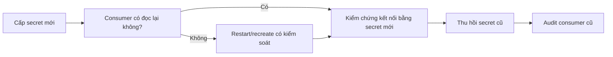

# 3. Configuration và secret

> **Tóm tắt một câu:** Image nên là artifact dùng lại được; configuration và secret được cung cấp ở runtime theo đúng owner, lifecycle và mức nhạy cảm.

> **Loại:** Explanation · **Cấp độ:** Intermediate · **Thời gian:** Khoảng 30 phút  
> **Nguồn chính:** [Build secrets](https://docs.docker.com/build/building/secrets/) · [Secrets in Compose](https://docs.docker.com/compose/how-tos/use-secrets/)

> **Sau chapter này, bạn có thể:**
> - Phân loại build-time config, runtime config và secret theo lifecycle.
> - Giải thích vì sao `ENV`, `ARG`, `.env` và secret mount không tương đương.
> - Đọc Compose secret theo top-level declaration và Service grant.
> - Lập câu hỏi rotation dựa trên cách ứng dụng nạp credential.

> **Thuật ngữ:** **Configuration** điều chỉnh hành vi theo môi trường. **Secret** là dữ liệu nhạy cảm như password, token hoặc private key. **Rotation** là thay secret cũ bằng secret mới có kiểm soát. **Secret exposure path** là mọi nơi secret có thể bị lộ trong hành trình từ nguồn cấp tới process, như shell history, build log, Image metadata, inspect output hoặc application log.

[← 2. Runtime security](02-runtime-security.md) · [Mục lục Production](README.md) · [4. Resource limits →](04-resource-limits.md)

---

## 1. Build once, configure at runtime

Một Image nên được promote từ test sang staging và production mà không build lại chỉ để đổi URL database hoặc log level. Nội dung ứng dụng giữ nguyên; giá trị phụ thuộc môi trường được inject khi tạo Container. Cách này làm artifact dễ đối chiếu và rollback hơn.

Secret cũng là configuration theo nghĩa rộng nhưng cần kênh phân phối, quyền đọc, rotation và audit nghiêm ngặt hơn.

| Kênh | Phù hợp | Rủi ro cần nhớ |
|---|---|---|
| Environment variable | Giá trị nhỏ, ứng dụng hỗ trợ trực tiếp | Có thể xuất hiện trong inspect, process environment hoặc diagnostic dump |
| Bind-mounted file | File cấu hình do host quản lý | Phụ thuộc path và permission host |
| Compose secret | Cấp file secret cho Service | Không thay đầy đủ secret manager của orchestrator/cloud |
| External secret manager | Secret production, rotation và audit | Cần integration và quyền truy cập riêng |

**Build-time configuration** tác động quá trình tạo Image. **Runtime configuration** tác động Container/process được tạo từ Image. Đặt giá trị vào sai lifecycle làm Image khó dùng lại hoặc khiến deploy không thể thay đổi mà không rebuild.

## 2. Vì sao không đặt secret trong Dockerfile

```dockerfile
ENV DB_PASSWORD=123456
```

`ENV` ghi giá trị vào Image configuration. Người có quyền inspect Image có thể đọc nó; Image được push sang Registry cũng mang cấu hình này. Build argument cũng không phải secret store: giá trị có thể xuất hiện trong metadata, provenance, cache hoặc log tùy builder và cách sử dụng.

Khi build cần credential tạm thời, BuildKit secret mount phù hợp hơn:

```dockerfile
RUN --mount=type=secret,id=maven_settings,target=/root/.m2/settings.xml \
    ./mvnw package -DskipTests
```

```text
RUN
├── --mount
│   ├── type=secret
│   ├── id=maven_settings
│   └── target=/root/.m2/settings.xml
└── command = ./mvnw package -DskipTests
```

| Token | Scope | Ý nghĩa |
|---|---|---|
| `type=secret` | BuildKit mount | Yêu cầu secret mount tạm cho đúng build step. |
| `id=maven_settings` | Build request | Tên logic khớp secret được CLI/builder cấp. |
| `target=...` | Build Container filesystem | Path command nhìn thấy trong lúc `RUN`; không phải path host. |
| `./mvnw ...` | Shell của build step | Consumer đọc file secret; nội dung không nên được copy hoặc in vào layer/log. |

Secret mount chỉ tồn tại trong build step theo cơ chế BuildKit. Nó giảm nguy cơ lưu secret vào layer, nhưng command vẫn có thể chủ động copy hoặc log nội dung; cơ chế đúng không cứu một Dockerfile sử dụng sai.

## 3. Compose secret theo scope

```yaml
services:
  api:
    image: example/api:1.0
    environment:
      DB_PASSWORD_FILE: /run/secrets/db_password
    secrets:
      - db_password

secrets:
  db_password:
    file: ./secrets/db-password.txt
```

Top-level `secrets` định nghĩa nguồn; `services.api.secrets` cấp secret cho Service; ứng dụng đọc file ở runtime. Convention biến `_FILE` chỉ hoạt động khi ứng dụng hoặc Image hỗ trợ, Docker không tự biến mọi environment variable thành file.

```text
secrets.db_password.file
        │ source do Compose đọc
        ▼
services.api.secrets[0]
        │ cấp quyền sử dụng cho Service
        ▼
/run/secrets/db_password
        │ file nhìn thấy trong Container
        ▼
application process
```

`./secrets/db-password.txt` là source path phía Compose host/project; `/run/secrets/db_password` là target mặc định trong Container. Hai path thuộc hai filesystem khác nhau.

```bash
docker compose config
docker compose exec api sh -c 'test -r /run/secrets/db_password && echo readable'
```

`config` kiểm tra model nhưng có thể render thông tin nhạy cảm từ các cơ chế khác, nên không đưa output vào log công khai. Lệnh `exec` chỉ kiểm tra file tồn tại và đọc được, không in nội dung secret; nó giả định Image có `sh` và Service đang chạy.

File nguồn local vẫn phải được bảo vệ và không commit vào Git. Trong production lớn, secret manager thường quản lý phân phối, rotation và audit tốt hơn Compose local.

## 4. Rotation là vấn đề lifecycle

Khi thay secret cần trả lời:

- Ứng dụng đọc một lần lúc startup hay đọc lại?
- Thay file có cần recreate/restart Container không?
- Credential cũ còn hiệu lực trong bao lâu?
- Rollback ứng dụng có tương thích secret mới không?

Docker không có một câu trả lời chung; lifecycle ứng dụng và hệ thống cấp secret quyết định.



Không thu hồi credential cũ trước khi mọi consumer đã chuyển, nhưng cũng không giữ hai credential vô thời hạn. Rotation cần owner, thời hạn overlap và rollback plan.

## 5. Quan niệm dễ sai

### “Biến môi trường luôn an toàn vì không nằm trong source code.”

- **Phân loại:** Sai.
- **Vì sao nghe hợp lý:** Giá trị được inject lúc deploy và không xuất hiện trong repository.
- **Lỗi kỹ thuật:** Giá trị có thể nằm trong shell history, Compose config, CI log hoặc Container metadata.
- **Cách nói tốt hơn:** Environment variable tách config khỏi Image, nhưng secret cần đánh giá toàn bộ exposure path.

### “File `.env` là secret manager.”

- **Phân loại:** Sai.
- **Lỗi kỹ thuật:** `.env` hỗ trợ interpolation; nó không tự mã hóa, rotate, audit hay giới hạn người đọc.
- **Kiểm chứng:** Xem file permission, repository ignore rule và nơi Compose/CI render giá trị.

### “BuildKit secret chắc chắn không thể lọt vào Image.”

- **Phân loại:** Sai do tuyệt đối hóa cơ chế.
- **Lỗi kỹ thuật:** Mount không tự tạo layer chứa secret, nhưng build command vẫn có thể copy secret sang path được commit hoặc in ra log.
- **Cách nói tốt hơn:** Build secret cung cấp kênh tạm an toàn hơn; Dockerfile vẫn phải tránh persist và disclosure.

## 6. Tự kiểm tra mental model

1. Vì sao `ARG TOKEN` không trở thành secret store chỉ vì không dùng `ENV`?
2. Trong ví dụ Compose, source secret và target secret thuộc hai scope filesystem nào?
3. Nếu ứng dụng chỉ đọc secret lúc startup, rotation cần thêm state transition nào?

## 7. Tóm tắt

1. Dùng một artifact và inject config ở runtime giúp deploy tái lập.
2. Secret yêu cầu vòng đời và quyền truy cập chặt hơn config thông thường.
3. `ENV` và `ARG` không phải nơi lưu secret; build secret mount vẫn cần consumer sử dụng đúng.
4. Compose secret tách source declaration khỏi Service grant và Container target.

## Tài liệu tham khảo

- Docker Docs, [Build secrets](https://docs.docker.com/build/building/secrets/)
- Docker Docs, [Secrets in Compose](https://docs.docker.com/compose/how-tos/use-secrets/)
- Docker Docs, [Interpolation](https://docs.docker.com/reference/compose-file/interpolation/)

[← 2. Runtime security](02-runtime-security.md) · [Mục lục Production](README.md) · [4. Resource limits →](04-resource-limits.md)
