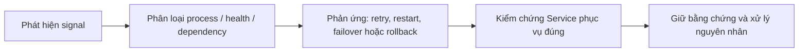

# 5. Healthcheck, restart policy và recovery

> **Tóm tắt một câu:** Healthcheck tạo tín hiệu quan sát; restart policy phản ứng khi Container dừng; cả hai không tự bảo đảm Service sẵn sàng phục vụ đúng.

> **Loại:** Explanation · **Cấp độ:** Intermediate · **Thời gian:** Khoảng 35 phút  
> **Nguồn chính:** [Dockerfile HEALTHCHECK](https://docs.docker.com/reference/dockerfile/#healthcheck) · [Start containers automatically](https://docs.docker.com/engine/containers/start-containers-automatically/)

> **Sau chapter này, bạn có thể:**
> - Phân biệt process state, health status, liveness và readiness.
> - Đọc `healthcheck` và `restart` theo đúng owner, timing và state transition.
> - Chẩn đoán restart loop bằng health log, exit code, OOM flag và restart count.
> - Giải thích giới hạn của `depends_on` và nhu cầu runtime resilience.

> **Thuật ngữ:** **Liveness** hỏi process có còn khả năng tiếp tục hoạt động không. **Readiness** hỏi instance hiện có nên nhận traffic không. **Recovery** là chuỗi phát hiện, phản ứng và kiểm chứng sau lỗi. **Restart loop** là vòng Container liên tục start rồi exit mà không đạt trạng thái phục vụ ổn định.

[← 4. Resource limits](04-resource-limits.md) · [Mục lục Production](README.md) · [6. Logging và observability →](06-logging-va-observability.md)

---

## 1. Ba tín hiệu khác nhau

| Tín hiệu | Câu hỏi | Docker Engine biết gì? |
|---|---|---|
| Process state | Process chính còn chạy không? | Biết trực tiếp |
| Health status | Command healthcheck thành công không? | Chạy command và lưu kết quả |
| Readiness nghiệp vụ | Instance có nên nhận traffic không? | Không có primitive routing đầy đủ chỉ từ health status |

Container có thể `running (unhealthy)`. Healthcheck thất bại không mặc định làm Docker Engine restart Container. Một orchestrator, reverse proxy hoặc automation khác có thể dùng health/readiness để điều khiển traffic, nhưng đó là lớp hành vi bổ sung.

## 2. Thiết kế healthcheck

```yaml
services:
  api:
    image: example/api:1.0
    healthcheck:
      test: ["CMD", "curl", "--fail", "http://localhost:8080/actuator/health"]
      interval: 30s
      timeout: 5s
      retries: 3
      start_period: 40s
```

```text
services.api.healthcheck
├── test[0] = CMD
├── test[1] = curl
├── test[2] = --fail
├── test[3] = http://localhost:8080/actuator/health
├── interval = 30s
├── timeout = 5s
├── retries = 3
└── start_period = 40s
```

| Key/token | Scope | Ý nghĩa |
|---|---|---|
| `test` | Container health configuration | Command chạy bên trong Container; tool phải tồn tại trong Image. |
| `CMD` | Exec-form marker | Chạy executable trực tiếp, không qua shell để xử lý pipe hoặc `&&`. |
| `interval` | Health scheduler | Nhịp giữa các lần kiểm tra theo Engine semantics. |
| `timeout` | Mỗi probe | Quá thời gian này, lần kiểm tra bị coi thất bại. |
| `retries` | Health state machine | Số failure liên tiếp trước khi chuyển `unhealthy`. |
| `start_period` | Startup grace behavior | Cho ứng dụng thời gian khởi động trước khi failure được tính như trạng thái ổn định. |

Không dùng endpoint chỉ trả 200 cố định. Ngược lại, kiểm tra mọi dependency sâu ở tần suất cao có thể làm lỗi nhỏ lan thành **health storm** — lượng probe đồng thời tạo thêm tải khi hệ thống đang suy yếu.

## 3. `CMD` và `CMD-SHELL`

```yaml
healthcheck:
  test: ["CMD-SHELL", "curl --fail http://localhost:8080/health || exit 1"]
```

`CMD-SHELL` chạy chuỗi qua shell mặc định trong Container và hỗ trợ `||`, pipe hoặc variable expansion. Nó phụ thuộc shell tồn tại và quote đúng. `CMD` tách executable/argument rõ hơn và giảm một lớp parser khi không cần shell feature.

Trước khi thêm healthcheck, Container chỉ có process lifecycle state. Sau create/start với healthcheck, `.State.Health.Status` thường đi qua `starting`, rồi `healthy` hoặc `unhealthy` dựa trên probe.

```bash
docker container inspect api --format 'State={{.State.Status}} Health={{if .State.Health}}{{.State.Health.Status}}{{else}}none{{end}}'
docker container inspect api --format '{{json .State.Health.Log}}'
```

Lệnh đầu tách process state khỏi health state. Lệnh sau đọc lịch sử probe gần đây gồm exit code và output; output có thể chứa dữ liệu ứng dụng nên cần redaction phù hợp.

## 4. Restart policy phản ứng với process exit

```yaml
services:
  api:
    image: example/api:1.0
    restart: unless-stopped
```

`restart` thuộc Service runtime configuration. Nó không nằm trong `healthcheck` và không được kích hoạt chỉ vì health status đổi sang unhealthy.

| Policy | Phản ứng chính |
|---|---|
| `no` | Không tự restart. |
| `on-failure` | Restart khi exit code biểu thị thất bại, theo option/semantics hỗ trợ. |
| `always` | Cố khởi động lại khi Container dừng, theo Engine semantics. |
| `unless-stopped` | Gần `always` nhưng tôn trọng việc người vận hành chủ động stop qua daemon restart theo semantics hiện hành. |

```bash
docker container inspect api --format 'Policy={{json .HostConfig.RestartPolicy}} Restarts={{.RestartCount}} Exit={{.State.ExitCode}} OOM={{.State.OOMKilled}}'
```

Restart count tăng chứng minh Container đã được restart, không chứng minh Service đã phục hồi. Image/config lỗi ổn định thường tạo restart loop và làm log bị lặp.

## 5. Dependency phải chịu được lỗi tạm thời

`depends_on` với `service_healthy` giúp sắp xếp một phần startup trong Compose, nhưng không bảo đảm database sống mãi sau đó. Ứng dụng production vẫn cần timeout, retry có backoff và error handling phù hợp.

**Backoff** là tăng khoảng chờ giữa các lần retry để tránh tạo thêm tải khi dependency đang lỗi. **Jitter** là độ ngẫu nhiên nhỏ thêm vào thời gian chờ để nhiều instance không retry cùng lúc. Retry không giới hạn và đồng bộ giữa nhiều instance có thể gây **retry storm**.

```text
Dependency mất kết nối
-> request timeout có giới hạn
-> retry có backoff + jitter nếu operation an toàn
-> circuit/open state hoặc trả lỗi có kiểm soát
-> probe/monitor xác nhận recovery
```

Restart toàn bộ application không phải chiến lược reconnect duy nhất; đôi khi nó làm tăng tải startup đúng lúc dependency đang yếu.

## 6. Recovery phải có bước verification

Một recovery flow tối thiểu:



Nếu chỉ restart mà không xác nhận request, data consistency và error rate, automation có thể báo “đã xử lý” trong khi người dùng vẫn gặp lỗi.

## 7. Quan niệm dễ sai

### “Healthcheck unhealthy thì Docker tự restart.”

- **Phân loại:** Sai với Docker Engine mặc định.
- **Vì sao nghe hợp lý:** Health status trông giống một failure signal mà runtime có thể phản ứng.
- **Lỗi kỹ thuật:** Restart policy phản ứng với Container stop/exit, không mặc định với health transition.
- **Kiểm chứng:** Xem `.State.Status`, `.State.Health.Status` và `.RestartCount` cùng lúc.

### “Restart policy sửa được lỗi ứng dụng.”

- **Phân loại:** Sai.
- **Lỗi kỹ thuật:** Restart có thể khôi phục lỗi tạm thời; lỗi cấu hình, migration hoặc dependency vẫn tạo vòng lặp thất bại.
- **Cách nói tốt hơn:** Restart là một phản ứng recovery có giới hạn, phải đi cùng diagnosis và verification.

### “Health endpoint càng kiểm tra nhiều dependency càng chính xác.”

- **Phân loại:** Không luôn đúng.
- **Lỗi kỹ thuật:** Probe sâu và dày có thể tăng latency, tạo tải và làm một dependency phụ biến mọi instance thành unhealthy.
- **Cách nói tốt hơn:** Kiểm tra capability cần thiết với chi phí thấp và tách liveness/readiness theo nền tảng hỗ trợ.

## 8. Tự kiểm tra mental model

1. Vì sao Container có thể `running` và `unhealthy` cùng lúc?
2. Khi nào `CMD-SHELL` cần thiết và nó thêm rủi ro parser nào?
3. Nếu database mất sau startup, `depends_on` còn bảo vệ backend không?
4. Restart count tăng nhưng error rate không giảm cho thấy điều gì?

## 9. Tóm tắt

1. Process state, health và readiness là ba khái niệm khác nhau.
2. Healthcheck phải quan sát đúng, nhẹ, có tool trong Image và timing phù hợp.
3. Restart policy phản ứng với process exit, không mặc định phản ứng với unhealthy.
4. Dependency failure cần timeout, backoff, jitter và recovery verification ở lớp ứng dụng/vận hành.

## Tài liệu tham khảo

- Dockerfile Reference, [HEALTHCHECK](https://docs.docker.com/reference/dockerfile/#healthcheck)
- Docker Docs, [Start containers automatically](https://docs.docker.com/engine/containers/start-containers-automatically/)
- Docker Docs, [Control startup order in Compose](https://docs.docker.com/compose/how-tos/startup-order/)

[← 4. Resource limits](04-resource-limits.md) · [Mục lục Production](README.md) · [6. Logging và observability →](06-logging-va-observability.md)
