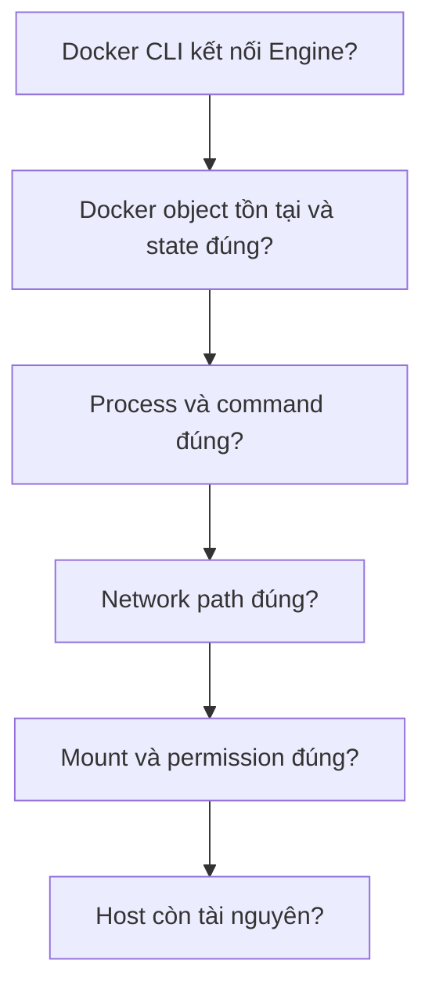

# 1. Phương pháp chẩn đoán Docker

> **Tóm tắt một câu:** Troubleshooting hiệu quả đi từ phạm vi rộng đến bằng chứng cụ thể, không đồng nhất symptom với nguyên nhân.

> **Thuật ngữ:** **Symptom** là biểu hiện quan sát được. **Hypothesis** là giả thuyết có thể kiểm chứng. **Evidence** là dữ liệu giúp giữ hoặc loại bỏ giả thuyết. **Baseline** là trạng thái bình thường dùng để so sánh.

[Mục lục Troubleshooting](README.md) · [2. Lỗi build Image →](02-loi-build-image.md)

---

## 1. Điều tra theo layer



Thứ tự này tránh nhảy vào application log khi Docker Engine còn chưa chạy, hoặc sửa firewall khi process bên trong chỉ listen trên sai port.

## 2. Bộ snapshot tối thiểu

```bash
docker version
docker info
docker container ls -a
docker container inspect <container>
docker container logs --timestamps --tail 200 <container>
docker system df
```

- `docker version` kiểm tra cả client và server; chỉ có Client section thường gợi ý không kết nối được Engine.
- `docker container ls -a` cho status, image, port và tên ở mức tổng quan.
- `inspect` cung cấp configuration/state đã resolve.
- `logs` cho output process, nhưng không bảo đảm ứng dụng đã log đầy đủ.
- `system df` cho usage theo object Docker.

Không đăng nguyên output inspect công khai nếu nó chứa environment hoặc metadata nhạy cảm.

## 3. So sánh desired state với actual state

**Desired state** là điều bạn định cấu hình: port `8080:80`, Volume `db-data`, Image tag `1.4.2`. **Actual state** là điều Engine thật sự tạo: Container dùng Image ID nào, mount source nào, process exit code bao nhiêu.

Ví dụ Compose file vừa sửa không có nghĩa Container hiện tại đã được recreate. `docker compose config` cho desired model đã resolve; `docker compose ps` và `docker container inspect` cho actual state.

## 4. Giữ timeline

Ghi lại:

- Thời điểm deploy/change gần nhất.
- Symptom bắt đầu khi nào.
- Image digest, Container ID và restart count.
- Host event như reboot, disk full hoặc update.
- Command đã thử và output.

Timeline giúp phân biệt correlation với cause. Việc lỗi xuất hiện sau deploy là tín hiệu mạnh, nhưng vẫn cần bằng chứng artifact/config nào thay đổi.

## 5. Quan niệm dễ sai

### “Thử restart trước, nếu hết thì coi như xong.”

- **Phân loại:** Nguy hiểm.
- **Lỗi kỹ thuật:** Restart có thể xóa symptom tạm thời và làm mất state/log cần điều tra.
- **Cách tốt hơn:** Chụp state/log trước, restart có chủ đích, sau đó kiểm chứng nguyên nhân và recurrence.

### “Error message cuối cùng luôn là root cause.”

- **Phân loại:** Sai.
- **Cách tốt hơn:** Đọc theo timeline; lỗi kết nối có thể là hậu quả của process dependency đã chết trước đó.

## 6. Tóm tắt

1. Bắt đầu từ layer thấp và trạng thái quan sát được.
2. Tách desired state khỏi actual state.
3. Mỗi thay đổi phải gắn với hypothesis và verification.

## Tài liệu tham khảo

- Docker Docs, [Troubleshooting the Docker daemon](https://docs.docker.com/engine/daemon/troubleshoot/)
- Docker CLI, [docker inspect](https://docs.docker.com/reference/cli/docker/inspect/)

[Mục lục Troubleshooting](README.md) · [2. Lỗi build Image →](02-loi-build-image.md)
