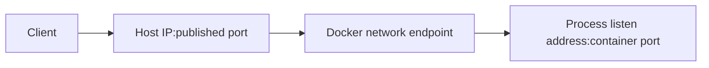

# 4. Chẩn đoán lỗi port và network

> **Tóm tắt một câu:** Lỗi “không kết nối được” phải được lần theo đường client → host publish → Container endpoint → listening process → dependency, vì DNS, routing và application port là các lớp khác nhau.

> **Thuật ngữ:** **Connection refused** thường nghĩa đã tới endpoint nhưng không có process chấp nhận kết nối. **Timeout** nghĩa chưa nhận phản hồi trong giới hạn thời gian và có thể liên quan route, firewall hoặc service treo. **Listen address** là địa chỉ interface mà process bind để nhận kết nối.

[← 3. Container không khởi động](03-container-khong-khoi-dong.md) · [Mục lục Troubleshooting](README.md) · [5. Lỗi storage và permission →](05-loi-storage-va-permission.md)

---

## 1. Symptom phải chứa điểm nhìn

“API không truy cập được” chưa đủ. Ghi rõ:

- Client chạy trên host, Container khác hay máy ngoài?
- Nó gọi hostname/IP và port nào?
- Lỗi là DNS failure, refused, timeout hay TLS/application error?
- Trước đây có hoạt động không, và thay đổi gần nhất là gì?



Không phải mọi luồng đều đi qua host publish. Hai Container cùng network thường gọi trực tiếp service name và container port.

## 2. Hypothesis: publish mapping sai

### Evidence

```bash
docker container ls
docker port <container>
docker inspect <container> --format '{{json .NetworkSettings.Ports}}'
```

Với `127.0.0.1:9000->8080/tcp`, client trên host gọi `127.0.0.1:9000`; app trong Container phải listen container port `8080`. Client từ máy khác không thể dùng loopback của host đó.

### Correction

- Sửa đúng chiều `HOST_PORT:CONTAINER_PORT`.
- Chọn host bind address có chủ đích.
- Không publish database chỉ để app Container khác gọi được; nối chúng vào cùng network.

### Verification

```bash
curl -v http://127.0.0.1:9000/health
docker port <container>
```

Kiểm tra từ đúng vị trí client thật. `curl` trên host không chứng minh máy ngoài truy cập được nếu firewall/network path khác.

## 3. Hypothesis: process listen sai port hoặc chỉ bind loopback

### Evidence

```bash
docker logs <container>
docker exec <container> sh -c 'ss -lntp || netstat -lntp'
```

Image tối giản có thể không có `ss` hoặc `netstat`; khi đó dùng log startup, health check hoặc debug Container trong cùng network namespace phù hợp.

Nếu process listen `127.0.0.1:8080` bên trong Container, traffic đến interface network của Container có thể không được nhận. Service server thường cần bind `0.0.0.0` hoặc interface phù hợp, tùy security model.

### Correction

Sửa application bind address và port, không đổi publish mapping ngẫu nhiên. Đảm bảo health check cũng gọi đúng port.

### Verification

Kiểm tra listening socket, gọi từ trong Container nếu cần, sau đó gọi qua network path thật.

## 4. Hypothesis: dùng sai `localhost`

### Evidence

```bash
docker exec <api-container> getent hosts db
docker inspect <api-container> --format '{{json .Config.Env}}'
```

Trong Container `api`, `localhost` trỏ về chính `api`, không phải Container `db` và cũng không phải host. Database URL nội bộ thường dùng `db:<container-port>` khi `db` là service name/alias trên network chung.

### Correction

Thay hostname theo đúng network scope. Nếu thật sự cần gọi host từ Docker Desktop, dùng cơ chế host gateway được nền tảng hỗ trợ thay vì đoán host IP.

### Verification

Resolve hostname từ chính client Container và thử kết nối đúng protocol/port. DNS resolve thành công chưa đủ; service phải ready và credential đúng.

## 5. Hypothesis: Container không cùng network hoặc DNS sai

### Evidence

```bash
docker network ls
docker network inspect <network>
docker inspect <container> --format '{{json .NetworkSettings.Networks}}'
```

So sánh network membership của cả client và server. Kiểm tra service name, container name và network alias thực tế thay vì IP ghi nhớ từ lần chạy trước.

### Correction

Attach/recreate service trong đúng user-defined network và dùng tên logic. Không dùng static IP mặc định để che lỗi service discovery.

### Verification

```bash
docker exec <client> getent hosts <service-name>
docker exec <client> sh -c 'nc -vz <service-name> <port>'
```

Không phải Image nào cũng có `nc`; có thể dùng client đúng protocol của ứng dụng.

## 6. Hypothesis: host port đã bị chiếm

### Evidence

Docker thường báo `port is already allocated` hoặc bind failure. Trên PowerShell:

```powershell
Get-NetTCPConnection -LocalPort 9000 -ErrorAction SilentlyContinue
```

Trên Linux:

```bash
ss -lntp | grep ':9000'
```

### Correction

Xác định process sở hữu port. Chọn host port khác hoặc dừng đúng service sau khi đánh giá ảnh hưởng.

> [!WARNING]
> Không kill process theo PID chỉ vì nó chiếm port. Xác nhận owner, service và người dùng phụ thuộc trước khi dừng.

### Verification

Port mới được Docker bind, `docker port` khớp cấu hình và client gọi thành công.

## 7. Tóm tắt

1. Xác định client ở đâu và nó gọi endpoint nào.
2. Tách DNS, network membership, publish mapping và listening process.
3. Kiểm chứng từ đúng network scope.
4. Không mở rộng bind address hay tắt firewall chỉ để thử nếu chưa hiểu phạm vi exposure.

## Tài liệu tham khảo

- Docker Docs, [Networking overview](https://docs.docker.com/engine/network/)
- Docker Docs, [Publishing ports](https://docs.docker.com/get-started/docker-concepts/running-containers/publishing-ports/)

[← 3. Container không khởi động](03-container-khong-khoi-dong.md) · [Mục lục Troubleshooting](README.md) · [5. Lỗi storage và permission →](05-loi-storage-va-permission.md)
