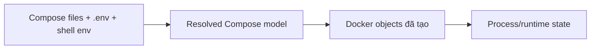

# 6. Chẩn đoán lỗi Docker Compose

> **Tóm tắt một câu:** Compose troubleshooting phải phân biệt file đầu vào, model đã resolve và Docker objects đang tồn tại; sửa YAML không tự thay đổi Container đã được tạo trước đó.

> **Thuật ngữ:** **Compose model** là cấu hình hợp nhất và resolve từ các Compose file, biến và profile. **Project name** là namespace Compose dùng đặt tên và nhóm Container, Network, Volume. **Recreate** là thay Container cũ bằng Container mới từ desired model hiện tại.

[← 5. Lỗi storage và permission](05-loi-storage-va-permission.md) · [Mục lục Troubleshooting](README.md) · [7. Disk usage và cleanup →](07-disk-usage-va-cleanup.md)

---

## 1. Ba lớp state cần tách



- File viết gì chưa chắc model resolve như vậy vì interpolation, override và profile.
- Model đúng chưa chắc object hiện tại đã được recreate.
- Object đúng cấu hình chưa chắc process bên trong healthy.

## 2. Symptom: Compose báo lỗi parse hoặc interpolation

### Hypothesis

- YAML indentation/type sai.
- Biến bắt buộc chưa được cung cấp.
- `${VAR}` được resolve từ nguồn khác điều người dùng nghĩ.
- Nhiều `-f` file override nhau ngoài ý muốn.

### Evidence

```bash
docker compose config
docker compose config --environment
docker compose config --profiles
```

`docker compose config` parse, merge và render model đã resolve. Đây là bằng chứng tốt hơn việc chỉ đọc một file riêng lẻ.

> [!CAUTION]
> Model đã render có thể chứa secret được nội suy. Không đăng output nguyên vẹn lên issue công khai.

### Correction

- Sửa YAML tại key gây lỗi và giữ đúng kiểu dữ liệu.
- Dùng `${VAR:?message}` cho biến bắt buộc hoặc default có chủ đích.
- Ghi rõ thứ tự `-f` và nơi `.env` được lấy.
- Không quote/ngắt chuỗi ngẫu nhiên nếu chưa biết parser đang nhận giá trị gì.

### Verification

```bash
docker compose config --quiet
docker compose config > resolved-compose.yml
```

Exit code thành công chứng minh model hợp lệ về Compose syntax; vẫn cần kiểm tra semantic value trong output đã resolve.

## 3. Symptom: sửa Compose file nhưng Container không đổi

### Hypothesis

- Chỉ chạy `start`/`restart`, không recreate.
- Đang thao tác project/context khác.
- Image tag local chưa được build/pull lại.
- Thay đổi nằm trong profile chưa bật.

### Evidence

```bash
docker compose ls
docker compose ps -a
docker compose images
docker compose config
docker inspect <container> --format 'image={{.Image}} created={{.Created}} labels={{json .Config.Labels}}'
```

`restart` chạy lại cùng Container với cấu hình cũ. `up` so desired model với project state và recreate khi cần; `--force-recreate` ép thay object nhưng không nên là phản xạ đầu tiên.

### Correction

```bash
docker compose up -d --build
```

Chỉ dùng `--build` khi source/Image cần build lại. Với Image từ Registry, dùng pull policy/workflow phù hợp. Nếu Compose không nhận ra thay đổi nhưng bạn đã chứng minh object cần thay, cân nhắc:

```bash
docker compose up -d --force-recreate <service>
```

### Verification

So Container ID/Created time, Image ID/digest và config actual sau `up`; sau đó kiểm tra service behavior.

## 4. Symptom: service dependency chưa sẵn sàng

### Hypothesis

- `depends_on` chỉ đảm bảo thứ tự create/start theo cấu hình đang dùng, không chứng minh dependency đã ready.
- Healthcheck sai command, shell hoặc port.
- Application thiếu retry khi dependency restart.

### Evidence

```bash
docker compose ps
docker inspect <dependency> --format '{{json .State.Health}}'
docker compose logs --timestamps --tail 200 <dependency> <consumer>
```

Đọc timeline: dependency được start lúc nào, health chuyển trạng thái ra sao, consumer thử kết nối lúc nào.

### Correction

- Định nghĩa healthcheck đo readiness có ý nghĩa.
- Dùng `depends_on` condition khi Compose implementation/workflow hỗ trợ.
- Thêm retry/backoff tại application vì dependency có thể lỗi sau startup.

### Verification

Recreate toàn project và quan sát startup sạch nhiều lần; sau đó restart riêng dependency để kiểm tra consumer recovery.

## 5. Symptom: tên project, Network hoặc Volume khác dự kiến

### Evidence

```bash
docker compose ls
docker compose config --services
docker compose config --networks
docker compose config --volumes
docker volume ls
docker network ls
```

Project name có thể đến từ option `-p`, environment, top-level `name` hoặc directory/project rules. Đổi project name tạo namespace object khác, làm dữ liệu có vẻ “mất” dù Volume cũ còn.

### Correction

Chọn project name ổn định và khai báo external/name rõ khi cần dùng chung resource. Không nối nhầm hai project vào resource chung chỉ để né lỗi naming.

### Verification

Inspect label `com.docker.compose.project`, resource name và mount source của Container mới.

## 6. Lệnh phá hủy cần đọc đúng phạm vi

> [!WARNING]
> `docker compose down` xóa Container và Network của project. `docker compose down --volumes` còn xóa named Volume khai báo trong project và anonymous Volume liên quan; dữ liệu có thể không khôi phục được. `--rmi` mở rộng sang Image. Luôn chạy `docker compose ps`, `docker compose config --volumes` và kiểm tra backup trước.

`docker compose rm -f` và `down` không phải cách sửa mọi lỗi state. Chúng có thể xóa evidence như Container metadata, writable layer và log local.

## 7. Quan niệm dễ sai

### “`docker compose restart` áp dụng file YAML mới.”

Sai. Restart giữ object/config hiện tại. Thay đổi cấu hình cần recreate qua `up` hoặc workflow tương đương.

### “`depends_on` nghĩa database đã nhận query.”

Sai nếu không có readiness condition phù hợp. Process được start không đồng nghĩa service ready.

## 8. Tóm tắt

1. Render model bằng `docker compose config`.
2. So model với object thực tế và project name.
3. Recreate có chủ đích; restart không cập nhật config.
4. Dùng health evidence và application retry cho dependency.

## Tài liệu tham khảo

- Docker Docs, [docker compose config](https://docs.docker.com/reference/cli/docker/compose/config/)
- Docker Docs, [Control startup order](https://docs.docker.com/compose/how-tos/startup-order/)

[← 5. Lỗi storage và permission](05-loi-storage-va-permission.md) · [Mục lục Troubleshooting](README.md) · [7. Disk usage và cleanup →](07-disk-usage-va-cleanup.md)
