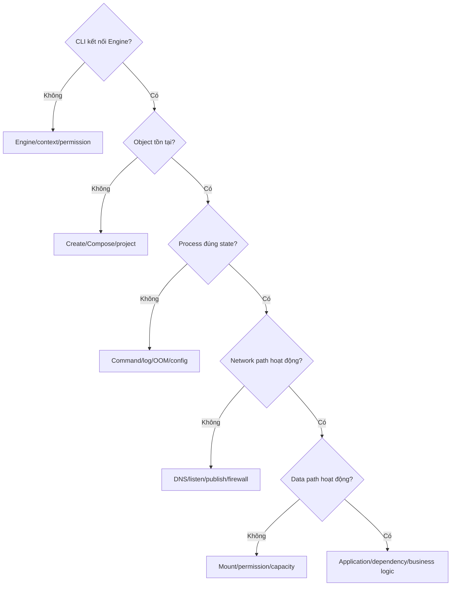

# 8. Diagnostic playbook end-to-end

> **Tóm tắt một câu:** Playbook tổng hợp bắt đầu bằng snapshot không phá hủy, khoanh vùng layer lỗi, kiểm chứng từng hypothesis và chỉ thay đổi phạm vi nhỏ nhất có thể hoàn tác.

> **Thuật ngữ:** **Diagnostic snapshot** là tập bằng chứng tại một thời điểm. **Blast radius** là phạm vi workload/dữ liệu có thể bị ảnh hưởng bởi một thay đổi. **Recovery path** là cách quay về trạng thái an toàn nếu correction thất bại.

[← 7. Disk usage và cleanup](07-disk-usage-va-cleanup.md) · [Mục lục Troubleshooting](README.md)

---

## 1. Bước 0: bảo toàn bằng chứng

Trước restart, recreate hoặc cleanup, ghi:

- Timestamp và timezone.
- Docker context, client/server version.
- Compose project hoặc Container name/ID.
- Image reference, Image ID/digest.
- Recent change/deploy/reboot.
- Exact symptom từ vị trí client.

```bash
docker context show
docker version
docker info
docker container ls -a
docker system df
```

> [!CAUTION]
> `docker inspect`, Compose config và log có thể chứa secret, token, hostname nội bộ hoặc dữ liệu người dùng. Redact khi chia sẻ nhưng không xóa thông tin kỹ thuật cần thiết như key name, timestamp và error code.

## 2. Bước 1: viết symptom có thể kiểm chứng

Mẫu tốt:

```text
Từ host Windows, GET http://localhost:8080/health lúc 10:32 trả connection refused.
Container api-1 xuất hiện trong docker ps -a với exited (1) sau 3 giây.
```

Mẫu kém: “Docker network hỏng”. Câu này đã nhảy sang hypothesis và bỏ qua state của process.

## 3. Bước 2: chọn layer đầu tiên bị sai



Chỉ đi sâu layer trên sau khi layer dưới có evidence hợp lệ.

## 4. Bước 3: snapshot workload mục tiêu

```bash
docker container inspect <container>
docker container logs --timestamps --tail 300 <container>
docker stats --no-stream <container>
docker top <container>
```

Nếu dùng Compose:

```bash
docker compose config
docker compose ps -a
docker compose logs --timestamps --tail 300
docker compose images
```

Lưu output cần thiết theo incident policy. `docker top` chỉ hoạt động khi Container/process state phù hợp; command thất bại cũng là evidence.

## 5. Bước 4: hypothesis matrix

| Symptom | Hypothesis | Evidence phân biệt | Correction nếu xác nhận | Verification |
|---|---|---|---|---|
| Exited ngay | Command sai | inspect command + logs + exit code | sửa command/Image | state/exit đúng contract |
| Refused từ host | App không listen hoặc mapping sai | `docker port`, socket, logs | sửa port/bind | gọi từ host thành công |
| API không gọi DB | `localhost`/DNS/network | config + network inspect + resolve | service name/network | query từ API path |
| Permission denied | UID/GID/mount mode | `id`, `ls -n`, inspect mounts | owner/mode hẹp | app ghi được |
| Config sửa không có hiệu lực | Container chưa recreate | Compose config vs inspect | `compose up` recreate | actual config mới |
| Disk đầy | cache/log/Volume | `system df -v`, host disk | cleanup đúng object | usage giảm, workload ổn |

Mỗi lần chỉ giữ một hypothesis chính và một phép thử nhỏ nhất có thể phân biệt nó với giả thuyết cạnh tranh.

## 6. Bước 5: correction có recovery path

Trước thay đổi, trả lời:

1. Object/data nào bị tác động?
2. Có backup hoặc cách tạo lại không?
3. Có thể thử trên một service/Container không?
4. Cách rollback config/Image/digest là gì?
5. Thay đổi có làm mất log/writable layer không?

Ưu tiên correction có scope nhỏ: sửa một environment value, recreate một service, attach đúng network. Tránh reset toàn bộ Docker Desktop, xóa mọi Volume hoặc prune hệ thống khi chưa chứng minh cần thiết.

## 7. Bước 6: verification nhiều lớp

Verification tốt không chỉ là “command không báo lỗi”:

```text
Docker state đúng
-> process/health đúng
-> network/storage operation đúng
-> user-visible behavior đúng
-> symptom không tái diễn trong cửa sổ quan sát
```

Ví dụ sau sửa port:

- Container `running`, restart count ổn định.
- Process listen đúng container port.
- Publish mapping đúng host port.
- Client thật gọi health endpoint thành công.
- Log không có lỗi lặp.

## 8. Bước 7: cleanup sau điều tra

Xóa debug Container, file test và temporary network do chính incident tạo ra. Không xóa evidence cần postmortem hoặc resource không rõ owner.

> [!WARNING]
> Không đưa `docker system prune -a --volumes`, `docker compose down --volumes`, `rm -f`, `--privileged` hoặc `chmod -R 777` vào checklist mặc định. Đây là hành động có blast radius lớn hoặc làm suy yếu bảo mật, chỉ dùng khi hypothesis và phạm vi đã được chứng minh.

## 9. Mẫu incident note

```text
Symptom:
Timeline:
Scope / affected services:
Desired state:
Actual state:
Evidence collected:
Hypothesis tested:
Root cause:
Correction:
Verification:
Recovery/rollback:
Follow-up prevention:
```

**Root cause** là điều kiện gốc tạo ra failure, không chỉ lỗi cuối cùng quan sát được. **Contributing factor** là yếu tố làm lỗi dễ xảy ra hoặc khó phát hiện hơn nhưng không đủ tự gây incident.

## 10. Tự kiểm tra

1. Vì sao restart trước snapshot có thể làm khó tìm root cause?
2. Khi DNS resolve được nhưng kết nối refused, hypothesis nào đã bị loại và layer nào cần kiểm tra tiếp?
3. Vì sao “đã chạy `docker compose up` thành công” chưa đủ verification?
4. Với disk full, bằng chứng nào cần có trước `volume prune`?

## 11. Tóm tắt

1. Bảo toàn state trước hành động thay đổi.
2. Viết symptom từ một điểm nhìn cụ thể.
3. Khoanh vùng layer và kiểm chứng một hypothesis mỗi lần.
4. Chọn correction có blast radius nhỏ và recovery path rõ.
5. Verification đi đến hành vi người dùng và khoảng thời gian đủ đại diện.

## Tài liệu tham khảo

- Docker Docs, [Troubleshooting the Docker daemon](https://docs.docker.com/engine/daemon/troubleshoot/)
- Docker CLI, [docker container](https://docs.docker.com/reference/cli/docker/container/)
- Docker CLI, [docker compose](https://docs.docker.com/reference/cli/docker/compose/)

[← 7. Disk usage và cleanup](07-disk-usage-va-cleanup.md) · [Mục lục Troubleshooting](README.md)
